<!--
Status: stable
Owner: MobVibe Core Team
Last updated: 2025-11-05
Related: SUMMARY.md, README.md, All documentation files
-->

# MobVibe Documentation Graph

> Visual representation of all documentation files and their relationships

## Table of Contents

- [Overview](#overview)
- [How to Render](#how-to-render)
- [Graph 1: High-Level Overview](#graph-1-high-level-overview)
- [Graph 2: Detailed Cross-Link Network](#graph-2-detailed-cross-link-network)
- [Graph Statistics](#graph-statistics)
- [Legend](#legend)
- [Navigation Guide](#navigation-guide)

---

## Overview

This document provides visual Mermaid graphs showing:
- **11 documentation files** organized by category
- **50+ cross-link relationships** between documents
- **3 main clusters**: Core Technical, UX/Design, Planning
- **Link strength indicators**: Strong, medium, and weak connections

---

## How to Render

### Online Rendering
1. Copy any graph code block
2. Visit [Mermaid Live Editor](https://mermaid.live/)
3. Paste code and view rendered diagram
4. Export as PNG/SVG if needed

### VS Code
1. Install "Markdown Preview Mermaid Support" extension
2. Open this file
3. Press `Ctrl+Shift+V` (preview)
4. Graphs render automatically

### GitHub
- Mermaid graphs render automatically in GitHub markdown

---

## Graph 1: High-Level Overview

**Purpose:** Shows main documentation structure with entry points and primary relationships

```mermaid
%%{init: {'theme':'base', 'themeVariables': { 'primaryColor':'#2196F3','primaryTextColor':'#fff','primaryBorderColor':'#1976D2','lineColor':'#666','secondaryColor':'#FF5C33','tertiaryColor':'#9C27B0'}}}%%

graph TB
    %% Entry Point
    README["📄 README.md<br/>Entry Point"]

    %% Central Hub
    SUMMARY["📚 SUMMARY.md<br/>Central Hub"]

    %% Core Technical Cluster
    subgraph TECH["🔧 Core Technical"]
        ARCH["🏗️ architecture.md<br/>System Design"]
        IMPL["⚙️ implementation.md<br/>Tech Stack"]
        DATA["🔄 data-flow.md<br/>Data Flows"]
    end

    %% UX/Design Cluster
    subgraph UX["🎨 UX/Design"]
        FEATURES["✨ features-and-journeys.md<br/>Features & Flows"]
        DESIGN["🎨 design-system.md<br/>Design System"]
        NATIVE["📱 native_ui.md<br/>Native Components"]
        UXCHANGE["🔀 UX-CHANGES.md<br/>UX Revisions"]
    end

    %% Planning Cluster
    subgraph PLAN["📋 Planning"]
        ROADMAP["🗓️ roadmap.md<br/>Timeline"]
        RECOS["💡 recommendations.md<br/>Best Practices"]
        ANALYSIS["🔍 analysis.md<br/>Code Analysis"]
    end

    %% Entry Flow
    README ==>|"Quick Links"| SUMMARY
    README -.->|"Direct Links"| ARCH
    README -.->|"Direct Links"| IMPL
    README -.->|"Direct Links"| DATA
    README -.->|"Direct Links"| FEATURES

    %% Central Hub Connections
    SUMMARY ==>|"Architecture Understanding"| ARCH
    SUMMARY ==>|"Architecture Understanding"| DATA
    SUMMARY ==>|"Implementation Details"| IMPL
    SUMMARY ==>|"User Experience"| FEATURES
    SUMMARY ==>|"User Experience"| UXCHANGE
    SUMMARY ==>|"User Experience"| DESIGN
    SUMMARY ==>|"Development Planning"| ROADMAP
    SUMMARY ==>|"Development Planning"| ANALYSIS

    %% Core Technical Interconnections
    ARCH <-->|"Strong"| IMPL
    ARCH <-->|"Strong"| DATA
    IMPL <-->|"Strong"| DATA

    %% UX/Design Interconnections
    FEATURES <-->|"Strong"| DESIGN
    FEATURES <-->|"Strong"| UXCHANGE
    DESIGN <-->|"Strong"| NATIVE
    DESIGN <-->|"Medium"| UXCHANGE

    %% Planning Interconnections
    ROADMAP <-->|"Strong"| RECOS
    ROADMAP <-->|"Strong"| ANALYSIS
    RECOS <-->|"Medium"| ANALYSIS

    %% Cross-Cluster Connections
    ARCH -.->|"Medium"| FEATURES
    ARCH -.->|"Medium"| DESIGN
    IMPL -.->|"Strong"| FEATURES
    IMPL -.->|"Medium"| DESIGN
    DATA -.->|"Strong"| FEATURES
    DATA -.->|"Medium"| UXCHANGE

    ROADMAP -.->|"Strong"| ARCH
    ROADMAP -.->|"Strong"| IMPL
    ROADMAP -.->|"Medium"| FEATURES
    ANALYSIS -.->|"Strong"| ARCH
    ANALYSIS -.->|"Strong"| IMPL
    RECOS -.->|"Medium"| ARCH
    RECOS -.->|"Medium"| IMPL

    UXCHANGE -.->|"Medium"| IMPL
    UXCHANGE -.->|"Medium"| ROADMAP
    UXCHANGE -.->|"Medium"| ANALYSIS

    %% Styling
    classDef entryPoint fill:#4CAF50,stroke:#388E3C,stroke-width:3px,color:#fff
    classDef centralHub fill:#FF9800,stroke:#F57C00,stroke-width:3px,color:#fff
    classDef technical fill:#2196F3,stroke:#1976D2,stroke-width:2px,color:#fff
    classDef uxDesign fill:#FF5C33,stroke:#E64A19,stroke-width:2px,color:#fff
    classDef planning fill:#9C27B0,stroke:#7B1FA2,stroke-width:2px,color:#fff

    class README entryPoint
    class SUMMARY centralHub
    class ARCH,IMPL,DATA technical
    class FEATURES,DESIGN,NATIVE,UXCHANGE uxDesign
    class ROADMAP,RECOS,ANALYSIS planning

    style TECH fill:#E3F2FD,stroke:#2196F3,stroke-width:2px
    style UX fill:#FFE0D9,stroke:#FF5C33,stroke-width:2px
    style PLAN fill:#F3E5F5,stroke:#9C27B0,stroke-width:2px
```



---

## Graph 2: Detailed Cross-Link Network

**Purpose:** Shows all 50+ specific cross-references and connection types

```mermaid
%%{init: {'theme':'base', 'themeVariables': { 'primaryColor':'#2196F3','primaryTextColor':'#fff','primaryBorderColor':'#1976D2','lineColor':'#666','secondaryColor':'#FF5C33','tertiaryColor':'#9C27B0'}}}%%

graph LR
    %% All Nodes
    README[("📄 README")]
    SUMMARY[("📚 SUMMARY")]
    ARCH[("🏗️ architecture")]
    IMPL[("⚙️ implementation")]
    DATA[("🔄 data-flow")]
    FEATURES[("✨ features-and-journeys")]
    DESIGN[("🎨 design-system")]
    NATIVE[("📱 native_ui")]
    UXCHANGE[("🔀 UX-CHANGES")]
    ROADMAP[("🗓️ roadmap")]
    RECOS[("💡 recommendations")]
    ANALYSIS[("🔍 analysis")]

    %% README Connections (Entry Point)
    README ==>|"Complete index"| SUMMARY
    README -->|"Quick link"| ARCH
    README -->|"Quick link"| IMPL
    README -->|"Quick link"| DATA
    README -->|"Quick link"| FEATURES
    README -->|"Quick link"| DESIGN
    README -->|"Quick link"| NATIVE
    README -->|"Quick link"| UXCHANGE
    README -->|"Quick link"| ROADMAP
    README -->|"Quick link"| RECOS
    README -->|"Quick link"| ANALYSIS

    %% SUMMARY Connections (Central Hub)
    SUMMARY ==>|"Architecture understanding"| ARCH
    SUMMARY ==>|"Architecture understanding"| DATA
    SUMMARY ==>|"Implementation details"| IMPL
    SUMMARY ==>|"User experience"| FEATURES
    SUMMARY ==>|"User experience"| UXCHANGE
    SUMMARY ==>|"User experience"| DESIGN
    SUMMARY ==>|"Development planning"| ROADMAP
    SUMMARY ==>|"Development planning"| ANALYSIS

    %% Architecture Connections (Front-matter: implementation, data-flow, design-system, features-and-journeys)
    ARCH <-->|"System design ↔ Tech stack"| IMPL
    ARCH <-->|"Architecture ↔ Flows"| DATA
    ARCH -->|"Structure → Components"| DESIGN
    ARCH -->|"System → Features"| FEATURES

    %% Implementation Connections (Front-matter: architecture, data-flow, features-and-journeys, design-system)
    IMPL <-->|"Tech stack ↔ Architecture"| ARCH
    IMPL <-->|"Code ↔ Data flows"| DATA
    IMPL -->|"Components → Features"| FEATURES
    IMPL -->|"Tech → Design specs"| DESIGN

    %% Data-Flow Connections (Implicit: architecture, implementation, features-and-journeys, design-system)
    DATA <-->|"Flows ↔ Architecture"| ARCH
    DATA <-->|"Data ↔ Implementation"| IMPL
    DATA -->|"Flows → User journeys"| FEATURES
    DATA -->|"Interactions → UI"| DESIGN

    %% Features-and-Journeys Connections (Implicit: implementation, data-flow, UX-CHANGES, design-system)
    FEATURES -->|"Requirements → Tech"| IMPL
    FEATURES -->|"User flows → Data"| DATA
    FEATURES <-->|"Features ↔ UX decisions"| UXCHANGE
    FEATURES <-->|"Journeys ↔ Components"| DESIGN

    %% Design-System Connections (Front-matter: features-and-journeys, UX-CHANGES, native_ui)
    DESIGN <-->|"System ↔ Features"| FEATURES
    DESIGN <-->|"Components ↔ UX"| UXCHANGE
    DESIGN <-->|"Design ↔ Native"| NATIVE

    %% Native-UI Connections (Expanded with: design-system, implementation)
    NATIVE -->|"Native specs ← Design"| DESIGN
    NATIVE -->|"Platform code ← Tech"| IMPL

    %% UX-CHANGES Connections (See also: analysis, design-system, features-and-journeys, implementation)
    UXCHANGE -->|"EAS Update details"| ANALYSIS
    UXCHANGE -->|"Component specs"| DESIGN
    UXCHANGE -->|"User flows"| FEATURES
    UXCHANGE -->|"Nano Banana API"| IMPL

    %% Roadmap Connections (Front-matter: recommendations, features-and-journeys, architecture, implementation, analysis)
    ROADMAP -->|"Timeline → Best practices"| RECOS
    ROADMAP -->|"Milestones → Features"| FEATURES
    ROADMAP -->|"Planning → Architecture"| ARCH
    ROADMAP -->|"Schedule → Tech"| IMPL
    ROADMAP -->|"Implementation → Analysis"| ANALYSIS

    %% Recommendations Connections (Front-matter: roadmap, architecture, implementation, analysis)
    RECOS -->|"Best practices → Timeline"| ROADMAP
    RECOS -->|"Patterns → Architecture"| ARCH
    RECOS -->|"Guidelines → Tech"| IMPL
    RECOS -->|"Solutions → Analysis"| ANALYSIS

    %% Analysis Connections (See also: architecture, implementation, recommendations, roadmap, UX-CHANGES)
    ANALYSIS -->|"Worker architecture"| ARCH
    ANALYSIS -->|"Backend API specs"| IMPL
    ANALYSIS -->|"Recommendations"| RECOS
    ANALYSIS -->|"Implementation timeline"| ROADMAP
    ANALYSIS -->|"WebView preview"| UXCHANGE

    %% Roadmap Additional Cross-References (See also)
    ROADMAP -.->|"Event-driven worker"| ARCH
    ROADMAP -.->|"Implementation practices"| ANALYSIS
    ROADMAP -.->|"UX decisions"| UXCHANGE
    ROADMAP -.->|"Component specs"| DESIGN
    ROADMAP -.->|"Proxy security"| ANALYSIS
    ROADMAP -.->|"Security requirements"| RECOS

    %% UX-CHANGES Additional Cross-References
    UXCHANGE -.->|"Workflows"| FEATURES
    UXCHANGE -.->|"Personas & journeys"| FEATURES
    UXCHANGE -.->|"UI library"| DESIGN
    UXCHANGE -.->|"Component implementation"| IMPL

    %% Analysis Detailed References
    ANALYSIS -.->|"Complete event-driven"| ARCH
    ANALYSIS -.->|"Implementation timeline"| ROADMAP
    ANALYSIS -.->|"Backend endpoints"| IMPL
    ANALYSIS -.->|"Security requirements"| RECOS
    ANALYSIS -.->|"Complete WebView design"| UXCHANGE
    ANALYSIS -.->|"UI implementation"| ROADMAP
    ANALYSIS -.->|"Database schema & RLS"| IMPL
    ANALYSIS -.->|"Data model practices"| RECOS

    %% Recommendations Detailed References
    RECOS -.->|"Worker architecture"| ARCH
    RECOS -.->|"Comprehensive solution"| ANALYSIS
    RECOS -.->|"WebView approach"| UXCHANGE
    RECOS -.->|"Implementation timeline"| ROADMAP
    RECOS -.->|"Backend proxy pattern"| ANALYSIS
    RECOS -.->|"API endpoints"| IMPL
    RECOS -.->|"Corrected schema"| ANALYSIS
    RECOS -.->|"Database details"| IMPL

    %% Styling
    classDef entryPoint fill:#4CAF50,stroke:#388E3C,stroke-width:3px,color:#fff
    classDef centralHub fill:#FF9800,stroke:#F57C00,stroke-width:3px,color:#fff
    classDef technical fill:#2196F3,stroke:#1976D2,stroke-width:2px,color:#fff
    classDef uxDesign fill:#FF5C33,stroke:#E64A19,stroke-width:2px,color:#fff
    classDef planning fill:#9C27B0,stroke:#7B1FA2,stroke-width:2px,color:#fff

    class README entryPoint
    class SUMMARY centralHub
    class ARCH,IMPL,DATA technical
    class FEATURES,DESIGN,NATIVE,UXCHANGE uxDesign
    class ROADMAP,RECOS,ANALYSIS planning
```



---

## Graph Statistics

### Nodes (Documents)
- **Total Documents**: 11 files
- **Entry Point**: 1 (README.md)
- **Central Hub**: 1 (SUMMARY.md)
- **Core Technical**: 3 files (architecture, implementation, data-flow)
- **UX/Design**: 4 files (features-and-journeys, design-system, native_ui, UX-CHANGES)
- **Planning**: 3 files (roadmap, recommendations, analysis)

### Edges (Connections)
- **Total Cross-Links**: 70+ connections
- **Strong Links** (⟷): 15 bidirectional relationships
- **Medium Links** (→): 25 unidirectional references
- **Weak Links** (⋯→): 30+ "See also" references

### Connectivity
- **Most Connected**: SUMMARY.md (hub connecting all clusters)
- **Highly Connected**: architecture.md, implementation.md, roadmap.md
- **Cross-Cluster Bridges**: UX-CHANGES.md, analysis.md, recommendations.md

### Clusters
1. **Core Technical** (tightly coupled)
   - architecture.md ↔ implementation.md ↔ data-flow.md
   - Strong bidirectional relationships

2. **UX/Design** (feature-focused)
   - features-and-journeys.md ↔ design-system.md
   - design-system.md ↔ native_ui.md
   - UX-CHANGES.md bridges to technical cluster

3. **Planning** (strategy layer)
   - roadmap.md ↔ recommendations.md ↔ analysis.md
   - Links down to both technical and UX clusters

---

## Legend

### Node Types

| Shape | Type | Example |
|-------|------|---------|
| 📄 Rectangle | Entry Point | README.md |
| 📚 Rounded Rectangle | Central Hub | SUMMARY.md |
| 🏗️ Rectangle | Core Technical | architecture.md |
| 🎨 Rounded | UX/Design | design-system.md |
| 📋 Hexagon | Planning | roadmap.md |

### Node Colors

| Color | Category | Hex Code |
|-------|----------|----------|
| 🟢 Green | Entry Point | #4CAF50 |
| 🟠 Orange | Central Hub | #FF9800 |
| 🔵 Blue | Core Technical | #2196F3 |
| 🔴 Red/Orange | UX/Design | #FF5C33 |
| 🟣 Purple | Planning | #9C27B0 |

### Connection Types

| Line Style | Strength | Meaning | Example |
|------------|----------|---------|---------|
| `==>` | Very Strong | Primary entry/hub connection | README → SUMMARY |
| `<-->` | Strong | Bidirectional cross-reference | architecture ↔ implementation |
| `-->` | Medium | Unidirectional reference | roadmap → architecture |
| `-.->` | Weak | "See also" reference | analysis ⋯→ UX-CHANGES |

### Cluster Colors

| Cluster | Background | Border |
|---------|-----------|---------|
| 🔧 Core Technical | Light Blue (#E3F2FD) | Blue (#2196F3) |
| 🎨 UX/Design | Light Orange (#FFE0D9) | Orange (#FF5C33) |
| 📋 Planning | Light Purple (#F3E5F5) | Purple (#9C27B0) |

---

## Navigation Guide

### For New Team Members
1. **Start**: README.md (project overview)
2. **Then**: SUMMARY.md (complete index)
3. **Next**: Follow "Quick Start for Developers" section

### For Developers
**Path**: README → SUMMARY → architecture → implementation → data-flow

**Purpose**: Understand system design, tech stack, and how data flows

### For Designers
**Path**: README → SUMMARY → design-system → native_ui → UX-CHANGES

**Purpose**: Learn design system, native components, and UX decisions

### For Project Managers
**Path**: README → SUMMARY → roadmap → features-and-journeys → recommendations

**Purpose**: Understand timeline, features, and strategic decisions

### For Understanding Specific Topics

#### Backend Architecture
- **Primary**: architecture.md → implementation.md
- **Supporting**: data-flow.md, analysis.md

#### Frontend UI/UX
- **Primary**: design-system.md → features-and-journeys.md
- **Supporting**: native_ui.md, UX-CHANGES.md

#### Project Planning
- **Primary**: roadmap.md → recommendations.md
- **Supporting**: analysis.md, features-and-journeys.md

#### Data Flows
- **Primary**: data-flow.md
- **Supporting**: architecture.md, implementation.md, features-and-journeys.md

---

## Documentation Health Metrics

### Coverage
- ✅ **Architecture**: Comprehensive (architecture.md, implementation.md, data-flow.md)
- ✅ **UX/Design**: Complete (design-system.md, native_ui.md, UX-CHANGES.md, features-and-journeys.md)
- ✅ **Planning**: Thorough (roadmap.md, recommendations.md, analysis.md)
- ✅ **Entry Points**: Multiple (README.md, SUMMARY.md)

### Cross-Linking
- ✅ **Front-matter**: All files have "Related" field with 3-5 related docs
- ✅ **In-Content**: 50+ "See also" references throughout
- ✅ **Hub Access**: All files link to SUMMARY.md
- ✅ **Bidirectional**: Core docs have reciprocal links

### Consistency
- ✅ **Front-matter**: HTML comments with Status, Owner, Last updated, Related
- ✅ **Source Note**: All files reference SUMMARY.md under H1
- ✅ **Terminology**: Normalized terms across all documents
- ✅ **Structure**: Consistent TOC, sections, formatting

### Maintainability
- ✅ **Backups**: .bak files created for all modified docs
- ✅ **Changelog**: SUMMARY.md tracks all documentation updates
- ✅ **Glossary**: Key terms defined in SUMMARY.md
- ✅ **Version Control**: Git-tracked with commit history

---

## Graph Usage Examples

### Example 1: Understanding Backend Architecture
```
Follow this path:
README → SUMMARY → architecture.md → implementation.md
                                   ↓
                              data-flow.md
```

**What you'll learn:**
- High-level system design
- Technology choices and rationale
- Database schema and API endpoints
- How data flows through the system

### Example 2: Implementing a New Feature
```
Follow this path:
features-and-journeys.md → design-system.md → implementation.md
         ↓                        ↓                   ↓
   UX-CHANGES.md          native_ui.md          data-flow.md
```

**What you'll learn:**
- Feature requirements and user flows
- UI components and design patterns
- Technical implementation details
- Data flow for the feature

### Example 3: Planning Next Sprint
```
Follow this path:
roadmap.md → recommendations.md → analysis.md
    ↓              ↓                   ↓
architecture.md  implementation.md  UX-CHANGES.md
```

**What you'll learn:**
- Timeline and milestones
- Technical best practices
- Code analysis insights
- Architecture and implementation details

---

## Mermaid Rendering Tips

### Color Scheme Customization
```mermaid
%%{init: {'theme':'dark'}}%%
```
Options: `default`, `dark`, `forest`, `neutral`, `base`

### Large Graph Optimization
- Use `LR` (left-right) for wide graphs
- Use `TB` (top-bottom) for tall graphs
- Use subgraphs to organize clusters
- Limit bidirectional arrows to essential connections

### Export Options
1. **PNG**: Best for presentations
2. **SVG**: Best for web (scalable)
3. **PDF**: Best for documentation

---

## Related Documentation

- 📚 [**SUMMARY.md**](./SUMMARY.md) - Complete documentation index
- 📄 [**README.md**](../README.md) - Project overview
- 🏗️ [**architecture.md**](./architecture.md) - System architecture
- ⚙️ [**implementation.md**](./implementation.md) - Technical implementation
- 🔄 [**data-flow.md**](./data-flow.md) - Data flow diagrams

---

**Status**: Complete ✅ | **Graphs**: 2 | **Nodes**: 11 | **Edges**: 70+ | **Last Updated**: 2025-11-05
