<!--
Status: stable
Owner: MobVibe Core Team
Last updated: 2025-11-05
Related: SUMMARY.md, DOCUMENTATION-GRAPH.md
-->

# MobVibe Documentation Index & Visual Guide

> Complete visual navigation system for all MobVibe documentation

---

## 📊 Quick Visual Overview

```mermaid
graph TB
    START[👤 Start Here] --> ROLE{Your Role?}

    ROLE -->|Developer| DEV[🛠️ Developer Path]
    ROLE -->|Designer| DES[🎨 Designer Path]
    ROLE -->|PM/Manager| PM[📋 Manager Path]
    ROLE -->|New Team| NEW[🆕 Onboarding Path]

    DEV --> ARCH[architecture.md<br/>System Design]
    DEV --> IMPL[implementation.md<br/>Tech Stack]
    DEV --> FLOW[data-flow.md<br/>Data Flows]

    DES --> DESIGN[design-system.md<br/>UI Components]
    DES --> NATIVE[native_ui.md<br/>Native Patterns]
    DES --> UX[UX-CHANGES.md<br/>UX Decisions]

    PM --> ROAD[roadmap.md<br/>Timeline]
    PM --> FEAT[features-and-journeys.md<br/>Features]
    PM --> REC[recommendations.md<br/>Best Practices]

    NEW --> SUM[SUMMARY.md<br/>Complete Overview]
    NEW --> README[README.md<br/>Quick Start]
    NEW --> GAP[feature-gap-analysis.md<br/>vs VibeCode]

    ARCH --> IMPL
    IMPL --> FLOW
    DESIGN --> NATIVE
    NATIVE --> UX
    ROAD --> FEAT

    style START fill:#4CAF50,color:#fff
    style DEV fill:#2196F3,color:#fff
    style DES fill:#FF5C33,color:#fff
    style PM fill:#9C27B0,color:#fff
    style NEW fill:#FF9800,color:#fff
```



---

## 📚 Documentation Structure (12 Files)

### 🏠 Entry Points (2 files)

| File | Description | Best For |
|------|-------------|----------|
| [**README.md**](../README.md) | Project overview, tech stack, quick links | First-time visitors, executives |
| [**SUMMARY.md**](./SUMMARY.md) | Complete documentation index with glossary | Understanding full scope, searching |

### 🔧 Core Technical (3 files)

| File | Lines | Description | When to Read |
|------|-------|-------------|--------------|
| [**architecture.md**](./architecture.md) | ~600 | System architecture, components, data flow | Understanding system design |
| [**implementation.md**](./implementation.md) | ~1,200 | Tech stack, database schema, code examples | Implementing features |
| [**data-flow.md**](./data-flow.md) | ~2,800 | Complete data flows for all features | Debugging, integrations |

### 🎨 UX & Design (4 files)

| File | Lines | Description | When to Read |
|------|-------|-------------|--------------|
| [**design-system.md**](./design-system.md) | ~900 | Native iOS/Android design system | Building UI components |
| [**native_ui.md**](./vibecode/native_ui.md) | ~200 | Native UI enhancements & libraries | Platform-specific features |
| [**features-and-journeys.md**](./features-and-journeys.md) | ~1,800 | Feature matrix, user personas, flows | Product planning, UX design |
| [**UX-CHANGES.md**](./UX-CHANGES.md) | ~450 | Major UX decisions (QR → WebView) | Understanding UX rationale |

### 📋 Planning & Strategy (3 files)

| File | Lines | Description | When to Read |
|------|-------|-------------|--------------|
| [**roadmap.md**](./roadmap.md) | ~400 | Development timeline, milestones | Sprint planning, estimates |
| [**recommendations.md**](./recommendations.md) | ~100 | Technical best practices | Architecture decisions |
| [**analysis.md**](./analysis.md) | ~90 | Codex recommendations analysis | Technical research |

### 🆕 New Documentation (2 files)

| File | Lines | Description | When to Read |
|------|-------|-------------|--------------|
| [**feature-gap-analysis.md**](./feature-gap-analysis.md) | ~800 | Competitive analysis vs VibeCode | Product strategy, prioritization |
| [**DOCUMENTATION-GRAPH.md**](./DOCUMENTATION-GRAPH.md) | ~540 | Visual Mermaid graphs of all docs | Understanding doc relationships |

---

## 🎯 Role-Based Navigation

### 👨‍💻 For Developers

**🚀 Getting Started (Day 1)**
1. Read [README.md](../README.md) - Project overview
2. Review [architecture.md](./architecture.md) - System design
3. Check [Tech Stack](./implementation.md#tech-stack) - Technologies used
4. Setup from [SETUP.md](../SETUP.md) - Installation guide

**🔨 Building Features (Daily)**
1. Check [roadmap.md](./roadmap.md) - What to build
2. Read [implementation.md](./implementation.md) - How to implement
3. Reference [data-flow.md](./data-flow.md) - Data flows
4. Follow [design-system.md](./design-system.md) - UI patterns

**🐛 Debugging (As Needed)**
1. Trace [data-flow.md](./data-flow.md) - Follow data paths
2. Review [architecture.md](./architecture.md) - Component interactions
3. Check [recommendations.md](./recommendations.md) - Best practices

### 🎨 For Designers

**🎯 Understanding Product (Week 1)**
1. Read [SUMMARY.md](./SUMMARY.md) - Complete overview
2. Review [features-and-journeys.md](./features-and-journeys.md) - All features
3. Check [UX-CHANGES.md](./UX-CHANGES.md) - Recent UX decisions

**🖼️ Designing UI (Daily)**
1. Follow [design-system.md](./design-system.md) - Design tokens, components
2. Use [native_ui.md](./vibecode/native_ui.md) - Native patterns
3. Reference [features-and-journeys.md](./features-and-journeys.md) - User flows

**✅ Design Review (Before Handoff)**
1. Validate against [design-system.md](./design-system.md) - Consistency check
2. Cross-reference [implementation.md](./implementation.md) - Technical feasibility
3. Review [UX-CHANGES.md](./UX-CHANGES.md) - Alignment with decisions

### 📊 For Project Managers

**📈 Planning Sprints (Weekly)**
1. Review [roadmap.md](./roadmap.md) - Timeline and phases
2. Check [features-and-journeys.md](./features-and-journeys.md) - Feature scope
3. Reference [feature-gap-analysis.md](./feature-gap-analysis.md) - Priority features

**🎯 Making Decisions (As Needed)**
1. Consult [recommendations.md](./recommendations.md) - Technical guidance
2. Review [analysis.md](./analysis.md) - Research findings
3. Check [architecture.md](./architecture.md) - Technical constraints

**📣 Communicating Progress (Stakeholder Updates)**
1. Use [SUMMARY.md](./SUMMARY.md) - Executive summary
2. Reference [roadmap.md](./roadmap.md) - Timeline status
3. Show [feature-gap-analysis.md](./feature-gap-analysis.md) - Competitive position

### 🆕 For New Team Members

**Day 1: Orientation**
1. [README.md](../README.md) - What is MobVibe?
2. [SUMMARY.md](./SUMMARY.md) - Documentation overview
3. [architecture.md](./architecture.md) - How it works

**Week 1: Deep Dive**
1. [features-and-journeys.md](./features-and-journeys.md) - All features explained
2. [implementation.md](./implementation.md) - Tech stack details
3. [design-system.md](./design-system.md) - UI/UX standards

**Week 2: Contributing**
1. [roadmap.md](./roadmap.md) - Current priorities
2. [recommendations.md](./recommendations.md) - Best practices
3. [SETUP.md](../SETUP.md) - Development setup

---

## 🔍 Find Documentation By Topic

### 🏗️ Architecture & System Design
- [architecture.md](./architecture.md) - Complete system architecture
- [data-flow.md](./data-flow.md) - Data flows and integrations
- [implementation.md](./implementation.md) - Tech stack and patterns

### ⚙️ Technical Implementation
- [implementation.md](./implementation.md) - Code structure, APIs, database
- [recommendations.md](./recommendations.md) - Best practices
- [analysis.md](./analysis.md) - Technical research

### 🎨 Design & User Experience
- [design-system.md](./design-system.md) - Design tokens, components
- [native_ui.md](./vibecode/native_ui.md) - Native patterns
- [UX-CHANGES.md](./UX-CHANGES.md) - UX decisions and rationale

### ✨ Features & User Flows
- [features-and-journeys.md](./features-and-journeys.md) - All features, user journeys
- [feature-gap-analysis.md](./feature-gap-analysis.md) - vs VibeCode comparison
- [roadmap.md](./roadmap.md) - Feature timeline

### 📅 Planning & Roadmap
- [roadmap.md](./roadmap.md) - Development timeline
- [recommendations.md](./recommendations.md) - Strategic recommendations
- [feature-gap-analysis.md](./feature-gap-analysis.md) - Competitive analysis

---

## 🔗 Documentation Cross-Reference Network

### High-Connectivity Hubs (Most Referenced)
1. **SUMMARY.md** - Central index, referenced by all docs
2. **architecture.md** - System design, 15+ cross-references
3. **implementation.md** - Technical details, 12+ cross-references
4. **features-and-journeys.md** - Feature specs, 10+ cross-references

### Bridge Documents (Connect Categories)
1. **UX-CHANGES.md** - Links UX ↔ Technical
2. **recommendations.md** - Links Planning ↔ Technical
3. **analysis.md** - Links Research ↔ Planning

### Specialized Documents (Focused Topics)
1. **native_ui.md** - Native UI patterns
2. **data-flow.md** - Data architecture
3. **feature-gap-analysis.md** - Competitive analysis

---

## 📊 Documentation Statistics

### Coverage Metrics
- **Total Files:** 12 documentation files
- **Total Lines:** ~15,000+ lines
- **Total Words:** ~85,000+ words
- **Cross-References:** 70+ strategic links
- **Glossary Terms:** 15 key terms defined

### Quality Metrics
- **Front-Matter:** ✅ 100% (all files)
- **Cross-Linking:** ✅ 95% coverage
- **Terminology:** ✅ Normalized across all docs
- **Backup Files:** ✅ 11 .bak files created
- **Last Updated:** ✅ All dated 2025-11-05

### Organization
- **Categories:** 5 (Entry, Technical, UX, Planning, New)
- **Visual Graphs:** 2 Mermaid diagrams
- **Navigation Paths:** 4 role-based guides
- **TOC Sections:** 10+ organized sections

---

## 🎨 Visual Documentation Graph

For a complete visual representation of all documentation relationships, see:

**[DOCUMENTATION-GRAPH.md](./DOCUMENTATION-GRAPH.md)**

This file contains:
- 📊 High-level overview graph (11 nodes, 3 clusters)
- 🔗 Detailed cross-link network (70+ connections)
- 🎯 Legend explaining colors, shapes, and lines
- 📈 Statistics and metrics
- 🧭 Navigation guides for different roles

### Quick Render Options

**Option 1: VS Code**
```bash
# Install extension
ext install bierner.markdown-mermaid
# Open and preview
code .docs/DOCUMENTATION-GRAPH.md
# Press Ctrl+Shift+V
```

**Option 2: Online**
1. Visit [mermaid.live](https://mermaid.live/)
2. Copy graph from [DOCUMENTATION-GRAPH.md](./DOCUMENTATION-GRAPH.md)
3. Paste and render

**Option 3: GitHub**
- Push to GitHub → Mermaid renders automatically

---

## 🆕 What's New (2025-11-05)

### Documentation Updates
✅ **Expo SDK 54 Migration** - All docs updated to React Native 0.81
✅ **Feature Gap Analysis** - Complete comparison with VibeCode
✅ **Visual Graphs** - Mermaid diagrams for doc relationships
✅ **Documentation Index** - This comprehensive navigation guide

### New Features Identified
🎯 **26 features analyzed** from VibeCode screenshots
🏆 **7 critical gaps** identified for MVP
📅 **Implementation timeline** provided (5.5-7.5 months)

### Quality Improvements
📝 **Front-matter added** to all 11 docs
🔗 **70+ cross-references** strategically placed
📚 **Glossary expanded** to 15 key terms
💾 **11 backup files** created for safety

---

## 🔍 Search by Keyword

| Keyword | Primary Doc | Related Docs |
|---------|-------------|--------------|
| Architecture | architecture.md | implementation.md, data-flow.md |
| Authentication | implementation.md | data-flow.md, features-and-journeys.md |
| Bottom Tabs | UX-CHANGES.md | design-system.md, features-and-journeys.md |
| Claude Agent | architecture.md | implementation.md, roadmap.md |
| Database | implementation.md | architecture.md, data-flow.md |
| Design System | design-system.md | native_ui.md, UX-CHANGES.md |
| Expo SDK 54 | SUMMARY.md | implementation.md, README.md |
| Features | features-and-journeys.md | roadmap.md, feature-gap-analysis.md |
| Icon Generation | features-and-journeys.md | implementation.md, UX-CHANGES.md |
| Nano Banana | implementation.md | features-and-journeys.md |
| Native UI | native_ui.md | design-system.md |
| Preview | UX-CHANGES.md | features-and-journeys.md, implementation.md |
| Roadmap | roadmap.md | recommendations.md, feature-gap-analysis.md |
| Supabase | implementation.md | architecture.md, data-flow.md |
| User Journeys | features-and-journeys.md | design-system.md |
| VibeCode | feature-gap-analysis.md | roadmap.md, recommendations.md |
| Voice Input | features-and-journeys.md | implementation.md |
| WebView | UX-CHANGES.md | implementation.md, data-flow.md |

---

## 📞 Need Help?

**Can't find what you're looking for?**

1. **Start with:** [SUMMARY.md](./SUMMARY.md) - Complete overview
2. **Check glossary:** [SUMMARY.md#glossary](./SUMMARY.md#glossary-of-key-terms) - Key terms
3. **Visual navigation:** [DOCUMENTATION-GRAPH.md](./DOCUMENTATION-GRAPH.md) - See relationships
4. **Search:** Use `Ctrl+F` in your editor across all `.docs/*.md` files

**Still stuck?**
- Check the [Changelog](./SUMMARY.md#change-log) for recent updates
- Review [README.md](../README.md) for quick links
- Contact the team for clarification

---

## ✅ Documentation Quality Checklist

When contributing to documentation:

- [ ] Added front-matter (Status, Owner, Last updated, Related)
- [ ] Updated "Last updated" date
- [ ] Added cross-links to related documents
- [ ] Used normalized terminology (see glossary)
- [ ] Created .bak backup before editing
- [ ] Updated SUMMARY.md if adding new file
- [ ] Updated this index if changing structure
- [ ] Tested all markdown links
- [ ] Ran spell check
- [ ] Added entry to changelog

---

**Last Updated:** 2025-11-05
**Document Version:** 1.0
**Status:** ✅ Complete and Current
**Maintained By:** MobVibe Core Team
