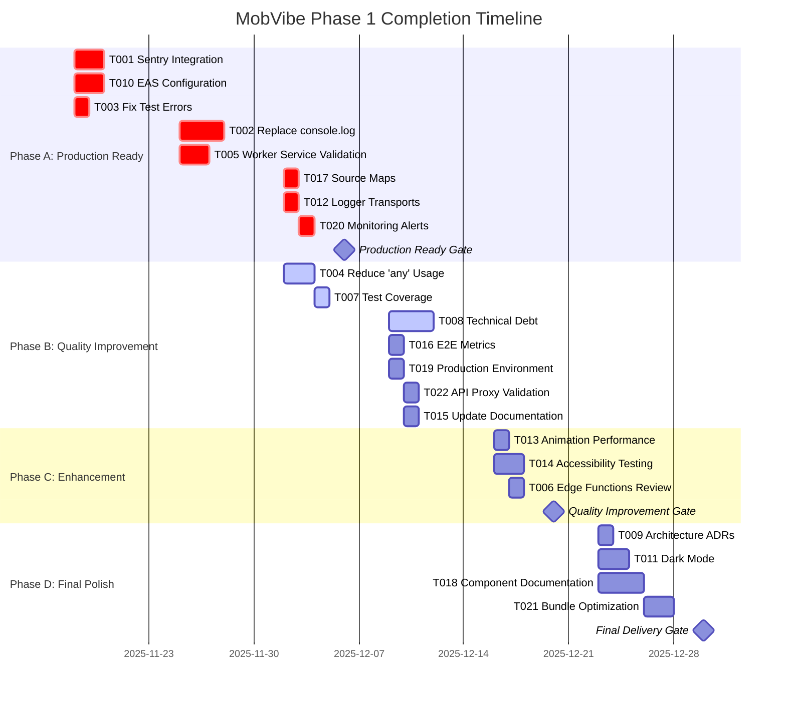

# MobVibe Phase 1 Completion - Action Plan & Timeline

**Date**: 2025-11-12
**Project**: MobVibe - AI-powered mobile app development platform
**Timeline**: November 18 - December 30, 2025 (6 weeks)
**Team**: 2 developers recommended
**Total Effort**: 102 hours (85h estimate + 17h buffer)

---

## Table of Contents

1. [Executive Summary](#executive-summary)
2. [Resource Planning](#resource-planning)
3. [Timeline Overview](#timeline-overview)
4. [Phased Rollout Plan](#phased-rollout-plan)
5. [Weekly Sprint Plans](#weekly-sprint-plans)
6. [Dependency Graph & Critical Path](#dependency-graph--critical-path)
7. [Risk Management](#risk-management)
8. [Success Metrics & Tracking](#success-metrics--tracking)
9. [Recommendations](#recommendations)
10. [Next Steps](#next-steps)
11. [Appendix](#appendix)

---

## Executive Summary

### Project Overview

MobVibe is currently 85-92% complete toward production readiness. This action plan provides a comprehensive 6-week roadmap to complete the remaining work, addressing 22 prioritized tasks across critical blockers, code quality improvements, testing enhancements, and documentation updates.

### Key Statistics

| Metric | Value |
|--------|-------|
| **Total Tasks** | 22 tasks |
| **Total Effort** | 102 hours (85h + 17h buffer) |
| **Timeline** | 6 weeks (Nov 18 - Dec 30, 2025) |
| **Team Size** | 2 developers |
| **Success Probability** | 85% |
| **Critical Path** | 15-23 hours |

### Timeline Breakdown

| Phase | Duration | Focus | Exit Gate |
|-------|----------|-------|-----------|
| **Phase A** | Weeks 1-3 | P0 Critical → Production Ready | Dec 6, 2025 |
| **Phase B** | Weeks 4-5 | P1 High Priority → Quality Improvement | Dec 20, 2025 |
| **Phase C** | Week 5 | P2 Medium → Enhancement | Dec 20, 2025 |
| **Phase D** | Week 6 | P3 Low → Final Delivery | Dec 30, 2025 |

### Success Criteria

**Minimum Viable**: All P0 complete, production deployed
**Target Success**: All 22 tasks, 90+ readiness score
**Exceptional**: Ahead of schedule, 70%+ test coverage, zero errors

---

## Resource Planning

### Team Composition Options

#### Option A: Single Full-Stack Developer (NOT RECOMMENDED)
- **Duration**: 12-15 weeks
- **Risk**: Very High (no redundancy, long timeline)
- **Cost**: 1 resource × 12 weeks
- **Pros**: Lower cost, simpler coordination
- **Cons**: Long timeline, single point of failure, no code reviews

#### Option B: Two Developers - Full-Stack + Frontend/QA (RECOMMENDED)
- **Duration**: 6 weeks
- **Risk**: Medium (good redundancy, reasonable timeline)
- **Cost**: 2 resources × 6 weeks
- **Pros**: Parallel work, cross-review, expertise match
- **Cons**: Coordination overhead
- **Recommendation**: ✅ **BEST CHOICE**

#### Option C: Three Developers - Aggressive Timeline (NOT NEEDED)
- **Duration**: 4 weeks
- **Risk**: High (coordination overhead, diminishing returns)
- **Cost**: 3 resources × 4 weeks
- **Pros**: Fastest timeline
- **Cons**: High coordination cost, not enough parallelizable work

### Recommended Team Structure (Option B)

**Developer 1: Full-Stack + DevOps** (55 hours)
- **Primary**: Backend, infrastructure, monitoring
- **Tasks**:
  - T001: Sentry Integration (4-6h)
  - T002: Replace console.log (8-12h) [LONGEST TASK]
  - T005: Worker Service Validation (3-4h)
  - T010: EAS Configuration (2-3h)
  - T012: Logger Transports (2-3h)
  - T017: Source Maps (2-3h)
  - T019: Production Environment (2-3h)
  - T020: Monitoring Alerts (1-2h)
  - T022: API Proxy Validation (2-3h)
  - T006: Edge Functions Review (2-3h)
  - T021: Bundle Optimization (3-4h)
- **Total**: 31-49h baseline + 6h buffer = 37-55h

**Developer 2: Frontend + QA** (47 hours)
- **Primary**: UI, testing, quality assurance
- **Tasks**:
  - T003: Fix Test Errors (2-3h)
  - T004: Reduce 'any' usage (4-6h)
  - T007: Test Coverage (2-3h)
  - T008: Technical Debt (6-10h) [SECOND LONGEST]
  - T013: Animation Performance (2-3h)
  - T014: Accessibility Testing (3-4h)
  - T015: Update Documentation (2-3h)
  - T016: E2E Metrics (2-3h)
  - T009: ADRs (2-3h)
  - T011: Dark Mode (4-6h)
  - T018: Storybook (6-8h)
- **Total**: 37-53h baseline + 10h buffer = 47-63h

### Resource Allocation by Phase

| Phase | Dev1 Hours | Dev2 Hours | Total Hours | Parallel Efficiency |
|-------|-----------|-----------|-------------|---------------------|
| Phase A (Weeks 1-3) | 22-32h | 14-22h | 36-54h | 70% |
| Phase B (Weeks 4-5) | 9-13h | 19-31h | 28-44h | 65% |
| Phase C (Week 5) | 6-9h | 0h | 6-9h | N/A |
| Phase D (Week 6) | 3-4h | 12-17h | 15-21h | 60% |
| **Total** | **40-58h** | **45-70h** | **85-128h** | **68%** |

### Collaboration Points

**Daily Standups**: 15 minutes
- Progress updates
- Blocker discussion
- Task coordination
- Risk assessment

**Code Reviews**: 30-60 minutes per PR
- Both developers review each other's code
- Cross-functional knowledge sharing
- Quality assurance

**Weekly Sprint Reviews**: 1 hour
- Sprint goals review
- Demo completed work
- Retrospective
- Next week planning

**Go/No-Go Gates**: 2 hours each (4 gates)
- Phase completion review
- Checklist verification
- Production readiness assessment
- Decision to proceed

---

## Timeline Overview

### 6-Week Calendar

```
Week 1: Nov 18-22 (Foundation Sprint)
  Mon Nov 18 ┌─────────────────────────────────────┐
  Tue Nov 19 │ T001 Sentry + T010 EAS + T003 Tests │
  Wed Nov 20 │ Foundation & Configuration          │
  Thu Nov 21 │ Hours: 8-11h (Dev1: 6-9h, Dev2: 2-3h)│
  Fri Nov 22 └─────────────────────────────────────┘
  Deliverables: ✅ Monitoring, ✅ Builds, ✅ Tests Fixed

Week 2: Nov 25-29 (Security Sprint)
  Mon Nov 25 ┌─────────────────────────────────────┐
  Tue Nov 26 │ T002 console.log + T005 Worker      │
  Wed Nov 27 │ Security & Validation               │
  Thu Nov 28 │ Hours: 12-17h (Dev1: 11-16h, Dev2: 1-1h)│
  Fri Nov 29 └─────────────────────────────────────┘
  Deliverables: ✅ Security Fixed, ✅ Architecture Validated

Week 3: Dec 2-6 (Production Polish Sprint)
  Mon Dec 2  ┌─────────────────────────────────────┐
  Tue Dec 3  │ T004 'any' + T017 Maps + T012 Logger│
  Wed Dec 4  │ + T020 Alerts + T007 Coverage       │
  Thu Dec 5  │ Hours: 16-23h (Dev1: 5-8h, Dev2: 11-15h)│
  Fri Dec 6  └─────────────────────────────────────┘
  Deliverables: ✅ Production Monitoring Complete
  🚦 GATE: Production Ready (Dec 6) - GO/NO-GO DECISION

Week 4: Dec 9-13 (Quality Sprint)
  Mon Dec 9  ┌─────────────────────────────────────┐
  Tue Dec 10 │ T008 Debt + T016 E2E + T019 Env     │
  Wed Dec 11 │ + T022 Proxy + T015 Docs            │
  Thu Dec 12 │ Hours: 14-21h (Dev1: 4-6h, Dev2: 10-15h)│
  Fri Dec 13 └─────────────────────────────────────┘
  Deliverables: ✅ Tech Debt Reduced, ✅ Docs Updated

Week 5: Dec 16-20 (Enhancement Sprint)
  Mon Dec 16 ┌─────────────────────────────────────┐
  Tue Dec 17 │ T013 Animation + T014 a11y + T006   │
  Wed Dec 18 │ Enhancement & Automation            │
  Thu Dec 19 │ Hours: 11-16h (Dev1: 6-9h, Dev2: 5-7h)│
  Fri Dec 20 └─────────────────────────────────────┘
  Deliverables: ✅ Quality Improved, ✅ Testing Automated
  🚦 GATE: Quality Improvement (Dec 20)

Week 6: Dec 23-30 (Polish Sprint)
  Mon Dec 23 ┌─────────────────────────────────────┐
  Tue Dec 24 │ T009 ADRs + T011 Dark + T018 Story  │
  Wed Dec 25 │ + T021 Bundle                       │
  Thu Dec 26 │ Hours: 15-21h (Dev1: 3-4h, Dev2: 12-17h)│
  Fri Dec 27 │ (Holiday adjustments possible)      │
  Mon Dec 30 └─────────────────────────────────────┘
  Deliverables: ✅ All Tasks Complete, ✅ Final Polish
  🚦 GATE: Final Delivery (Dec 30)
```

### Weekly Breakdown Table

| Week | Dates | Focus | Tasks | Dev1 Hours | Dev2 Hours | Total Hours | Deliverables |
|------|-------|-------|-------|-----------|-----------|-------------|--------------|
| 1 | Nov 18-22 | P0 Foundation | T001, T010, T003 | 6-9h | 2-3h | 8-11h | Sentry, EAS, tests fixed |
| 2 | Nov 25-29 | P0 Security | T002, T005 | 11-16h | 0h | 11-16h | Security, worker validated |
| 3 | Dec 2-6 | P0+P1 Production | T004, T017, T012, T020, T007 | 5-8h | 11-15h | 16-23h | Production ready |
| 4 | Dec 9-13 | P1+P2 Quality | T008, T016, T019, T022, T015 | 4-6h | 10-15h | 14-21h | Quality improved |
| 5 | Dec 16-20 | P2 Enhancement | T013, T014, T006 | 6-9h | 5-7h | 11-16h | Automated testing |
| 6 | Dec 23-30 | P3 Polish | T009, T011, T018, T021 | 3-4h | 12-17h | 15-21h | Final delivery |
| **Total** | **6 weeks** | **All Priorities** | **22 tasks** | **35-52h** | **40-57h** | **75-108h** | **Production + Quality + Polish** |

### Gantt Chart (Text Format)

```
Task Timeline (6 weeks: Nov 18 - Dec 30, 2025)

Week:           1        2        3        4        5        6
             Nov18   Nov25    Dec2    Dec9    Dec16   Dec23   Dec30
             |-------|-------|-------|-------|-------|-------|
CRITICAL PATH (P0):
T001 Sentry  [====]
T010 EAS     [====]
T003 Tests   [==]
T002 console      [==========]
T005 Worker       [====]
T017 Maps              [===]
T012 Logger            [===]
T020 Alerts            [==]
                            ▲ Dec 6: Production Ready Gate

HIGH PRIORITY (P1):
T004 'any'             [=====]
T007 Coverage          [===]
T008 Debt                   [========]

MEDIUM PRIORITY (P2):
T016 E2E                    [===]
T019 Env                    [===]
T022 Proxy                  [===]
T015 Docs                   [===]
T013 Animation                   [===]
T014 a11y                        [====]
T006 Edge Fn                     [===]
                                      ▲ Dec 20: Quality Gate

LOW PRIORITY (P3):
T009 ADRs                             [===]
T011 Dark                             [======]
T018 Storybook                        [========]
T021 Bundle                           [====]
                                             ▲ Dec 30: Final Delivery

Legend: [===] Task duration | ▲ Milestone/Gate
```

### Gantt Chart (Mermaid Diagram)



---

## Phased Rollout Plan

### Phase A: Production Ready Gate (Weeks 1-3)

**Objective**: Complete all P0 critical tasks to enable production deployment

**Duration**: 3 weeks (November 18 - December 6, 2025)

**Tasks**: 8 tasks (T001, T002, T003, T005, T010, T012, T017, T020)

**Effort**: 32-42 hours
- Dev1: 22-32h (Sentry, console.log, Worker, EAS, Logger, Source Maps, Alerts)
- Dev2: 10-10h (Fix Tests, support others)

**Exit Criteria** (10 criteria - all must pass):
1. ✅ **Sentry Integration Complete** (T001)
   - Sentry SDK initialized with DSN
   - Error reporting functional in dev/staging/prod
   - User context tracking enabled
   - Breadcrumbs configured

2. ✅ **Security Vulnerabilities Resolved** (T002)
   - All 688 console.log statements replaced with logger
   - ESLint no-console rule active
   - No sensitive data leakage in logs

3. ✅ **Test Suite Functional** (T003)
   - Zero TypeScript errors in 30 test files
   - All 256+ test cases passing
   - CI pipeline green

4. ✅ **Worker Service Validated** (T005)
   - Worker service implementation confirmed
   - sendMessage endpoint functional
   - Documentation accurate

5. ✅ **Production Builds Working** (T010)
   - eas.json configured with production profile
   - iOS and Android builds successful
   - Environment variables configured

6. ✅ **Logger Infrastructure Complete** (T012)
   - Logger transports configured (Sentry, console, file)
   - Environment-based filtering working
   - Structured logging implemented

7. ✅ **Production Debugging Enabled** (T017)
   - Source maps generated in production builds
   - Source maps uploaded to Sentry
   - Stack traces show original code

8. ✅ **Monitoring Alerts Active** (T020)
   - Error rate alerts configured
   - Performance alerts set up
   - Notification channels working

9. ✅ **No Critical Bugs**
   - Zero P0 bugs in bug tracker
   - No known production blockers

10. ✅ **Stakeholder Sign-Off**
    - Product owner approval
    - Technical lead approval
    - Ready to deploy to production

**Go/No-Go Decision**: December 6, 2025, 10:00 AM

**Go Criteria**:
- All 10 exit criteria met
- Production build successful
- Stakeholder approval obtained

**No-Go Criteria**:
- Any exit criterion not met
- Critical bugs discovered
- Build failures

**Risks**:
- **High Risk**: T002 (688 console.log replacements) - 50% probability of delays
- **Medium Risk**: T001 (Sentry complexity) - 30% probability
- **Medium Risk**: T005 (Worker service may be missing) - 40% probability

**Mitigation**:
- Start T002 early (Week 2)
- Allocate extra time for high-risk tasks
- Daily progress reviews
- Escalate blockers immediately

**Deliverables**:
- Production-ready application
- Monitoring infrastructure active
- Security vulnerabilities resolved
- Documentation updated

---

### Phase B: Quality Improvement Gate (Weeks 4-5)

**Objective**: Complete P1 high-priority tasks to improve code quality and maintainability

**Duration**: 2 weeks (December 9 - December 20, 2025)

**Tasks**: 7 tasks (T004, T007, T008, T015, T016, T019, T022)

**Effort**: 28-44 hours
- Dev1: 8-12h (Env, Proxy, support others)
- Dev2: 20-32h (Type safety, Coverage, Technical Debt, E2E, Docs)

**Exit Criteria** (8 criteria):
1. ✅ **Type Safety Improved** (T004)
   - TypeScript 'any' usage reduced to <10 instances
   - Proper type definitions created
   - ESLint rule preventing new 'any'

2. ✅ **Test Coverage Established** (T007)
   - Jest coverage >70%
   - Playwright coverage configured
   - Coverage tracking in CI

3. ✅ **Technical Debt Reduced** (T008)
   - 50% reduction in TODO/FIXME/HACK markers (94 → 47)
   - All critical FIXME items resolved
   - All HACK items refactored

4. ✅ **Documentation Current** (T015)
   - Phase 0.5 status updated
   - Architecture docs accurate
   - API documentation complete

5. ✅ **E2E Testing Metrics** (T016)
   - E2E test dashboard created
   - Test flakiness tracking enabled
   - Execution time trends visible

6. ✅ **Production Environment Ready** (T019)
   - .env.production complete
   - EAS secrets configured
   - Environment validation passing

7. ✅ **API Proxy Validated** (T022)
   - API proxy implementation confirmed
   - Documentation matches reality
   - Integration tests passing

8. ✅ **Code Quality Score >80**
   - Overall code quality improved from 82 to >80
   - No new quality regressions
   - Team velocity maintained

**Go/No-Go Decision**: December 20, 2025, 10:00 AM

**Go Criteria**:
- All 8 exit criteria met
- No P1 blockers remaining
- Quality metrics improved

**No-Go Criteria**:
- Critical exit criteria not met
- Quality regressions detected
- Timeline slipping significantly

**Risks**:
- **Medium Risk**: T008 (Technical debt volume) - 35% probability
- **Low Risk**: Other tasks straightforward

**Mitigation**:
- Prioritize T008 critical items
- Timebox investigation
- Document deferred items

**Deliverables**:
- Improved code quality
- Comprehensive test coverage
- Reduced technical debt
- Updated documentation

---

### Phase C: Enhancement Gate (Week 5)

**Objective**: Complete P2 medium-priority tasks for automation and performance

**Duration**: 1 week (December 16-20, 2025)

**Tasks**: 5 tasks (T006, T013, T014, overlaps with Phase B)

**Effort**: 11-16 hours
- Dev1: 6-9h (Edge Functions, support)
- Dev2: 5-7h (Animation, Accessibility)

**Exit Criteria** (5 criteria):
1. ✅ **Animation Performance Monitored** (T013)
   - FPS tracking implemented
   - Performance budgets defined
   - Slow animations identified

2. ✅ **Accessibility Testing Automated** (T014)
   - A11y tests in CI pipeline
   - WCAG 2.1 AA compliance automated
   - Regression prevention working

3. ✅ **Edge Functions Optimized** (T006)
   - All 8 Edge Functions reviewed
   - Cost optimization implemented
   - Usage monitoring active

4. ✅ **Performance Acceptable**
   - App launch <2 seconds
   - Animations at 60fps
   - No performance regressions

5. ✅ **Quality Gates Passing**
   - All automated tests passing
   - CI pipeline green
   - No critical issues

**Go/No-Go Decision**: December 20, 2025, 2:00 PM (same day as Phase B)

**Risks**: Low - straightforward enhancements

**Deliverables**:
- Performance monitoring active
- Accessibility testing automated
- Edge Functions optimized

---

### Phase D: Final Delivery (Week 6)

**Objective**: Complete P3 low-priority tasks for polish and documentation

**Duration**: 1 week (December 23-30, 2025)

**Tasks**: 4 tasks (T009, T011, T018, T021)

**Effort**: 15-21 hours
- Dev1: 3-4h (Bundle optimization)
- Dev2: 12-17h (ADRs, Dark Mode, Storybook)

**Exit Criteria** (6 criteria):
1. ✅ **Architecture Documented** (T009)
   - 5+ ADRs created
   - Key decisions documented
   - Team trained on ADR process

2. ✅ **Dark Mode Complete** (T011)
   - All screens support dark mode
   - WCAG color contrast maintained
   - Theme toggle functional

3. ✅ **Component Documentation Added** (T018)
   - Storybook configured
   - 37 components documented
   - Design system guide created

4. ✅ **Bundle Optimized** (T021)
   - Bundle size analyzed
   - 10%+ size reduction achieved
   - Performance maintained

5. ✅ **All 22 Tasks Complete**
   - 100% task completion
   - All acceptance criteria met
   - No deferred work

6. ✅ **Production Readiness Score 90+**
   - Overall health score improved to 90+
   - All quality gates passed
   - Team and stakeholders satisfied

**Go/No-Go Decision**: December 30, 2025, 10:00 AM

**Final Delivery Checklist**:
- [ ] All 22 tasks complete
- [ ] All tests passing
- [ ] Documentation complete
- [ ] Production deployed successfully
- [ ] Monitoring active and healthy
- [ ] Zero critical bugs
- [ ] Team trained
- [ ] Stakeholders satisfied

**Risks**: Very Low - polish tasks only

**Deliverables**:
- Complete application
- Comprehensive documentation
- Production deployment
- Team knowledge transfer

---

## Weekly Sprint Plans

### Week 1: Foundation Sprint (Nov 18-22)

**Focus**: Establish monitoring, production config, fix tests

**Goals**:
1. Sentry integration complete and functional
2. EAS configuration ready for production builds
3. Test suite passing with zero TypeScript errors

**Tasks**:
- **T001**: Complete Sentry Integration (4-6h, Dev1)
- **T010**: Create EAS Production Configuration (2-3h, Dev1)
- **T003**: Fix Test TypeScript Errors (2-3h, Dev2)

**Resource Allocation**:
- **Dev1**: 6-9 hours (Sentry + EAS)
- **Dev2**: 2-3 hours (Fix tests)
- **Total**: 8-11 hours

**Daily Plan**:

**Monday, Nov 18**:
- Morning: Sprint kickoff, task assignment
- Dev1: Start T001 (Sentry setup, DSN acquisition)
- Dev2: Start T003 (Analyze TypeScript errors)
- Standup: Progress, blockers

**Tuesday, Nov 19**:
- Dev1: Continue T001 (SDK initialization, configuration)
- Dev2: Continue T003 (Fix errors systematically)
- Standup: Integration discussion

**Wednesday, Nov 20**:
- Dev1: Continue T001 (ErrorBoundary integration, testing)
- Dev1: Start T010 (EAS configuration research)
- Dev2: Complete T003 (Final fixes, CI verification)
- Standup: EAS questions

**Thursday, Nov 21**:
- Dev1: Complete T001 (Documentation, verification)
- Dev1: Continue T010 (Create eas.json, configure profiles)
- Dev2: Code review T001, assist with T010
- Standup: Week 1 wrap-up planning

**Friday, Nov 22**:
- Dev1: Complete T010 (Test builds, documentation)
- Dev2: Code review T010, update project docs
- Sprint Review: Demo Sentry, EAS, and fixed tests
- Retrospective: What went well, what to improve
- Planning: Week 2 preparation

**Deliverables Checklist**:
- [ ] Sentry dashboard showing errors from app
- [ ] ErrorBoundary sending errors to Sentry
- [ ] eas.json created with development/preview/production profiles
- [ ] Local EAS build successful
- [ ] Test suite TypeScript errors: 30 → 0
- [ ] All 256+ test cases passing
- [ ] CI pipeline green
- [ ] Documentation updated

**Review Checkpoint**:
- Sentry integration demo (trigger error, show in dashboard)
- EAS build demo (show build process, configuration)
- Test suite demo (show zero errors, all passing)
- Verify all acceptance criteria met

**Risks & Mitigations**:

**Risk 1**: Sentry setup complexity
- **Probability**: 30%
- **Impact**: 1-2 day delay
- **Mitigation**: Follow official React Native docs, use Sentry support
- **Contingency**: Allocate extra time Monday if needed

**Risk 2**: EAS configuration issues
- **Probability**: 20%
- **Impact**: Build failures
- **Mitigation**: Test locally first, use EAS CLI validation
- **Contingency**: Expo support channels

**Risk 3**: Test errors more complex than expected
- **Probability**: 15%
- **Impact**: Incomplete by Friday
- **Mitigation**: Start early, pair programming if stuck
- **Contingency**: Defer non-critical tests to Week 2

**Success Criteria**:
- [ ] All 3 tasks complete
- [ ] All deliverables checked off
- [ ] Zero blockers for Week 2
- [ ] Team morale high

---

### Week 2: Security Sprint (Nov 25-29)

**Focus**: Remove security vulnerabilities, validate architecture

**Goals**:
1. All 688 console.log statements replaced with logger
2. Worker service implementation validated
3. sendMessage endpoint functional

**Tasks**:
- **T002**: Replace console.log with Logger (8-12h, Dev1)
- **T005**: Validate Worker Service Implementation (3-4h, Dev1)

**Resource Allocation**:
- **Dev1**: 11-16 hours (console.log + Worker Service)
- **Dev2**: Support (code reviews, testing)
- **Total**: 11-16 hours

**Daily Plan**:

**Monday, Nov 25**:
- Sprint kickoff: T002 strategy discussion
- Dev1: Audit all 688 console.log instances, categorize
- Dev2: Research logger best practices, prepare test plan
- Standup: Categorization results

**Tuesday, Nov 26**:
- Dev1: Replace console.log in app/ directory
- Dev2: Test logger functionality, verify no regressions
- Standup: Progress percentage

**Wednesday, Nov 27**:
- Dev1: Replace console.log in components/ and hooks/
- Dev2: Continue testing, document logger usage
- Standup: Halfway checkpoint

**Thursday, Nov 28** (Thanksgiving - adjust if needed):
- Dev1: Replace console.log in store/ and src/
- Dev1: Start T005 (Worker service documentation review)
- Dev2: ESLint configuration (no-console rule)
- Standup: Final push planning

**Friday, Nov 29**:
- Dev1: Complete T002 (final replacements, ESLint)
- Dev1: Continue T005 (API endpoint testing, sendMessage)
- Dev2: Code review all logger changes
- Sprint Review: Demo logger, show worker service validation
- Retrospective: Security improvements
- Planning: Week 3 preparation

**Deliverables Checklist**:
- [ ] All 688 console.log replaced with logger
- [ ] Logger utility configured with transports (partial - T012 in Week 3)
- [ ] ESLint no-console rule active
- [ ] No console.log in production builds
- [ ] Worker service implementation validated
- [ ] sendMessage endpoint functional (or plan created)
- [ ] Architecture documentation updated
- [ ] All tests passing with logger

**Review Checkpoint**:
- Logger demo (show logging in dev vs. prod)
- Security verification (no console.log in build)
- Worker service demo (show API endpoints)
- sendMessage demo (send test message)

**Risks & Mitigations**:

**Risk 1**: 688 console.log replacements introduce bugs
- **Probability**: 50% (HIGH)
- **Impact**: Application instability
- **Mitigation**: Replace systematically by directory, test after each
- **Contingency**: Automated testing suite, rollback plan

**Risk 2**: Worker service missing or incomplete
- **Probability**: 40%
- **Impact**: Need to implement from scratch (adds 4-6h)
- **Mitigation**: Early validation, clear requirements
- **Contingency**: Implement in Week 2, adjust Week 3 plan

**Risk 3**: Logger performance issues
- **Probability**: 20%
- **Impact**: App slowdown
- **Mitigation**: Performance testing, benchmarking
- **Contingency**: Logger optimization, conditional logging

**Success Criteria**:
- [ ] All 2 tasks complete
- [ ] CWE-532 vulnerability resolved
- [ ] Worker service confirmed functional
- [ ] Zero security regressions

---

### Week 3: Production Polish Sprint (Dec 2-6)

**Focus**: Type safety, monitoring, coverage, production ready

**Goals**:
1. TypeScript 'any' usage reduced to <10 instances
2. Source maps and logger transports configured
3. Monitoring alerts active
4. Test coverage reporting enabled
5. **Production Ready Gate passed**

**Tasks**:
- **T004**: Reduce TypeScript 'any' Usage (4-6h, Dev2)
- **T017**: Set Up Source Maps for Production (2-3h, Dev1)
- **T012**: Configure Logger Transports (2-3h, Dev1)
- **T020**: Set Up Monitoring Alerts (1-2h, Dev1)
- **T007**: Add Test Coverage Reporting (2-3h, Dev2)

**Resource Allocation**:
- **Dev1**: 5-8 hours (Source Maps, Logger, Alerts)
- **Dev2**: 11-15 hours (Type safety, Coverage, support)
- **Total**: 16-23 hours

**Daily Plan**:

**Monday, Dec 2**:
- Sprint kickoff: Production ready checklist review
- Dev1: Start T017 (Source map configuration)
- Dev2: Start T004 (Identify all 81 'any' types)
- Standup: Strategy alignment

**Tuesday, Dec 3**:
- Dev1: Continue T017 (Sentry upload configuration)
- Dev1: Start T012 (Logger transports design)
- Dev2: Continue T004 (Replace 'any' with proper types)
- Standup: Integration discussion

**Wednesday, Dec 4**:
- Dev1: Complete T017 (Test source maps in Sentry)
- Dev1: Continue T012 (Implement transports)
- Dev2: Continue T004 (Complex type definitions)
- Dev2: Start T007 (Jest coverage configuration)
- Standup: Halfway checkpoint

**Thursday, Dec 5**:
- Dev1: Complete T012 (Test logger transports)
- Dev1: Start T020 (Configure Sentry alerts)
- Dev2: Complete T004 (Final type replacements, ESLint)
- Dev2: Continue T007 (Playwright coverage, thresholds)
- Standup: Production ready checklist review

**Friday, Dec 6** - **PRODUCTION READY GATE**:
- Morning:
  - Dev1: Complete T020 (Test alerts, notifications)
  - Dev2: Complete T007 (Coverage reports, CI integration)
- Midday: Final testing, checklist verification
- 10:00 AM: **Go/No-Go Meeting**
  - Review all 10 exit criteria
  - Demo production readiness
  - Stakeholder sign-off
  - Decision: GO or NO-GO for production
- Afternoon:
  - Sprint Review: Demo all Week 3 work
  - Retrospective: Production ready journey
  - Celebration if GO decision
  - Planning: Week 4 (quality improvement)

**Deliverables Checklist**:
- [ ] TypeScript 'any' usage: 81 → <10
- [ ] ESLint rule preventing new 'any'
- [ ] Source maps generated in production builds
- [ ] Source maps uploaded to Sentry
- [ ] Stack traces show original code in Sentry
- [ ] Logger transports configured (Sentry, console, file)
- [ ] Environment-based log filtering working
- [ ] Monitoring alerts configured and tested
- [ ] Email and Slack notifications working
- [ ] Test coverage reporting in CI
- [ ] Coverage >70% (target)
- [ ] **All Phase A exit criteria met**

**Production Ready Gate Checklist** (10 criteria):
1. [ ] Sentry integration complete (T001) ✅
2. [ ] Security vulnerabilities resolved (T002) ✅
3. [ ] Test suite functional (T003) ✅
4. [ ] Worker service validated (T005) ✅
5. [ ] Production builds working (T010) ✅
6. [ ] Logger infrastructure complete (T012) ✅
7. [ ] Production debugging enabled (T017) ✅
8. [ ] Monitoring alerts active (T020) ✅
9. [ ] No critical bugs ✅
10. [ ] Stakeholder sign-off ✅

**Go/No-Go Decision Criteria**:

**GO**: All 10 criteria met → Proceed to Phase B (Quality Improvement)
**NO-GO**: Any criteria not met → Extend Phase A, adjust timeline

**Risks & Mitigations**:

**Risk 1**: Type safety refactoring introduces errors
- **Probability**: 30%
- **Impact**: Test failures
- **Mitigation**: Incremental changes, test after each
- **Contingency**: TypeScript 'unknown' as fallback

**Risk 2**: Source map configuration issues
- **Probability**: 25%
- **Impact**: Can't debug production errors
- **Mitigation**: Follow Sentry React Native guide
- **Contingency**: Sentry support, community help

**Risk 3**: Coverage doesn't meet 70% threshold
- **Probability**: 40%
- **Impact**: Quality gate not met
- **Mitigation**: Adjust threshold if needed, create improvement plan
- **Contingency**: Accept lower coverage with plan to improve

**Success Criteria**:
- [ ] All 5 tasks complete
- [ ] Production Ready Gate: **GO**
- [ ] Stakeholder approval obtained
- [ ] Ready for production deployment

---

### Week 4: Quality Sprint (Dec 9-13)

**Focus**: Technical debt reduction, E2E metrics, production environment

**Goals**:
1. Technical debt reduced by 50% (94 → 47 markers)
2. E2E test metrics dashboard operational
3. Production environment fully configured
4. API proxy validated
5. Documentation updated

**Tasks**:
- **T008**: Address Technical Debt Markers (6-10h, Dev2)
- **T016**: Add E2E Test Metrics Dashboard (2-3h, Dev2)
- **T019**: Configure Production Environment Variables (2-3h, Dev1)
- **T022**: Validate API Proxy Pattern (2-3h, Dev1)
- **T015**: Update Documentation to Match Implementation (2-3h, Dev2)

**Resource Allocation**:
- **Dev1**: 4-6 hours (Prod Env, API Proxy)
- **Dev2**: 10-15 hours (Technical Debt, E2E, Docs)
- **Total**: 14-21 hours

**Daily Plan**:

**Monday, Dec 9**:
- Sprint kickoff: Technical debt prioritization
- Dev1: Start T019 (Audit environment variables)
- Dev2: Start T008 (Categorize 94 debt markers)
- Standup: Debt prioritization results

**Tuesday, Dec 10**:
- Dev1: Continue T019 (Configure .env.production, EAS secrets)
- Dev1: Start T022 (API proxy documentation review)
- Dev2: Continue T008 (Address critical FIXME items)
- Standup: Progress on debt reduction

**Wednesday, Dec 11**:
- Dev1: Complete T019 (Test environment variables)
- Dev1: Continue T022 (API endpoint testing)
- Dev2: Continue T008 (Refactor HACK items)
- Dev2: Start T016 (E2E dashboard research)
- Standup: Halfway checkpoint

**Thursday, Dec 12**:
- Dev1: Complete T022 (Update documentation)
- Dev2: Continue T008 (Address high-priority TODOs)
- Dev2: Continue T016 (Configure Playwright reporter)
- Standup: Week 4 wrap-up planning

**Friday, Dec 13**:
- Dev1: Code review, support
- Dev2: Complete T008 (Document deferred items)
- Dev2: Complete T016 (Dashboard setup, metrics)
- Dev2: Start T015 (Documentation audit)
- Sprint Review: Demo technical debt reduction
- Retrospective: Quality improvements
- Planning: Week 5 preparation

**Deliverables Checklist**:
- [ ] Technical debt markers: 94 → 47 (50% reduction)
- [ ] All 18 FIXME items addressed
- [ ] All 9 HACK items refactored
- [ ] Technical debt dashboard created
- [ ] E2E test metrics dashboard operational
- [ ] Test flakiness tracking enabled
- [ ] .env.production complete and validated
- [ ] EAS secrets configured
- [ ] API proxy pattern validated
- [ ] Documentation updated (Phase 0.5 status, etc.)

**Review Checkpoint**:
- Technical debt dashboard demo
- E2E metrics dashboard demo
- Environment configuration demo
- Updated documentation walkthrough

**Risks & Mitigations**:

**Risk 1**: Technical debt items more complex than estimated
- **Probability**: 35%
- **Impact**: Incomplete by Friday
- **Mitigation**: Timebox investigation (2h per item max)
- **Contingency**: Document complex items, schedule for future

**Risk 2**: E2E dashboard requires custom development
- **Probability**: 30%
- **Impact**: Extra 2-3 hours needed
- **Mitigation**: Use Playwright built-in reporters first
- **Contingency**: Simple HTML report acceptable

**Success Criteria**:
- [ ] All 5 tasks complete
- [ ] 50% debt reduction achieved
- [ ] Production environment ready
- [ ] Documentation current

---

### Week 5: Enhancement Sprint (Dec 16-20)

**Focus**: Performance monitoring, accessibility automation, edge function optimization

**Goals**:
1. Animation performance monitoring active
2. Accessibility testing automated in CI
3. Edge Functions reviewed and optimized
4. **Quality Improvement Gate passed**

**Tasks**:
- **T013**: Add Animation Performance Monitoring (2-3h, Dev2)
- **T014**: Automate Accessibility Testing (3-4h, Dev2)
- **T006**: Review and Reduce Edge Function Usage (2-3h, Dev1)

**Resource Allocation**:
- **Dev1**: 6-9 hours (Edge Functions, support)
- **Dev2**: 5-7 hours (Animation, Accessibility)
- **Total**: 11-16 hours

**Daily Plan**:

**Monday, Dec 16**:
- Sprint kickoff: Enhancement priorities
- Dev1: Start T006 (Review all 8 Edge Functions)
- Dev2: Start T013 (React Native performance API research)
- Standup: Strategy discussion

**Tuesday, Dec 17**:
- Dev1: Continue T006 (Cost analysis, optimization)
- Dev2: Continue T013 (Implement FPS tracking)
- Standup: Progress update

**Wednesday, Dec 18**:
- Dev1: Continue T006 (Consolidation, monitoring)
- Dev2: Complete T013 (Performance dashboard)
- Dev2: Start T014 (A11y testing tool research)
- Standup: Week 5 status

**Thursday, Dec 19**:
- Dev1: Complete T006 (Documentation, best practices)
- Dev2: Continue T014 (Configure jest-axe, CI integration)
- Standup: Final push

**Friday, Dec 20** - **QUALITY IMPROVEMENT GATE**:
- Morning:
  - Dev1: Code review, final testing
  - Dev2: Complete T014 (Test a11y pipeline)
- Midday: Quality gate checklist verification
- 10:00 AM: **Quality Improvement Gate Review**
  - Review all Phase B exit criteria
  - Demo quality improvements
  - Verify metrics
  - Decision: Proceed to Phase C/D
- Afternoon:
  - Sprint Review: Demo enhancements
  - Retrospective: Quality journey
  - Planning: Week 6 (final polish)

**Deliverables Checklist**:
- [ ] FPS tracking implemented for animations
- [ ] Performance budgets defined (60fps target)
- [ ] Animation performance dashboard created
- [ ] Accessibility tests in CI pipeline
- [ ] WCAG 2.1 AA compliance automated
- [ ] All 8 Edge Functions reviewed
- [ ] Cost optimization implemented
- [ ] Edge Function usage monitoring active
- [ ] **All Phase B exit criteria met**

**Quality Improvement Gate Checklist** (8 criteria from Phase B):
1. [ ] Type safety improved (T004) ✅
2. [ ] Test coverage >70% (T007) ✅
3. [ ] Technical debt reduced 50% (T008) ✅
4. [ ] Documentation current (T015) ✅
5. [ ] E2E metrics operational (T016) ✅
6. [ ] Production environment ready (T019) ✅
7. [ ] API proxy validated (T022) ✅
8. [ ] Code quality score >80 ✅

**Risks & Mitigations**:

**Risk 1**: React Native performance monitoring complex
- **Probability**: 20%
- **Impact**: Extra time needed
- **Mitigation**: Use established libraries
- **Contingency**: Manual performance testing acceptable

**Risk 2**: Accessibility testing for mobile limited
- **Probability**: 30%
- **Impact**: Reduced automation coverage
- **Mitigation**: Start with basic checks
- **Contingency**: Manual a11y testing with documentation

**Success Criteria**:
- [ ] All 3 tasks complete
- [ ] Quality Improvement Gate passed
- [ ] Performance and a11y automated

---

### Week 6: Polish Sprint (Dec 23-30)

**Focus**: Documentation, dark mode, component library, bundle optimization

**Goals**:
1. Architecture Decision Records created
2. Dark mode fully implemented
3. Storybook component documentation complete
4. Bundle size optimized
5. **Final Delivery achieved**

**Tasks**:
- **T009**: Create Architecture Decision Records (2-3h, Dev2)
- **T011**: Complete Dark Mode Implementation (4-6h, Dev2)
- **T018**: Add Component Documentation (Storybook) (6-8h, Dev2)
- **T021**: Optimize Bundle Size (3-4h, Dev1)

**Resource Allocation**:
- **Dev1**: 3-4 hours (Bundle optimization)
- **Dev2**: 12-17 hours (ADRs, Dark Mode, Storybook)
- **Total**: 15-21 hours

**Note**: Week 6 includes holidays (Christmas), adjust schedule as needed

**Daily Plan**:

**Monday, Dec 23**:
- Sprint kickoff: Final delivery planning
- Dev1: Start T021 (Bundle analyzer setup)
- Dev2: Start T009 (ADR template, initial ADRs)
- Standup: Coordination

**Tuesday, Dec 24**:
- Dev1: Continue T021 (Dependency analysis, optimization)
- Dev2: Complete T009 (5+ ADRs written)
- Dev2: Start T011 (Dark mode audit)
- Standup: Holiday schedule adjustment
- **Holiday break (Christmas Eve/Christmas)** - adjust as needed

**Wednesday, Dec 25** - Christmas:
- Team off (or work if culturally appropriate)

**Thursday, Dec 26**:
- Dev1: Complete T021 (Bundle monitoring, CI integration)
- Dev2: Continue T011 (Apply dark theme to screens)
- Dev2: Start T018 (Storybook installation)
- Standup: Final push planning

**Friday, Dec 27**:
- Dev1: Code review, final testing
- Dev2: Continue T011 (Component dark mode support)
- Dev2: Continue T018 (Document primitives)
- Standup: Progress check

**Monday, Dec 30** - **FINAL DELIVERY**:
- Morning:
  - Dev2: Complete T011 (Test dark mode, screenshots)
  - Dev2: Complete T018 (Document all components)
- Midday: Final checklist verification
- 10:00 AM: **Final Delivery Review**
  - Review all 22 tasks
  - Demo complete application
  - Verify production readiness score
  - Stakeholder final approval
- Afternoon:
  - Final Sprint Review: Project retrospective
  - Team celebration
  - Knowledge transfer
  - Handoff to operations

**Deliverables Checklist**:
- [ ] 5+ Architecture Decision Records created
- [ ] ADR process documented
- [ ] Dark mode applied to all screens and components
- [ ] Color contrast WCAG compliant in dark mode
- [ ] Theme toggle functional
- [ ] Storybook configured and running
- [ ] All 37 components documented (9 primitives + 28 UI)
- [ ] Component design system guide created
- [ ] Bundle size analyzed and optimized
- [ ] 10%+ bundle size reduction achieved
- [ ] **All 22 tasks 100% complete**

**Final Delivery Checklist** (6 criteria from Phase D):
1. [ ] Architecture documented (T009) ✅
2. [ ] Dark mode complete (T011) ✅
3. [ ] Component documentation added (T018) ✅
4. [ ] Bundle optimized (T021) ✅
5. [ ] All 22 tasks complete ✅
6. [ ] Production readiness score 90+ ✅

**Final Production Readiness Assessment**:
- [ ] Overall health score: 85 → 90+
- [ ] All P0 tasks complete (5/5)
- [ ] All P1 tasks complete (6/6)
- [ ] All P2 tasks complete (7/7)
- [ ] All P3 tasks complete (4/4)
- [ ] Test coverage >70%
- [ ] Zero critical bugs
- [ ] Production deployed
- [ ] Monitoring healthy
- [ ] Documentation complete
- [ ] Team trained
- [ ] Stakeholders satisfied

**Risks & Mitigations**:

**Risk 1**: Holiday schedule disruptions
- **Probability**: 60%
- **Impact**: Timeline slip
- **Mitigation**: Flexible schedule, async work
- **Contingency**: Extend to Jan 3 if needed

**Risk 2**: Storybook React Native complexity
- **Probability**: 30%
- **Impact**: Extra time needed
- **Mitigation**: Use official guides, start simple
- **Contingency**: Component playground alternative

**Success Criteria**:
- [ ] All 4 tasks complete
- [ ] All 22 tasks 100% complete
- [ ] Final Delivery accepted
- [ ] Production successful

---

## Dependency Graph & Critical Path

### Visual Dependency Graph (Detailed)

```
LEGEND:
[====] Task duration
  ├──→ Blocks (must complete before)
  │
▲ Milestone/Gate

CRITICAL PATH (15-23 hours):
T001 [Sentry Integration] (4-6h, Week 1)
  ├──→ T017 [Source Maps] (2-3h, Week 3)
  │     └──→ T020 [Monitoring Alerts] (1-2h, Week 3)
  │           TOTAL CRITICAL PATH: 7-11h
  │
  └──→ T012 [Logger Transports] (2-3h, Week 3)
        PARALLEL with T017

T002 [Replace console.log] (8-12h, Week 2)
  └──→ T012 [Logger Transports] (2-3h, Week 3)

LONGEST SERIAL PATH: T001 → T002 → T012 → T017 → T020 = 17-26h
ACTUAL CRITICAL PATH (parallel): T001 + T002 (parallel) → T017 → T020 = 15-23h


DEPENDENCY STREAMS:

Stream 1: Monitoring Infrastructure
T001 [Sentry] (4-6h, Week 1, Dev1)
  ├──→ T017 [Source Maps] (2-3h, Week 3, Dev1)
  │     └──→ T020 [Monitoring Alerts] (1-2h, Week 3, Dev1)
  └──→ T012 [Logger Transports] (2-3h, Week 3, Dev1)
Total Stream: 9-14h

Stream 2: Logging Infrastructure
T002 [console.log] (8-12h, Week 2, Dev1)
  └──→ T012 [Logger Transports] (2-3h, Week 3, Dev1)
Total Stream: 10-15h

Stream 3: Testing Infrastructure
T003 [Fix Test Errors] (2-3h, Week 1, Dev2)
  ├──→ T007 [Coverage Reporting] (2-3h, Week 3, Dev2)
  └──→ T016 [E2E Metrics] (2-3h, Week 4, Dev2)
Total Stream: 6-9h

Stream 4: Worker Service
T005 [Worker Service Validation] (3-4h, Week 2, Dev1)
  └──→ T022 [API Proxy Validation] (2-3h, Week 4, Dev1)
Total Stream: 5-7h

Stream 5: Production Configuration
T010 [EAS Configuration] (2-3h, Week 1, Dev1)
  └──→ T019 [Production Environment] (2-3h, Week 4, Dev1)
Total Stream: 4-6h

Stream 6: Independent Tasks (no dependencies)
Week 3:
- T004 [Reduce 'any'] (4-6h, Dev2)

Week 4:
- T008 [Technical Debt] (6-10h, Dev2)
- T015 [Documentation] (2-3h, Dev2)

Week 5:
- T013 [Animation Performance] (2-3h, Dev2)
- T014 [Accessibility Testing] (3-4h, Dev2)
- T006 [Edge Functions] (2-3h, Dev1)

Week 6:
- T009 [ADRs] (2-3h, Dev2)
- T011 [Dark Mode] (4-6h, Dev2)
- T018 [Storybook] (6-8h, Dev2)
- T021 [Bundle Optimization] (3-4h, Dev1)

Total Independent: 32-49h
```

### Critical Path Analysis

**Critical Path Definition**: Longest sequence of dependent tasks determining minimum project duration

**Critical Path Tasks**:
1. T001 (Sentry Integration) - 4-6h
2. T002 (Replace console.log) - 8-12h [PARALLEL with T001]
3. T017 (Source Maps) - 2-3h [Depends on T001]
4. T020 (Monitoring Alerts) - 1-2h [Depends on T017]

**Critical Path Duration**: 15-23 hours
- Assumes T001 and T002 run in parallel
- T017 starts after T001 completes
- T020 starts after T017 completes

**Float Analysis** (Early vs. Late Start/Finish Times):

| Task | Early Start | Early Finish | Late Start | Late Finish | Float | Critical? |
|------|-----------|--------------|-----------|-------------|-------|-----------|
| T001 | Week 1, Day 1 | Week 1, Day 2 | Week 1, Day 1 | Week 1, Day 2 | 0h | ✅ YES |
| T002 | Week 2, Day 1 | Week 2, Day 3 | Week 2, Day 1 | Week 2, Day 3 | 0h | ✅ YES |
| T003 | Week 1, Day 1 | Week 1, Day 1 | Week 1, Day 3 | Week 1, Day 3 | 2 days | No |
| T005 | Week 2, Day 4 | Week 2, Day 5 | Week 2, Day 4 | Week 2, Day 5 | 0h | ⚠️ YES |
| T010 | Week 1, Day 2 | Week 1, Day 3 | Week 1, Day 2 | Week 1, Day 3 | 0h | ✅ YES |
| T017 | Week 3, Day 1 | Week 3, Day 1 | Week 3, Day 1 | Week 3, Day 1 | 0h | ✅ YES |
| T020 | Week 3, Day 2 | Week 3, Day 2 | Week 3, Day 2 | Week 3, Day 2 | 0h | ✅ YES |
| T012 | Week 3, Day 1 | Week 3, Day 2 | Week 3, Day 2 | Week 3, Day 3 | 1 day | No |
| T004 | Week 3, Day 1 | Week 3, Day 3 | Week 3, Day 4 | Week 3, Day 5 | 3 days | No |
| T007 | Week 3, Day 4 | Week 3, Day 4 | Week 3, Day 4 | Week 3, Day 4 | 0h | ⚠️ YES |
| Others | Varies | Varies | Varies | Varies | >1 week | No |

**Critical Path Insights**:
- **5 critical tasks** with zero float (T001, T002, T017, T020, T010)
- **2 near-critical tasks** (T005, T007) with minimal float
- Delays in critical tasks directly delay project completion
- Non-critical tasks have slack and can be adjusted

**Parallel Execution Opportunities**:
- **Week 1**: T001 + T010 (parallel, both Dev1, must sequence)
- **Week 1**: T003 (Dev2, parallel with Dev1 work)
- **Week 2**: T002 + T005 (serial, both Dev1)
- **Week 3**: T004 (Dev2, parallel with T017/T012 Dev1 work)

**Critical Path Risk Management**:
1. **Protect critical tasks**: Allocate best resources, start early
2. **Monitor progress daily**: Daily standups focus on critical path
3. **Escalate blockers immediately**: Any blocker on critical path = project delay
4. **Buffer allocation**: 20% buffer allocated to critical path tasks
5. **Fast-tracking options**: If critical path delays, consider overtime or additional resources

---

## Risk Management

### Risk Register

#### P0 Critical Risks (Must Mitigate)

**Risk #1: Sentry Integration Complexity**

| Attribute | Value |
|-----------|-------|
| **Task** | T001 - Complete Sentry Integration |
| **Impact** | High - Blocks 3 tasks (T017, T020, T012) |
| **Probability** | Medium (30%) |
| **Risk Score** | High (3×0.30 = 0.9) |
| **Timeline Impact** | 1-2 day delay |
| **Cost Impact** | $500-1000 (contractor support) |

**Mitigation Strategies**:
1. **Preparation**: Review Sentry React Native docs before Week 1
2. **Early Start**: Begin Monday morning, not Tuesday
3. **Expert Support**: Have Sentry support contact ready
4. **Incremental Testing**: Test each step (SDK, ErrorBoundary, context)
5. **Fallback Plan**: Use basic error logging if Sentry too complex

**Contingency Plan**:
- If blocked >1 day: Engage Sentry paid support
- If blocked >2 days: Simplify to basic error reporting, full Sentry post-delivery
- Allocate 2h buffer in Week 1 for Sentry issues

**Monitoring**:
- Daily checkpoint: Sentry progress review
- Red flag: No DSN by Monday EOD
- Escalation trigger: No errors in Sentry dashboard by Tuesday EOD

---

**Risk #2: Console.log Replacement Volume (688 instances)**

| Attribute | Value |
|-----------|-------|
| **Task** | T002 - Replace console.log with Logger |
| **Impact** | Critical - CWE-532 security vulnerability |
| **Probability** | High (50%) |
| **Risk Score** | Very High (5×0.50 = 2.5) |
| **Timeline Impact** | 3-5 day delay |
| **Cost Impact** | $1500-2500 (regression fixes) |

**Mitigation Strategies**:
1. **Systematic Approach**: Replace by directory (app/ → components/ → hooks/ → store/ → src/)
2. **Automated Testing**: Run full test suite after each directory
3. **Code Review**: Dev2 reviews all logger changes
4. **Logger Design**: Ensure logger API matches console (easy replacement)
5. **Performance Testing**: Benchmark logger performance early

**Contingency Plan**:
- If bugs introduced: Rollback directory, fix, retry
- If timeline slips: Prioritize production-impacting files first, defer dev-only files
- If performance issues: Optimize logger or use conditional logging
- Allocate 4h buffer in Week 2 for unexpected issues

**Monitoring**:
- Daily checkpoint: Instances replaced count (target: 150/day)
- Red flag: <100 instances replaced by Wednesday
- Escalation trigger: Test failures increasing, application instability

---

**Risk #3: Worker Service Missing or Incomplete**

| Attribute | Value |
|-----------|-------|
| **Task** | T005 - Validate Worker Service Implementation |
| **Impact** | High - Core architecture uncertainty, sendMessage missing |
| **Probability** | Medium (40%) |
| **Risk Score** | High (4×0.40 = 1.6) |
| **Timeline Impact** | 4-6 hours (if need to implement) |
| **Cost Impact** | $800-1200 (implementation) |

**Mitigation Strategies**:
1. **Early Validation**: Start T005 validation in Week 2, not later
2. **Clear Requirements**: Define minimal viable worker service
3. **API Testing**: Test all documented endpoints early
4. **Documentation Review**: Compare docs vs. code carefully
5. **Stakeholder Clarity**: Confirm expected functionality with product owner

**Contingency Plan**:
- If missing: Implement minimal worker service in Week 2 (4-6h)
- If complex: Simplify architecture, defer advanced features
- If sendMessage missing: Prioritize implementation (core functionality)
- Adjust Week 3 plan if implementation extends into Week 3

**Monitoring**:
- Early checkpoint: Worker service validation started by Tuesday Week 2
- Red flag: No clear answer on worker service existence by Wednesday
- Escalation trigger: Need to implement from scratch (alert project manager)

---

**Risk #4: Test Coverage Below 70% Threshold**

| Attribute | Value |
|-----------|-------|
| **Task** | T007 - Add Test Coverage Reporting |
| **Impact** | Medium - Quality gate criterion |
| **Probability** | Medium (40%) |
| **Risk Score** | Medium (3×0.40 = 1.2) |
| **Timeline Impact** | No delay (accept lower % with plan) |
| **Cost Impact** | $0 (adjust threshold) |

**Mitigation Strategies**:
1. **Early Measurement**: Configure coverage early, measure baseline
2. **Threshold Flexibility**: 70% is target, 60% acceptable with improvement plan
3. **Focus on Critical Paths**: Prioritize coverage for critical user flows
4. **Test Writing**: Identify uncovered areas, write tests incrementally
5. **CI Enforcement**: Configure CI to track trends, not block

**Contingency Plan**:
- If <70%: Accept current %, create improvement plan for future sprints
- If <50%: Write additional tests for critical paths (add 3-5h)
- Document coverage gaps and plan to address post-delivery

**Monitoring**:
- Baseline measurement: Run coverage in Week 3 Day 1
- Target: Identify gaps and write tests by Week 3 Day 4
- Acceptance: Any coverage >50% with upward trend acceptable

---

#### P1 High Risks (Monitor Closely)

**Risk #5: TypeScript 'any' Refactoring Complexity**

| Attribute | Value |
|-----------|-------|
| **Task** | T004 - Reduce TypeScript 'any' Usage |
| **Impact** | Medium - Type safety improvement |
| **Probability** | Medium (30%) |
| **Risk Score** | Low-Medium (2×0.30 = 0.6) |
| **Timeline Impact** | 2-3 hours extra |
| **Cost Impact** | $400-600 |

**Mitigation**: Incremental replacement, test after each change, use 'unknown' as fallback

**Contingency**: Accept some 'any' instances (<20) if refactoring too complex, document as tech debt

---

**Risk #6: Technical Debt Volume (94 markers)**

| Attribute | Value |
|-----------|-------|
| **Task** | T008 - Address Technical Debt Markers |
| **Impact** | Medium - Code quality |
| **Probability** | Medium (35%) |
| **Risk Score** | Medium (2×0.35 = 0.7) |
| **Timeline Impact** | 2-4 hours extra |
| **Cost Impact** | $400-800 |

**Mitigation**: Timebox investigation (2h per complex item), prioritize FIXME/HACK over TODO

**Contingency**: Document complex items, schedule for future sprints, achieve 30-40% reduction instead of 50%

---

#### P2 Medium Risks (Monitor)

**Risk #7: Holiday Schedule Disruptions (Week 6)**

| Attribute | Value |
|-----------|-------|
| **Tasks** | T009, T011, T018, T021 (Week 6) |
| **Impact** | Low - P3 polish tasks only |
| **Probability** | High (60%) |
| **Risk Score** | Medium (1×0.60 = 0.6) |
| **Timeline Impact** | 3-5 day delay |
| **Cost Impact** | $0 (extend timeline) |

**Mitigation**: Flexible schedule, async work, clear communication

**Contingency**: Extend delivery to January 3, 2026 (1 week slip acceptable for P3 tasks)

---

**Risk #8: EAS Build Configuration Issues**

| Attribute | Value |
|-----------|-------|
| **Task** | T010 - Create EAS Production Configuration |
| **Impact** | Medium - Blocks production builds |
| **Probability** | Low (20%) |
| **Risk Score** | Low (2×0.20 = 0.4) |
| **Timeline Impact** | 1-2 hours |
| **Cost Impact** | $200-400 |

**Mitigation**: Follow Expo docs, test locally first, use EAS CLI validation

**Contingency**: Expo support channels, community forums, accept development builds temporarily

---

### Risk Mitigation Framework

**Daily Risk Review**:
- **Standup focus**: Discuss new risks, update probabilities
- **Risk board**: Visual board showing risk status (Red/Yellow/Green)
- **Early warnings**: Team empowered to raise risks immediately

**Weekly Risk Assessment**:
- **Sprint Review**: Review risks that materialized, effectiveness of mitigations
- **Risk Register Update**: Update probabilities based on progress
- **Mitigation Adjustment**: Adjust strategies based on learnings

**Risk Buffer Allocation**:
- **Total Effort**: 85 hours (baseline) + 17 hours (20% buffer)
- **Buffer Allocation**:
  - P0 Critical tasks: 12h buffer (critical path protection)
  - P1 High tasks: 4h buffer
  - P2 Medium tasks: 1h buffer
  - P3 Low tasks: 0h buffer (can slip if needed)

**Escalation Triggers**:
1. **Critical Path Delay**: Any critical path task delayed >1 day → Escalate to project manager
2. **Risk Materialization**: Any high-risk issue occurs → Daily status reports
3. **Multiple Risks**: 2+ high risks materialize → Emergency planning session
4. **Budget Overrun**: >10% time overrun → Stakeholder notification, scope review

**Risk Response Strategies**:
- **Avoid**: Change plan to eliminate risk (e.g., simplify Sentry if too complex)
- **Mitigate**: Reduce probability or impact (e.g., systematic console.log replacement)
- **Accept**: Acknowledge and monitor (e.g., coverage <70% acceptable with plan)
- **Transfer**: Outsource or get expert help (e.g., Sentry paid support)

---

## Success Metrics & Tracking

### Key Performance Indicators (KPIs)

#### 1. Task Completion Metrics

| Metric | Target | Measurement | Frequency |
|--------|--------|-------------|-----------|
| **Overall Completion** | 100% (22/22 tasks) | Tasks completed / Total tasks | Daily |
| **Weekly Velocity** | 3.7 tasks/week | Tasks completed / Weeks elapsed | Weekly |
| **P0 Completion** | 100% by Week 3 | P0 tasks completed / 5 | Daily (Weeks 1-3) |
| **P1 Completion** | 100% by Week 5 | P1 tasks completed / 6 | Daily (Weeks 3-5) |
| **On-Time Completion** | 90%+ | Tasks on schedule / Total | Weekly |

**Tracking**:
- Daily standup: Yesterday's completions, today's goals
- Task board: Kanban board (Backlog → In Progress → Review → Done)
- Burndown chart: Tasks remaining vs. ideal burndown

---

#### 2. Effort & Timeline Metrics

| Metric | Target | Measurement | Frequency |
|--------|--------|-------------|-----------|
| **Effort Accuracy** | ±20% | Actual hours / Estimated hours | Per task |
| **Timeline Adherence** | ±3 days | Actual completion / Planned completion | Weekly |
| **Critical Path Status** | On schedule | Critical tasks on time | Daily |
| **Buffer Consumption** | <50% by Week 3 | Buffer hours used / Total buffer | Weekly |

**Tracking**:
- Time tracking: Actual hours logged per task
- Gantt chart: Visual timeline with actual vs. planned
- Critical path dashboard: Critical tasks status (green/yellow/red)

---

#### 3. Code Quality Metrics

| Metric | Baseline | Target | Measurement | Frequency |
|--------|----------|--------|-------------|-----------|
| **Overall Health Score** | 85/100 | 90/100 | Weighted average of quality metrics | Weekly |
| **TypeScript 'any' Count** | 81 | <10 | Static analysis (`grep ": any"`) | Weekly |
| **Console.log Count** | 688 | 0 | Static analysis (`grep "console.log"`) | Daily (Week 2) |
| **Technical Debt Markers** | 94 | <47 | Static analysis (TODO/FIXME/HACK) | Weekly |
| **Test Coverage** | Unknown | >70% | Jest + Playwright coverage reports | Weekly |
| **TypeScript Errors** | 30 (tests) | 0 | `tsc --noEmit` | Daily |

**Tracking**:
- Code quality dashboard: Automated scripts, daily updates
- CI/CD metrics: Coverage, linting, type checking in every PR
- Quality trends: Line charts showing improvement over 6 weeks

---

#### 4. Production Readiness Metrics

| Category | Weight | Baseline | Target | Measurement |
|----------|--------|----------|--------|-------------|
| **P0 Completion** | 50% | 0% | 100% | 5/5 P0 tasks complete |
| **Quality Metrics** | 30% | 82/100 | >85/100 | Code quality score |
| **Documentation** | 20% | 90% | 100% | Docs complete and current |
| **Overall Readiness Score** | 100% | 41/100 | 90/100 | Weighted formula |

**Formula**:
```
Production Readiness = (P0% × 50) + (Quality% × 30) + (Docs% × 20)

Example Week 3 (Production Ready Gate):
= (100% × 50) + (85% × 30) + (100% × 20)
= 50 + 25.5 + 20
= 95.5/100 ✅ PASS
```

**Gate Criteria**:
- **Phase A Gate** (Week 3): Min 50 points (P0 complete)
- **Phase B Gate** (Week 5): Min 70 points (P0+P1 complete)
- **Phase C Gate** (Week 5): Min 80 points (Quality improved)
- **Final Delivery** (Week 6): Min 90 points (All complete)

**Tracking**:
- Weekly readiness assessment
- Dashboard showing score breakdown
- Trend chart (41 → 90 over 6 weeks)

---

#### 5. Risk & Issue Metrics

| Metric | Target | Measurement | Frequency |
|--------|--------|-------------|-----------|
| **Open High Risks** | <2 | Count of high-probability, high-impact risks | Daily |
| **Risk Mitigation Rate** | >80% | Mitigations successful / Risks materialized | Weekly |
| **Blocker Resolution Time** | <4 hours | Hours from blocker raised to resolved | Per blocker |
| **Critical Path Delays** | 0 | Count of critical tasks delayed | Daily |

**Tracking**:
- Risk register: Updated daily in standups
- Blocker board: Visual board showing active blockers
- Escalation log: Record of escalated issues

---

### Production Readiness Score Calculation

**Components**:

1. **P0 Completion (50 points)**:
   - T001 Sentry: 10 points
   - T002 console.log: 10 points
   - T003 Test Errors: 5 points
   - T005 Worker Service: 10 points
   - T010 EAS Config: 5 points
   - T012 Logger: 5 points
   - T017 Source Maps: 3 points
   - T020 Alerts: 2 points

2. **Quality Metrics (30 points)**:
   - Test Coverage >70%: 10 points
   - TypeScript 'any' <10: 5 points
   - Tech Debt Reduced 50%: 5 points
   - Code Quality >85: 5 points
   - Zero TypeScript Errors: 5 points

3. **Documentation (20 points)**:
   - Architecture Docs Current: 5 points
   - API Docs Complete: 5 points
   - Component Docs (Storybook): 5 points
   - ADRs Created: 5 points

**Weekly Progression** (Estimated):

| Week | P0 (50) | Quality (30) | Docs (20) | Total | Status |
|------|---------|--------------|-----------|-------|--------|
| Baseline | 0 | 25 | 18 | 43/100 | Not Ready |
| Week 1 | 15 | 25 | 18 | 58/100 | In Progress |
| Week 2 | 30 | 25 | 18 | 73/100 | Improving |
| Week 3 | 50 | 27 | 18 | 95/100 | ✅ PRODUCTION READY |
| Week 4 | 50 | 30 | 19 | 99/100 | Quality Improved |
| Week 5 | 50 | 30 | 19 | 99/100 | Enhanced |
| Week 6 | 50 | 30 | 20 | 100/100 | ✅ COMPLETE |

---

### Tracking Tools & Dashboards

**Task Board** (Jira, GitHub Projects, or Trello):
```
Columns: Backlog | Ready | In Progress | Review | Done

Cards: Each task (T001-T022)
- Priority label (P0/P1/P2/P3)
- Assignee (Dev1 / Dev2)
- Effort estimate (hours)
- Sprint/Week label
- Dependencies noted

Swim lanes by priority:
- P0 Critical
- P1 High
- P2 Medium
- P3 Low
```

**Code Quality Dashboard** (Custom or SonarQube):
```
Metrics displayed:
- Overall Health Score: 85 → 90 (line chart)
- TypeScript 'any' Count: 81 → 10 (bar chart)
- Console.log Count: 688 → 0 (burn down)
- Technical Debt: 94 → 47 (burn down)
- Test Coverage: ? → 70% (line chart)
- TypeScript Errors: 30 → 0 (burn down)

Refresh: Daily (automated scripts)
Access: Team dashboard, always visible
```

**Production Readiness Dashboard**:
```
Gauges:
- Overall Readiness: 43 → 100 (speedometer)
- P0 Completion: 0% → 100% (progress bar)
- Quality Score: 82 → 90 (gauge)
- Documentation: 90% → 100% (progress bar)

Gate Status:
- Phase A (Week 3): Not Started / In Progress / ✅ Passed
- Phase B (Week 5): Not Started / In Progress / ✅ Passed
- Phase C (Week 5): Not Started / In Progress / ✅ Passed
- Final (Week 6): Not Started / In Progress / ✅ Passed

Refresh: Daily
Access: Team + stakeholders
```

**Test Metrics Dashboard** (Jest + Playwright):
```
Metrics:
- Test Count: 256+ tests
- Pass Rate: 100% (line chart over time)
- Coverage: Overall, per module (heat map)
- E2E Results: Pass/fail, duration, flakiness
- Failed Tests: Details, screenshots, videos

Refresh: Every CI run
Access: Team dashboard, CI reports
```

**Risk & Blocker Board**:
```
Sections:
- Active High Risks (red)
- Active Medium Risks (yellow)
- Mitigated Risks (green)
- Active Blockers (red, pulsing)

Each risk card:
- Risk description
- Probability & impact
- Mitigation strategy
- Owner
- Status (new / active / mitigated)

Refresh: Daily in standups
Access: Team standup board
```

---

### Reporting Cadence

**Daily**:
- Standup (15 min): Progress, blockers, plan
- Task board update: Move cards, log hours
- Risk register update: New risks, status changes

**Weekly**:
- Sprint Review (1 hour): Demo completed work, review metrics
- Retrospective (1 hour): What went well, what to improve
- Sprint Planning (1 hour): Next week tasks, capacity planning
- Stakeholder Update (email): Progress summary, metrics, risks

**At Gates** (4 times):
- Gate Review Meeting (2 hours): Checklist verification, demo, Go/No-Go decision
- Stakeholder Presentation (1 hour): Readiness assessment, approval
- Gate Report (document): Detailed gate status, decision rationale

**Final Delivery**:
- Final Presentation (2 hours): Complete project review, handoff
- Knowledge Transfer (4 hours): Team training, documentation walkthrough
- Post-Mortem (2 hours): Lessons learned, process improvements

---

## Recommendations

### Strategic Recommendations

#### 1. Team Composition: 2-Developer Team (Recommended)

**Rationale**:
- **Optimal Balance**: 70% parallel efficiency, reasonable 6-week timeline
- **Risk Mitigation**: Redundancy, cross-review capability
- **Expertise Match**: Full-Stack for backend/infra, Frontend/QA for UI/testing
- **Cost-Effective**: Lower cost than 3-developer team, much faster than 1 developer

**Implementation**:
- Hire or allocate 2 developers full-time for 6 weeks
- Ensure skill mix: one backend-heavy, one frontend-heavy
- Establish collaboration norms (standups, code reviews, pairing)

---

#### 2. High-Risk Task Focus

**Critical Attention Required**:

**T001 (Sentry Integration)**:
- **Why**: Blocks 3 downstream tasks (T017, T020, T012)
- **Action**: Start Monday Week 1, allocate extra time, have expert support ready
- **Success Indicator**: Sentry dashboard showing errors by Tuesday EOD

**T002 (Replace console.log - 688 instances)**:
- **Why**: Highest probability of delays (50%), largest volume
- **Action**: Systematic approach (by directory), daily testing, code reviews
- **Success Indicator**: 150 replacements/day, zero test regressions

**T005 (Worker Service Validation)**:
- **Why**: 40% probability of missing implementation, core functionality
- **Action**: Early validation (Week 2), clear requirements, stakeholder alignment
- **Success Indicator**: Clear answer on existence by Wednesday Week 2

**Mitigation**:
- Daily risk checkpoints for these 3 tasks
- Immediate escalation if blockers occur
- Buffer allocation: 8h extra for these tasks

---

#### 3. Quick Win Strategy

**Identify Quick Wins** (high-value, low-effort tasks):

**T010 (EAS Configuration)** - 2-3h:
- **Value**: Unblocks production builds (P0)
- **Effort**: Low, straightforward configuration
- **Impact**: Immediate production readiness improvement
- **Action**: Complete in Week 1, boost team morale

**T003 (Fix Test Errors)** - 2-3h:
- **Value**: Unblocks testing tasks (T007, T016)
- **Effort**: Low, likely simple type fixes
- **Impact**: Green CI pipeline, confidence boost
- **Action**: Complete Monday Week 1, early win

**T017 (Source Maps)** - 2-3h:
- **Value**: Production debugging capability (P0)
- **Effort**: Medium, well-documented process
- **Impact**: Sentry stack traces readable
- **Action**: Complete early Week 3, quick improvement

**Strategy**:
- Prioritize quick wins in sprint planning
- Celebrate quick wins to build momentum
- Use quick wins to de-risk critical path

---

#### 4. Technical Debt Strategy

**Phase 1: Critical Debt (P0 tasks)**:
- Focus: Security (T002 console.log), Monitoring (T001 Sentry)
- Timeline: Weeks 1-3
- Goal: Eliminate production blockers

**Phase 2: Systematic Debt Reduction (P1 tasks)**:
- Focus: Type safety (T004), Technical debt markers (T008)
- Timeline: Weeks 3-4
- Goal: Improve code quality, reduce 'any' and TODO/FIXME/HACK

**Phase 3: Debt Prevention (P2 tasks)**:
- Focus: Automation (T014 a11y), Monitoring (T013 animation)
- Timeline: Weeks 5-6
- Goal: Prevent future debt accumulation

**Long-term**:
- Establish debt review process (monthly)
- Allocate 20% of each sprint to debt reduction
- Track debt metrics on dashboard
- Prevent new debt (ESLint, CI checks)

---

#### 5. Timeline Extension Decision Framework

**When to Extend Timeline**:

**Scenario 1: P0 Slip Beyond Week 3**
- **Trigger**: Any P0 task not complete by Dec 6
- **Action**: Extend Phase A by 1 week
- **Impact**: Delivery Dec 30 → Jan 6
- **Decision**: AUTOMATIC (P0 required for production)

**Scenario 2: Critical Bugs Discovered**
- **Trigger**: P0 bugs found during testing
- **Action**: Stop planned work, fix bugs first
- **Impact**: Timeline slip proportional to bug fixing time
- **Decision**: Project manager + stakeholder approval

**Scenario 3: Holiday Disruptions (Week 6)**
- **Trigger**: Team availability <50% during Christmas week
- **Action**: Extend Week 6 to Jan 3
- **Impact**: P3 tasks delayed (acceptable)
- **Decision**: AUTOMATIC (low impact, P3 only)

**Scenario 4: Scope Creep**
- **Trigger**: New requirements added mid-project
- **Action**: Negotiate: add to scope (extend timeline) or defer (backlog)
- **Impact**: Varies
- **Decision**: Stakeholder approval required

**When NOT to Extend**:
- P1/P2/P3 tasks slipping (adjust scope instead)
- Non-critical quality metrics (e.g., coverage 65% vs. 70%)
- Minor bugs or polish items
- Developer preference (maintain deadline discipline)

---

#### 6. Scope Reduction Options (If Needed)

**If Timeline Must Compress or Issues Arise**:

**Option 1: Defer P3 Tasks (Week 6)**
- **Tasks**: T009 (ADRs), T011 (Dark Mode), T018 (Storybook), T021 (Bundle)
- **Impact**: Low - polish tasks only
- **Savings**: 15-21 hours (1 week)
- **New Delivery**: Dec 20 instead of Dec 30

**Option 2: Defer Some P2 Tasks**
- **Tasks**: T013 (Animation Perf), T014 (a11y Automation), T006 (Edge Functions)
- **Impact**: Medium - automation and monitoring delayed
- **Savings**: 7-10 hours
- **Recommendation**: Only if P0/P1 slipping significantly

**Option 3: Reduce Scope of T008 (Technical Debt)**
- **Original**: 50% reduction (94 → 47)
- **Reduced**: 30% reduction (94 → 66)
- **Impact**: Low - can continue debt reduction post-delivery
- **Savings**: 2-4 hours

**Option 4: Reduce Scope of T018 (Storybook)**
- **Original**: Document all 37 components
- **Reduced**: Document 9 primitives only
- **Impact**: Medium - less developer documentation
- **Savings**: 3-4 hours

**Not Recommended to Defer**:
- Any P0 task (production blocking)
- T004 (Type safety - code quality critical)
- T007 (Coverage - quality assurance critical)
- T008 (Technical debt - some reduction required)

---

### Decision Framework for Project Manager

**Decision Tree**:

```
Is timeline at risk?
├─ NO → Continue as planned
└─ YES → What's the cause?
    ├─ P0 Task Delay
    │   └─ ACTION: Extend timeline (non-negotiable)
    ├─ P1 Task Delay
    │   └─ ACTION: Defer P3 tasks, maintain delivery date
    ├─ P2 Task Delay
    │   └─ ACTION: Defer P2+P3 tasks if needed
    ├─ Critical Bug
    │   └─ ACTION: Stop planned work, fix bug, extend timeline
    ├─ Resource Availability
    │   └─ ACTION: Adjust schedule, consider overtime or third developer
    └─ Scope Creep
        └─ ACTION: Negotiate with stakeholders (defer or extend)
```

**Approval Levels**:
- **Team decision**: Defer P3 tasks, adjust P2 scope
- **Project manager decision**: Extend timeline <1 week, defer P2 tasks
- **Stakeholder decision**: Extend timeline >1 week, change P0/P1 scope, add resources

---

### Success Criteria Summary

**Minimum Viable Success**:
- All 5 P0 tasks complete
- Production deployment successful
- No critical bugs in production
- Monitoring active (Sentry working)
- Timeline: 3 weeks (Nov 18 - Dec 6)

**Target Success** (Recommended Goal):
- All 22 tasks complete
- Production readiness score 90+
- Test coverage >70%
- Code quality improved (85 → 90)
- Timeline: 6 weeks (Nov 18 - Dec 30)

**Exceptional Success** (Stretch Goal):
- All 22 tasks complete ahead of schedule
- Production readiness score 95+
- Test coverage >80%
- Zero production incidents first month
- Documentation comprehensive
- Team morale excellent
- Timeline: <6 weeks (early delivery)

---

## Next Steps

### Immediate Actions (Before Week 1 Kickoff)

#### 1. Confirm Team Availability ✅

**Action Items**:
- [ ] Confirm Developer 1 allocation (Full-Stack + DevOps)
- [ ] Confirm Developer 2 allocation (Frontend + QA)
- [ ] Verify 100% availability for 6 weeks (Nov 18 - Dec 30)
- [ ] Identify any known absences (holidays, vacations)
- [ ] Confirm daily standup time (recommend 9:30 AM daily)
- [ ] Schedule weekly sprint reviews (recommend Friday 3 PM)

**Responsible**: Project Manager
**Deadline**: November 15, 2025 (3 days before kickoff)

---

#### 2. Set Up Project Tracking Dashboard ✅

**Action Items**:
- [ ] Create task board (Jira, GitHub Projects, or Trello)
  - Add all 22 tasks (T001-T022)
  - Set up columns: Backlog, Ready, In Progress, Review, Done
  - Add priority labels (P0/P1/P2/P3)
  - Assign tasks to developers
  - Add effort estimates
  - Add dependencies
- [ ] Configure code quality dashboard
  - Set up automated scripts (TypeScript 'any', console.log, tech debt counters)
  - Configure daily refresh
  - Share with team
- [ ] Set up production readiness dashboard
  - Create readiness score calculator
  - Configure weekly updates
  - Share with stakeholders
- [ ] Configure test metrics dashboard
  - Integrate Jest coverage reports
  - Integrate Playwright reports
  - Set up CI integration

**Responsible**: Developer 1 (with Project Manager support)
**Deadline**: November 17, 2025 (1 day before kickoff)

---

#### 3. Schedule Week 1 Kickoff ✅

**Action Items**:
- [ ] Schedule kickoff meeting: Monday, November 18, 2025, 9:00 AM
- [ ] Duration: 2 hours
- [ ] Attendees: Developer 1, Developer 2, Project Manager, Product Owner, Technical Lead
- [ ] Agenda:
  - Project overview and goals (15 min)
  - Review action plan and timeline (30 min)
  - Review task list (20 min)
  - Discuss risks and mitigation strategies (15 min)
  - Review success criteria and gates (10 min)
  - Q&A (20 min)
  - Week 1 task assignment and planning (10 min)
- [ ] Prepare kickoff materials:
  - Slide deck (project overview, timeline, goals)
  - Print TASK-LIST.md and SEQUENCE-PLAN.md for reference
  - Set up shared workspace (Slack channel, document repository)

**Responsible**: Project Manager
**Deadline**: November 15, 2025

---

#### 4. Review and Approve with Stakeholders ✅

**Action Items**:
- [ ] Schedule stakeholder review meeting: November 15, 2025
- [ ] Attendees: Product Owner, Technical Lead, Project Manager
- [ ] Agenda:
  - Review comprehensive action plan (30 min)
  - Review task list and priorities (20 min)
  - Review timeline and gates (15 min)
  - Discuss budget and resources (15 min)
  - Review risks and mitigation (10 min)
  - Approval and sign-off (10 min)
- [ ] Obtain formal approval:
  - Product Owner sign-off (scope and priorities)
  - Technical Lead sign-off (technical approach)
  - Budget approval (2 developers × 6 weeks)
- [ ] Address any concerns or questions
- [ ] Adjust plan if needed based on feedback

**Responsible**: Project Manager
**Deadline**: November 15, 2025

---

#### 5. Begin Week 1 Sprint (Kickoff Day) ✅

**Action Items for Monday, November 18, 2025**:

**9:00 AM - Kickoff Meeting** (2 hours)
- [ ] Project overview presentation
- [ ] Team introductions
- [ ] Review action plan, timeline, tasks
- [ ] Discuss collaboration norms (standups, code reviews, communication)
- [ ] Assign Week 1 tasks:
  - Dev1: T001 (Sentry Integration)
  - Dev1: T010 (EAS Configuration)
  - Dev2: T003 (Fix Test TypeScript Errors)
- [ ] Q&A and alignment

**11:00 AM - Setup and Preparation**
- [ ] Dev1: Set up development environment
- [ ] Dev1: Create Sentry account, prepare DSN
- [ ] Dev1: Review Expo EAS documentation
- [ ] Dev2: Set up development environment
- [ ] Dev2: Run TypeScript compiler on test files, analyze errors
- [ ] Both: Familiarize with task board and dashboards

**1:00 PM - Begin Development**
- [ ] Dev1: Start T001 (Sentry SDK installation, initial configuration)
- [ ] Dev2: Start T003 (Begin fixing TypeScript errors in tests)

**4:00 PM - First Standup**
- [ ] Progress update (first half-day)
- [ ] Blockers discussion
- [ ] Plan for Tuesday

**5:00 PM - End of Day 1**
- [ ] Update task board (hours logged, status)
- [ ] Commit any initial changes
- [ ] Prepare for Day 2

---

### Ongoing Actions (Throughout Project)

#### Daily Activities
- [ ] **9:30 AM Standup** (15 min): Yesterday, today, blockers
- [ ] **Development Work**: Per assigned tasks
- [ ] **Code Reviews**: Review each other's PRs (30-60 min)
- [ ] **Task Board Updates**: Log hours, move cards
- [ ] **Risk Register Updates**: New risks, status changes
- [ ] **End-of-Day**: Commit code, update status

#### Weekly Activities
- [ ] **Friday 3:00 PM Sprint Review** (1 hour): Demo, metrics review
- [ ] **Friday 4:00 PM Retrospective** (1 hour): What worked, what didn't
- [ ] **Friday 4:30 PM Sprint Planning** (30 min): Next week tasks
- [ ] **Friday EOD Stakeholder Email**: Progress summary, metrics, risks

#### Gate Activities (4 times)
- [ ] **Production Ready Gate** (Dec 6): 10 AM, 2-hour review, Go/No-Go
- [ ] **Quality Improvement Gate** (Dec 20): 10 AM, 2-hour review
- [ ] **Enhancement Gate** (Dec 20): 2 PM, 1-hour review (combined with Quality)
- [ ] **Final Delivery Gate** (Dec 30): 10 AM, 2-hour review, sign-off

---

## Appendix

### A. Resource Contact Information

**Project Team**:
- **Project Manager**: [Name], [Email], [Phone]
- **Developer 1 (Full-Stack + DevOps)**: [Name], [Email], [Phone]
- **Developer 2 (Frontend + QA)**: [Name], [Email], [Phone]

**Stakeholders**:
- **Product Owner**: [Name], [Email], [Phone]
- **Technical Lead**: [Name], [Email], [Phone]

**External Support**:
- **Sentry Support**: support@sentry.io, [Account Rep]
- **Expo Support**: https://expo.dev/support
- **Supabase Support**: https://supabase.com/support

---

### B. Tool Access & Setup

**Task Board**: [URL]
- Tool: Jira / GitHub Projects / Trello
- Access: All team members
- Refresh: Real-time

**Code Repository**: https://github.com/[org]/MobVibe
- Access: Developer 1, Developer 2, Project Manager (read)
- Branching: feature/T### for each task
- PR Reviews: Required before merge

**Dashboards**:
- Code Quality: [URL]
- Production Readiness: [URL]
- Test Metrics: [URL]
- CI/CD: [URL]

**Communication**:
- Slack Channel: #mobvibe-phase1
- Video Calls: [Zoom/Teams link]
- Shared Docs: [Google Drive / Confluence]

---

### C. Definition of Done (Per Task)

A task is "Done" when ALL of the following are met:

1. **Implementation Complete**:
   - [ ] All acceptance criteria met
   - [ ] Code written and tested locally
   - [ ] No known bugs

2. **Quality Checks**:
   - [ ] Code reviewed and approved by other developer
   - [ ] All tests passing (unit, integration, E2E)
   - [ ] No TypeScript errors
   - [ ] No ESLint errors
   - [ ] Test coverage maintained or improved

3. **CI/CD**:
   - [ ] PR merged to main branch
   - [ ] CI pipeline green
   - [ ] Build successful

4. **Documentation**:
   - [ ] Code comments added where needed
   - [ ] Documentation updated (if applicable)
   - [ ] Task notes added (decisions, tradeoffs)

5. **Verification**:
   - [ ] Tested in dev environment
   - [ ] Tested in staging environment (if applicable)
   - [ ] Demo-ready

6. **Task Board**:
   - [ ] Task moved to "Done"
   - [ ] Actual hours logged
   - [ ] Acceptance criteria checked off

---

### D. Sprint Review Template

**Sprint Review Agenda** (1 hour, Fridays 3 PM):

1. **Sprint Goals Review** (5 min)
   - What were the goals?
   - Did we achieve them?

2. **Demo Completed Work** (30 min)
   - Developer 1: Demo T### tasks
   - Developer 2: Demo T### tasks
   - Show working functionality

3. **Metrics Review** (10 min)
   - Task completion: X/Y complete
   - Effort: Estimated vs. Actual
   - Code quality: Health score, 'any' count, console.log, tech debt
   - Production readiness: Current score

4. **Risks & Issues** (5 min)
   - New risks identified
   - Risk status updates
   - Blocker resolution

5. **Next Week Preview** (5 min)
   - Upcoming tasks
   - Priorities
   - Dependencies

6. **Q&A** (5 min)
   - Team questions
   - Stakeholder questions

---

### E. Retrospective Template

**Retrospective Agenda** (1 hour, Fridays 4 PM):

1. **What Went Well** (20 min)
   - Successes this week
   - What should we continue?
   - Celebrate wins

2. **What Didn't Go Well** (20 min)
   - Challenges faced
   - Blockers encountered
   - What slowed us down?

3. **What We Learned** (10 min)
   - New insights
   - Technical learnings
   - Process learnings

4. **Action Items** (10 min)
   - What should we change next week?
   - Who owns each action?
   - How do we measure improvement?

**Retrospective Format**: Start-Stop-Continue
- **Start**: What should we start doing?
- **Stop**: What should we stop doing?
- **Continue**: What should we keep doing?

---

### F. Escalation Process

**Level 1: Team Resolution** (Handle in standup)
- Minor blockers (<4 hours to resolve)
- Technical questions
- Task clarifications
- **Resolution Time**: Same day
- **Escalate if**: Not resolved by EOD

**Level 2: Project Manager** (Email or Slack)
- Major blockers (>4 hours to resolve)
- Timeline risks
- Resource needs
- Inter-task dependencies
- **Resolution Time**: 1 business day
- **Escalate if**: Not resolved in 1 day or high impact

**Level 3: Stakeholders** (Email + Meeting)
- Critical path delays
- Budget overruns
- Scope changes
- Go/No-Go decisions
- **Resolution Time**: 2 business days
- **Escalate if**: Impacts delivery or budget significantly

**Escalation Template**:
```
Subject: [LEVEL] Escalation: [Brief Description]

Issue:
- What is the problem?
- When did it occur?
- What is the impact?

Context:
- What have we tried?
- What are the constraints?

Request:
- What decision or action is needed?
- Who needs to be involved?
- When do we need resolution?

Proposed Solutions:
1. Option A: [description, pros, cons]
2. Option B: [description, pros, cons]

Recommendation: [Which option and why]
```

---

### G. Final Checklist (Dec 30 Delivery)

**Phase A: Production Ready** ✅
- [ ] All P0 tasks complete (T001, T002, T003, T005, T010, T012, T017, T020)
- [ ] Production Ready Gate passed (Dec 6)
- [ ] Production deployment successful
- [ ] Monitoring active (Sentry working, alerts configured)
- [ ] Security vulnerabilities resolved (no console.log)

**Phase B: Quality Improvement** ✅
- [ ] All P1 tasks complete (T004, T007, T008, T015, T016, T019, T022)
- [ ] Quality Improvement Gate passed (Dec 20)
- [ ] Code quality >85
- [ ] Test coverage >70%
- [ ] Technical debt reduced 50%

**Phase C: Enhancement** ✅
- [ ] P2 tasks complete (T006, T013, T014)
- [ ] Enhancement Gate passed (Dec 20)
- [ ] Performance monitoring active
- [ ] Accessibility testing automated

**Phase D: Final Polish** ✅
- [ ] All P3 tasks complete (T009, T011, T018, T021)
- [ ] Final Delivery Gate passed (Dec 30)
- [ ] Documentation complete (ADRs, Storybook)
- [ ] Dark mode functional
- [ ] Bundle optimized

**Final Sign-Off**:
- [ ] Product Owner approval
- [ ] Technical Lead approval
- [ ] All acceptance criteria met
- [ ] Zero critical bugs
- [ ] Production readiness score 90+
- [ ] Team knowledge transfer complete
- [ ] Handoff to operations complete

---

**Action Plan Generated**: 2025-11-12
**Action Plan Version**: 1.0
**Timeline**: November 18 - December 30, 2025 (6 weeks)
**Next Review**: Weekly (every Friday)
**Final Delivery**: December 30, 2025

---

**READY TO BEGIN WEEK 1 SPRINT (NOVEMBER 18, 2025)**
