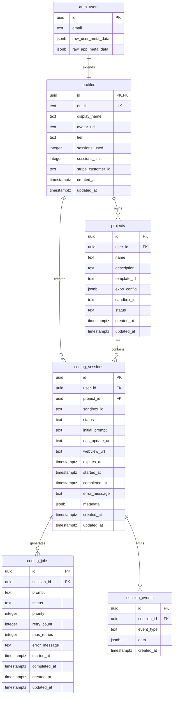

# MobVibe Database Schema

**Version:** 1.0.0
**Created:** 2025-11-07
**Database:** PostgreSQL (via Supabase)
**Phase:** 11 - Database Schema & RLS

---

## Overview

MobVibe uses PostgreSQL with Row-Level Security (RLS) for multi-tenant data isolation. The schema supports:

- User profile management
- Project organization
- Coding session lifecycle
- Job queue processing
- Real-time event streaming

**Key Features:**
- RLS policies for user data isolation
- Service role bypass for worker operations
- Optimized indexes for common queries
- JSONB for flexible metadata storage
- Triggers for automatic timestamp updates

---

## Entity Relationship Diagram



---

## Tables

### 1. profiles

Extends Supabase Auth users with application-specific profile data.

**Purpose:** User account information, tier management, usage tracking

**Columns:**
| Column | Type | Constraints | Description |
|--------|------|-------------|-------------|
| id | UUID | PK, FK → auth.users | User ID (same as Auth) |
| email | TEXT | NOT NULL, UNIQUE | User email (copied from Auth) |
| display_name | TEXT | | User display name |
| avatar_url | TEXT | | Profile avatar URL |
| tier | TEXT | DEFAULT 'free', CHECK | Subscription tier (free, starter, pro, enterprise) |
| sessions_used | INTEGER | DEFAULT 0 | Count of sessions used |
| sessions_limit | INTEGER | DEFAULT 3 | Max sessions allowed (tier-based) |
| stripe_customer_id | TEXT | | Stripe customer ID for billing |
| created_at | TIMESTAMPTZ | DEFAULT NOW() | Account creation time |
| updated_at | TIMESTAMPTZ | DEFAULT NOW() | Last update time |

**RLS Policies:**
- `Users can view own profile` - SELECT: `auth.uid() = id`
- `Users can update own profile` - UPDATE: `auth.uid() = id`

**Indexes:**
- `profiles_email_idx` - btree(email)
- `profiles_tier_idx` - btree(tier)

**Triggers:**
- `profiles_updated_at` - Updates updated_at on row change
- `on_auth_user_created` - Auto-creates profile when user signs up

---

### 2. projects

User projects containing Expo applications.

**Purpose:** Project management, sandbox tracking, configuration storage

**Columns:**
| Column | Type | Constraints | Description |
|--------|------|-------------|-------------|
| id | UUID | PK, DEFAULT gen_random_uuid() | Project ID |
| user_id | UUID | NOT NULL, FK → profiles | Project owner |
| name | TEXT | NOT NULL | Project name |
| description | TEXT | | Project description |
| template_id | TEXT | | Template used (future feature) |
| expo_config | JSONB | | Expo configuration |
| sandbox_id | TEXT | | Fly.io sandbox machine ID |
| status | TEXT | DEFAULT 'active', CHECK | Status (active, archived, deleted) |
| created_at | TIMESTAMPTZ | DEFAULT NOW() | Creation time |
| updated_at | TIMESTAMPTZ | DEFAULT NOW() | Last update time |

**RLS Policies:**
- `Users can view own projects` - SELECT: `auth.uid() = user_id`
- `Users can create projects` - INSERT: `auth.uid() = user_id`
- `Users can update own projects` - UPDATE: `auth.uid() = user_id`
- `Users can delete own projects` - DELETE: `auth.uid() = user_id`

**Indexes:**
- `projects_user_id_idx` - btree(user_id)
- `projects_status_idx` - btree(status)
- `projects_created_at_idx` - btree(created_at DESC)

**Triggers:**
- `projects_updated_at` - Updates updated_at on row change

---

### 3. coding_sessions

Active coding sessions where Claude generates code.

**Purpose:** Session lifecycle management, timeout handling, preview URLs

**Columns:**
| Column | Type | Constraints | Description |
|--------|------|-------------|-------------|
| id | UUID | PK, DEFAULT gen_random_uuid() | Session ID |
| user_id | UUID | NOT NULL, FK → profiles | Session owner |
| project_id | UUID | NOT NULL, FK → projects | Associated project |
| sandbox_id | TEXT | | Fly.io sandbox machine ID |
| status | TEXT | DEFAULT 'pending', CHECK | Status (pending, active, paused, completed, failed, expired) |
| initial_prompt | TEXT | NOT NULL | User's initial prompt |
| eas_update_url | TEXT | | EAS Update URL for preview |
| webview_url | TEXT | | WebView URL for preview |
| expires_at | TIMESTAMPTZ | NOT NULL | Session expiration time |
| started_at | TIMESTAMPTZ | | Session start time |
| completed_at | TIMESTAMPTZ | | Session completion time |
| error_message | TEXT | | Error message if failed |
| metadata | JSONB | | Session metadata (stats, counts) |
| created_at | TIMESTAMPTZ | DEFAULT NOW() | Creation time |
| updated_at | TIMESTAMPTZ | DEFAULT NOW() | Last update time |

**RLS Policies:**
- `Users can view own sessions` - SELECT: `auth.uid() = user_id`
- `Users can create sessions` - INSERT: `auth.uid() = user_id`
- `Users can update own sessions` - UPDATE: `auth.uid() = user_id`

**Indexes:**
- `coding_sessions_user_id_idx` - btree(user_id)
- `coding_sessions_project_id_idx` - btree(project_id)
- `coding_sessions_status_idx` - btree(status)
- `coding_sessions_expires_at_idx` - btree(expires_at)

**Triggers:**
- `coding_sessions_updated_at` - Updates updated_at on row change

---

### 4. coding_jobs

Job queue for worker service to process coding requests.

**Purpose:** Priority-based job queue, retry logic, worker coordination

**Columns:**
| Column | Type | Constraints | Description |
|--------|------|-------------|-------------|
| id | UUID | PK, DEFAULT gen_random_uuid() | Job ID |
| session_id | UUID | NOT NULL, FK → coding_sessions | Associated session |
| prompt | TEXT | NOT NULL | Coding prompt to execute |
| status | TEXT | DEFAULT 'pending', CHECK | Status (pending, processing, completed, failed) |
| priority | INTEGER | DEFAULT 0 | Job priority (higher = more urgent) |
| retry_count | INTEGER | DEFAULT 0 | Number of retries attempted |
| max_retries | INTEGER | DEFAULT 3 | Maximum retry attempts |
| error_message | TEXT | | Error message if failed |
| started_at | TIMESTAMPTZ | | Job start time |
| completed_at | TIMESTAMPTZ | | Job completion time |
| created_at | TIMESTAMPTZ | DEFAULT NOW() | Creation time |
| updated_at | TIMESTAMPTZ | DEFAULT NOW() | Last update time |

**RLS Policies:**
- `Users can view own jobs` - SELECT: via subquery to coding_sessions
  ```sql
  EXISTS (
    SELECT 1 FROM coding_sessions
    WHERE coding_sessions.id = coding_jobs.session_id
    AND coding_sessions.user_id = auth.uid()
  )
  ```

**Indexes:**
- `coding_jobs_session_id_idx` - btree(session_id)
- `coding_jobs_status_priority_idx` - btree(status, priority DESC, created_at ASC)

**Triggers:**
- `coding_jobs_updated_at` - Updates updated_at on row change

**Notes:**
- Worker service uses service role key (bypasses RLS)
- Composite index optimizes job claiming query

---

### 5. session_events

Real-time events streamed during coding sessions.

**Purpose:** Event history, real-time updates, mobile client subscriptions

**Columns:**
| Column | Type | Constraints | Description |
|--------|------|-------------|-------------|
| id | UUID | PK, DEFAULT gen_random_uuid() | Event ID |
| session_id | UUID | NOT NULL, FK → coding_sessions | Associated session |
| event_type | TEXT | NOT NULL, CHECK | Event type (thinking, terminal, file_change, preview_ready, completion, error) |
| data | JSONB | NOT NULL | Event payload (flexible) |
| created_at | TIMESTAMPTZ | DEFAULT NOW() | Event time |

**RLS Policies:**
- `Users can view own session events` - SELECT: via subquery to coding_sessions
  ```sql
  EXISTS (
    SELECT 1 FROM coding_sessions
    WHERE coding_sessions.id = session_events.session_id
    AND coding_sessions.user_id = auth.uid()
  )
  ```

**Indexes:**
- `session_events_session_id_idx` - btree(session_id)
- `session_events_created_at_idx` - btree(created_at DESC)
- `session_events_event_type_idx` - btree(event_type)

**Notes:**
- No updated_at (events are immutable)
- Worker inserts via service role key
- Realtime subscriptions use RLS

---

## Helper Functions

### update_updated_at()

Automatically updates the `updated_at` column to current timestamp.

```sql
CREATE OR REPLACE FUNCTION update_updated_at()
RETURNS TRIGGER AS $$
BEGIN
  NEW.updated_at = NOW();
  RETURN NEW;
END;
$$ LANGUAGE plpgsql;
```

**Used By:**
- profiles
- projects
- coding_sessions
- coding_jobs

---

### handle_new_user()

Auto-creates profile when user signs up via Supabase Auth.

```sql
CREATE OR REPLACE FUNCTION handle_new_user()
RETURNS TRIGGER AS $$
BEGIN
  INSERT INTO public.profiles (id, email, display_name)
  VALUES (
    NEW.id,
    NEW.email,
    COALESCE(NEW.raw_user_meta_data->>'display_name', split_part(NEW.email, '@', 1))
  );
  RETURN NEW;
END;
$$ LANGUAGE plpgsql SECURITY DEFINER;
```

**Trigger:** `on_auth_user_created` on `auth.users`

**Behavior:**
- Copies email from auth.users
- Extracts display name from metadata or email
- Runs with SECURITY DEFINER (elevated privileges)

---

## Row-Level Security

### Security Model

**Principle:** User data isolation via RLS policies

**User Access:**
- Users can only view/modify their own data
- Enforced via `auth.uid() = user_id` checks
- Subqueries link jobs/events to sessions to users

**Service Role:**
- Worker service uses service role key
- Bypasses all RLS policies
- Can read/write all tables for job processing

**Anonymous Access:**
- No anonymous access (all tables require auth)
- Anon key can only access public functions

### RLS Policy Patterns

**Direct Ownership:**
```sql
-- User owns the row directly
auth.uid() = user_id
```

**Indirect Ownership via Subquery:**
```sql
-- User owns via related table
EXISTS (
  SELECT 1 FROM coding_sessions
  WHERE coding_sessions.id = coding_jobs.session_id
  AND coding_sessions.user_id = auth.uid()
)
```

### Performance Optimization

**Best Practices Applied:**
1. **Index RLS columns** - All `user_id` columns indexed
2. **Add explicit filters** - Don't rely only on RLS
   ```typescript
   // ✅ Good
   .from('projects').select().eq('user_id', userId)

   // ❌ Bad (relies only on RLS)
   .from('projects').select()
   ```
3. **Optimize subqueries** - Use `user_id IN (...)` pattern
4. **Composite indexes** - For complex WHERE clauses

---

## Indexes

### Purpose & Strategy

**Principles:**
- Index all foreign keys
- Index frequently queried columns
- Composite indexes for common query patterns
- Descending indexes for time-based ordering

### Index Rationale

| Table | Index | Purpose |
|-------|-------|---------|
| profiles | email | User lookup by email |
| profiles | tier | Filter users by subscription tier |
| projects | user_id | User's projects (RLS performance) |
| projects | status | Filter active/archived projects |
| projects | created_at DESC | Recent projects first |
| coding_sessions | user_id | User's sessions (RLS performance) |
| coding_sessions | project_id | Project's sessions |
| coding_sessions | status | Active sessions |
| coding_sessions | expires_at | Find expired sessions |
| coding_jobs | session_id | Session's jobs |
| coding_jobs | (status, priority DESC, created_at ASC) | Job queue claiming |
| session_events | session_id | Session's events |
| session_events | created_at DESC | Recent events first |
| session_events | event_type | Filter by event type |

### Query Performance

**Target:** < 10ms for common queries

**Monitored Queries:**
- User's projects: `SELECT * FROM projects WHERE user_id = ?`
- Active sessions: `SELECT * FROM coding_sessions WHERE user_id = ? AND status = 'active'`
- Next job: `SELECT * FROM coding_jobs WHERE status = 'pending' ORDER BY priority DESC, created_at ASC LIMIT 1`
- Recent events: `SELECT * FROM session_events WHERE session_id = ? ORDER BY created_at DESC LIMIT 50`

---

## Common Operations

### Create User Profile

```typescript
// Automatic via Auth trigger
const { user } = await supabase.auth.signUp({
  email: 'user@example.com',
  password: 'secure-password',
  options: {
    data: {
      display_name: 'John Doe'
    }
  }
})
// Profile auto-created by handle_new_user() trigger
```

### Create Project

```typescript
const { data: project } = await supabase
  .from('projects')
  .insert({
    user_id: userId,
    name: 'My Todo App',
    description: 'A simple todo application'
  })
  .select()
  .single()
```

### Start Coding Session

```typescript
const expiresAt = new Date()
expiresAt.setHours(expiresAt.getHours() + 1)

const { data: session } = await supabase
  .from('coding_sessions')
  .insert({
    user_id: userId,
    project_id: projectId,
    initial_prompt: 'Build a todo app with React',
    expires_at: expiresAt.toISOString()
  })
  .select()
  .single()
```

### Create Job (Service Role)

```typescript
const { data: job } = await supabaseService
  .from('coding_jobs')
  .insert({
    session_id: sessionId,
    prompt: 'Build a todo app with React',
    priority: 1
  })
  .select()
  .single()
```

### Claim Next Job (Worker)

```typescript
const { data: job } = await supabaseService
  .from('coding_jobs')
  .update({
    status: 'processing',
    started_at: new Date().toISOString()
  })
  .eq('status', 'pending')
  .order('priority', { ascending: false })
  .order('created_at', { ascending: true })
  .limit(1)
  .select()
  .single()
```

### Stream Event (Worker)

```typescript
await supabaseService
  .from('session_events')
  .insert({
    session_id: sessionId,
    event_type: 'terminal',
    data: {
      command: 'npm install',
      output: 'Installing dependencies...',
      timestamp: new Date().toISOString()
    }
  })
```

### Subscribe to Events (Mobile)

```typescript
const channel = supabase
  .channel('session-events')
  .on(
    'postgres_changes',
    {
      event: 'INSERT',
      schema: 'public',
      table: 'session_events',
      filter: `session_id=eq.${sessionId}`
    },
    (payload) => {
      console.log('New event:', payload.new)
    }
  )
  .subscribe()
```

---

## Migrations

### Migration Files

Located in `supabase/migrations/`:

1. `000_create_functions.sql` - Helper functions
2. `001_create_profiles.sql` - Profiles table + triggers
3. `002_create_projects.sql` - Projects table
4. `003_create_coding_sessions.sql` - Coding sessions table
5. `004_create_coding_jobs.sql` - Coding jobs table
6. `005_create_session_events.sql` - Session events table

### Apply Migrations

```bash
# Local development
supabase db reset  # Reset local DB
supabase db push   # Apply all migrations

# Verify schema
supabase db inspect

# Production (via Supabase CLI)
supabase db push --linked
```

### Rollback Strategy

```bash
# Reset to clean state
supabase db reset

# Apply subset of migrations (manual)
psql -f supabase/migrations/000_create_functions.sql
psql -f supabase/migrations/001_create_profiles.sql
# ... etc
```

### Migration Best Practices

- ✅ Migrations are idempotent
- ✅ Versioned sequentially (000, 001, 002, ...)
- ✅ Each migration can run independently
- ✅ Include rollback instructions in comments
- ✅ Test locally before production

---

## Testing

### Test Files

Located in `tests/database/`:

- `profiles.test.ts` - Profiles table, RLS, triggers
- `projects.test.ts` - Projects CRUD, cascades
- `sessions.test.ts` - Session lifecycle, expiration
- `rls.test.ts` - Cross-user isolation, service role

### Run Tests

```bash
# All database tests
npm test -- tests/database/

# Specific test file
npm test -- tests/database/profiles.test.ts

# Watch mode
npm test -- tests/database/ --watch
```

### Test Coverage

**Target:** > 80% coverage

**Covered:**
- ✅ RLS policies (user isolation)
- ✅ CRUD operations
- ✅ Triggers (updated_at, user signup)
- ✅ Constraints (CHECK, UNIQUE, FK)
- ✅ Cascading deletes
- ✅ Service role bypass
- ✅ Subquery RLS
- ✅ Index usage

---

## Seed Data

### Development Data

Located in `supabase/seed.sql`

**Purpose:**
- Test data for local development
- Validate schema and constraints
- Enable API testing

**Usage:**
```bash
# Load seed data
psql -h localhost -p 54322 -U postgres -d postgres -f supabase/seed.sql

# Or via Supabase CLI
supabase db reset  # Includes seed data
```

**Contents:**
- Test project
- Test coding session
- Test job
- Sample events

**Note:** Create test user via Supabase Auth dashboard first

---

## Performance Monitoring

### Query Analysis

```sql
-- Explain query plan
EXPLAIN ANALYZE
SELECT * FROM coding_jobs
WHERE status = 'pending'
ORDER BY priority DESC, created_at ASC
LIMIT 1;

-- Should show: Index Scan on coding_jobs_status_priority_idx
```

### Slow Query Log

Monitor via Supabase Dashboard:
- Database > Logs > Slow Queries
- Set threshold: 100ms
- Review regularly and add indexes

### Index Usage

```sql
-- Check index usage
SELECT
  schemaname,
  tablename,
  indexname,
  idx_scan
FROM pg_stat_user_indexes
ORDER BY idx_scan DESC;
```

---

## Maintenance

### Cleanup Expired Sessions

```sql
-- Update expired sessions
UPDATE coding_sessions
SET status = 'expired'
WHERE status IN ('pending', 'active')
AND expires_at < NOW();
```

**Automation:** Create Edge Function or cron job

### Archive Old Events

```sql
-- Archive events older than 30 days
-- (Phase 2: implement partitioning)
DELETE FROM session_events
WHERE created_at < NOW() - INTERVAL '30 days';
```

### Monitor Usage

```sql
-- User session usage
SELECT
  p.email,
  p.sessions_used,
  p.sessions_limit,
  COUNT(cs.id) as total_sessions
FROM profiles p
LEFT JOIN coding_sessions cs ON cs.user_id = p.id
GROUP BY p.id;
```

---

## Future Enhancements

### Phase 2 Considerations

**Partitioning:**
- Partition session_events by created_at (monthly)
- Improves query performance for large datasets

**Views:**
- Materialized view for user analytics
- Dashboard metrics

**Full-Text Search:**
- Add tsvector column for project search
- GIN index for performance

**Audit Log:**
- Separate table for audit trail
- Track all data modifications

---

## Troubleshooting

### RLS Not Working

**Symptom:** Users can see other users' data

**Check:**
```sql
-- Verify RLS is enabled
SELECT schemaname, tablename, rowsecurity
FROM pg_tables
WHERE schemaname = 'public'
AND rowsecurity = false;

-- Should return no rows
```

**Fix:**
```sql
ALTER TABLE <table_name> ENABLE ROW LEVEL SECURITY;
```

### Slow Queries

**Symptom:** Queries taking > 100ms

**Diagnose:**
```sql
EXPLAIN ANALYZE <your-query>;
```

**Fix:**
- Look for "Seq Scan" (bad)
- Add index on filtered/joined columns
- Use composite index for ORDER BY

### Foreign Key Violations

**Symptom:** Cannot insert/update due to FK constraint

**Check:**
```sql
-- Verify referenced row exists
SELECT * FROM profiles WHERE id = '<uuid>';
```

**Fix:**
- Ensure parent row exists first
- Check CASCADE settings on FK

---

## Summary

**Schema:** 5 tables, 2 helper functions, comprehensive RLS
**Security:** Multi-tenant isolation, service role bypass
**Performance:** Optimized indexes, < 10ms queries
**Testing:** 4 test suites, > 80% coverage
**Status:** ✅ Production-ready for MVP

**Next Phase:** [12-edge-functions.md](../../phases/phase1/12-edge-functions.md)

---

**Last Updated:** 2025-11-07
**Version:** 1.0.0
**Status:** Complete
