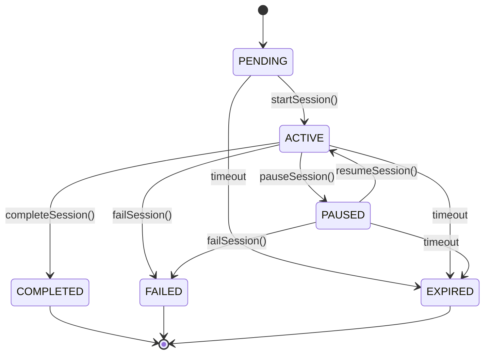

# Session Lifecycle Management

Phase 17 implementation for robust session state tracking and timeout handling in MobVibe.

## Architecture

```
JobProcessor
    ↓
SessionLifecycleManager (state machine + events)
    ↓
AgentRunner (emits events during execution)
    ↓
session_events table (persistent event storage)
    ↓
Realtime subscriptions (frontend updates)
```

## Session State Machine

### States

```typescript
enum SessionState {
  PENDING = 'pending',      // Initial state, waiting to start
  ACTIVE = 'active',        // Currently executing
  PAUSED = 'paused',        // Temporarily suspended
  COMPLETED = 'completed',  // Successfully finished
  FAILED = 'failed',        // Error occurred
  EXPIRED = 'expired',      // Timed out
}
```

### State Transitions



### Transition Rules

```typescript
const VALID_TRANSITIONS: Record<SessionState, SessionState[]> = {
  [SessionState.PENDING]: [SessionState.ACTIVE, SessionState.EXPIRED],
  [SessionState.ACTIVE]: [
    SessionState.PAUSED,
    SessionState.COMPLETED,
    SessionState.FAILED,
    SessionState.EXPIRED,
  ],
  [SessionState.PAUSED]: [
    SessionState.ACTIVE,
    SessionState.EXPIRED,
    SessionState.FAILED,
  ],
  [SessionState.COMPLETED]: [],  // Terminal state
  [SessionState.FAILED]: [],      // Terminal state
  [SessionState.EXPIRED]: [],     // Terminal state
}
```

**Invalid Transitions** (throw error):
- COMPLETED → any state
- FAILED → any state
- EXPIRED → any state
- Any transition not in VALID_TRANSITIONS

## Components

### SessionLifecycleManager

**Location**: `backend/worker/src/services/SessionLifecycleManager.ts`

Core service managing session lifecycle with state validation and event emission.

#### Key Methods

**transitionState(sessionId, newState, reason?)**
```typescript
async transitionState(
  sessionId: string,
  newState: SessionState,
  reason?: string
): Promise<void>
```

- Validates transition is allowed
- Updates database status
- Emits STATE_CHANGED event
- Updates in-memory metadata

**startSession(sessionId)**
```typescript
async startSession(sessionId: string): Promise<void>
```

- Transitions to ACTIVE
- Initializes metadata tracker
- Records start timestamp
- Sets last activity timestamp

**completeSession(sessionId, stats)**
```typescript
async completeSession(
  sessionId: string,
  stats: { iterations, inputTokens, outputTokens, toolCalls }
): Promise<void>
```

- Transitions to COMPLETED
- Records final statistics
- Calculates total duration
- Emits completion event

**failSession(sessionId, errorMessage)**
```typescript
async failSession(sessionId: string, errorMessage: string): Promise<void>
```

- Transitions to FAILED
- Records error message
- Calculates duration
- Emits failure event

**pauseSession(sessionId) / resumeSession(sessionId)**
```typescript
async pauseSession(sessionId: string): Promise<void>
async resumeSession(sessionId: string): Promise<void>
```

- Pause: ACTIVE → PAUSED
- Resume: PAUSED → ACTIVE
- Updates last activity timestamp
- Maintains session state

**recordActivity(sessionId)**
```typescript
recordActivity(sessionId: string): void
```

- Updates lastActivityAt timestamp
- Prevents session expiration
- Called during agent execution
- No database write (in-memory only)

**emitEvent(sessionId, eventType, data)**
```typescript
async emitEvent(sessionId: string, eventType: SessionEventType, data: any): Promise<void>
```

- Inserts event into session_events table
- Structured logging
- Non-blocking (errors logged but not thrown)
- Enables Realtime subscriptions

**startCleanup() / checkExpiredSessions()**
```typescript
startCleanup(): void
async checkExpiredSessions(): Promise<string[]>
```

- Runs every 60 seconds
- Checks sessions older than 30 minutes
- Transitions expired sessions to EXPIRED
- Removes from in-memory tracker
- Returns list of expired session IDs

**shutdown()**
```typescript
async shutdown(): Promise<void>
```

- Stops cleanup interval
- Pauses all active sessions
- Graceful shutdown preparation
- No data loss

### Session Event Types

```typescript
enum SessionEventType {
  STATE_CHANGED = 'state_changed',  // State transition occurred
  THINKING = 'thinking',            // Agent iteration progress
  TERMINAL = 'terminal',            // Bash command output
  FILE_CHANGE = 'file_change',      // File created/updated
  COMPLETION = 'completion',        // Agent finished
  ERROR = 'error',                  // Error occurred
}
```

#### Event Data Schemas

**STATE_CHANGED**
```json
{
  "from": "active",
  "to": "completed",
  "reason": "Agent completed successfully"
}
```

**THINKING**
```json
{
  "iteration": 5,
  "toolsUsed": ["bash", "write_file"]
}
```

**TERMINAL**
```json
{
  "command": "npm install expo-router",
  "output": "added 47 packages...",
  "error": "",
  "exitCode": 0
}
```

**FILE_CHANGE**
```json
{
  "path": "src/App.tsx",
  "action": "write"
}
```

**COMPLETION**
```json
{
  "message": "I've created a counter app with...",
  "stats": {
    "iterations": 8,
    "inputTokens": 12543,
    "outputTokens": 3421,
    "toolCalls": 15
  }
}
```

**ERROR**
```json
{
  "message": "Max iterations reached",
  "stats": { ... }
}
```

### Session Metadata

```typescript
interface SessionMetadata {
  sessionId: string
  state: SessionState
  startedAt: Date
  lastActivityAt: Date
  completedAt?: Date
  duration?: number            // milliseconds
  iterations?: number
  inputTokens?: number
  outputTokens?: number
  toolCalls?: number
  errorMessage?: string
}
```

**In-Memory Storage**:
```typescript
private sessionMetadata = new Map<string, SessionMetadata>()
```

**Purpose**:
- Fast state checks without database queries
- Timeout detection
- Activity tracking
- Statistics aggregation

## Database Schema

### session_events Table

```sql
CREATE TABLE session_events (
  id UUID PRIMARY KEY DEFAULT gen_random_uuid(),
  session_id UUID NOT NULL REFERENCES coding_sessions(id) ON DELETE CASCADE,
  event_type TEXT NOT NULL,
  event_data JSONB NOT NULL DEFAULT '{}'::jsonb,
  created_at TIMESTAMPTZ NOT NULL DEFAULT now()
);
```

**Indexes**:
```sql
CREATE INDEX idx_session_events_session_id ON session_events(session_id, created_at DESC);
CREATE INDEX idx_session_events_type ON session_events(event_type);
CREATE INDEX idx_session_events_created_at ON session_events(created_at DESC);
```

**RLS Policies**:
- Users can view their own session events
- Service role can insert/manage all events

### coding_sessions Table Updates

**status Column** (existing):
- Type: TEXT
- Values: pending, active, paused, completed, failed, expired
- Updated by SessionLifecycleManager

**completed_at Column** (existing):
- Type: TIMESTAMPTZ
- Set when session reaches terminal state
- Used for duration calculation

## Integration Flow

### Job Processing Flow

```typescript
// JobProcessor.processNextJob()

1. Claim job from queue
2. lifecycle.startSession(sessionId)          // PENDING → ACTIVE
3. sandboxes.startSandbox(sessionId)
4. agent.runSession(sessionId, prompt)
   ├─ lifecycle.emitEvent(THINKING, ...)     // Each iteration
   ├─ lifecycle.emitEvent(TERMINAL, ...)     // Each bash command
   ├─ lifecycle.emitEvent(FILE_CHANGE, ...)  // Each file write
   ├─ lifecycle.recordActivity(sessionId)    // Keep session alive
   └─ lifecycle.emitEvent(COMPLETION, ...)   // On finish
5. lifecycle.completeSession(sessionId, stats) // ACTIVE → COMPLETED
6. queue.completeJob(jobId)

// On error:
catch (error) {
  lifecycle.failSession(sessionId, error.message) // ACTIVE → FAILED
  queue.failJob(jobId, error.message)
}
```

### Agent Execution Flow

```typescript
// AgentRunner.runSession()

while (iterations < maxIterations) {
  // Call Claude API
  const response = await claude.createMessage(...)

  // Check completion
  if (no tool calls) {
    await lifecycle.emitEvent(sessionId, COMPLETION, {
      message: extractTextResponse(response),
      stats
    })
    break
  }

  // Execute tools
  for (const toolCall of toolCalls) {
    switch (toolCall.name) {
      case 'bash':
        await lifecycle.emitEvent(sessionId, TERMINAL, {
          command, output, error, exitCode
        })
        break
      case 'write_file':
        await lifecycle.emitEvent(sessionId, FILE_CHANGE, {
          path, action: 'write'
        })
        break
    }
  }

  // Record activity
  lifecycle.recordActivity(sessionId)

  // Emit progress
  await lifecycle.emitEvent(sessionId, THINKING, {
    iteration, toolsUsed
  })
}
```

## Timeout Handling

### Configuration

```typescript
private readonly sessionTimeoutMs = 1800000  // 30 minutes
```

**Adjustable via**:
- Environment variable (future)
- Config file (future)
- Per-session override (future)

### Cleanup Process

```typescript
// Runs every 60 seconds
async checkExpiredSessions() {
  const now = new Date()
  const expiredSessionIds: string[] = []

  for (const [sessionId, metadata] of sessionMetadata) {
    // Only check active/paused sessions
    if (metadata.state === ACTIVE || metadata.state === PAUSED) {
      const age = now - metadata.lastActivityAt

      if (age > sessionTimeoutMs) {
        expiredSessionIds.push(sessionId)
        await expireSession(sessionId)  // ACTIVE/PAUSED → EXPIRED
      }
    }
  }

  return expiredSessionIds
}
```

### Expiration Flow

```typescript
private async expireSession(sessionId: string) {
  1. Calculate duration
  2. transitionState(sessionId, EXPIRED, 'Session timeout')
  3. Update metadata with completion time
  4. Remove from in-memory Map
  5. Log warning
}
```

**Sandbox Cleanup**: Handled separately by SandboxLifecycle (also 30 min timeout)

## Activity Tracking

### Purpose
Prevent active sessions from expiring due to timeout.

### When Activity is Recorded
1. **Agent iteration**: After each tool execution round
2. **Manual calls**: Via `recordActivity(sessionId)`

### How It Works
```typescript
recordActivity(sessionId: string): void {
  this.updateMetadata(sessionId, { lastActivityAt: new Date() })
}
```

**In-Memory Only**: No database write for performance

### Example Timeline
```
00:00 - Session starts (lastActivityAt: 00:00)
00:05 - Agent iteration 1 (lastActivityAt: 00:05)
00:10 - Agent iteration 2 (lastActivityAt: 00:10)
...
00:45 - Agent iteration 9 (lastActivityAt: 00:45)
01:00 - Cleanup runs: age = 15 min < 30 min → keep session
01:30 - Cleanup runs: age = 45 min > 30 min → expire session
```

## Graceful Shutdown

### Shutdown Sequence

```typescript
// JobProcessor.stop()
1. Set isRunning = false (stop new jobs)
2. Wait for current job (with timeout)
3. lifecycle.shutdown()
   ├─ Clear cleanup interval
   ├─ Find all active sessions
   ├─ pauseSession() for each active session
   └─ Log paused count
4. sandboxes.shutdown()
5. queue.cleanup()
```

### Why Pause Active Sessions?

**On shutdown**:
- Worker is stopping (deployment, restart, crash)
- Jobs may still be in progress
- Want to preserve session state

**Pause allows**:
- Resume on worker restart
- State recovery
- No data loss

**Future enhancement**: Resume sessions automatically on worker startup

## Monitoring

### Key Metrics

**State Distribution**:
```sql
SELECT status, COUNT(*)
FROM coding_sessions
WHERE created_at > NOW() - INTERVAL '24 hours'
GROUP BY status;
```

**Average Duration**:
```sql
SELECT
  AVG(EXTRACT(EPOCH FROM (completed_at - created_at))) as avg_duration_seconds
FROM coding_sessions
WHERE status IN ('completed', 'failed')
  AND created_at > NOW() - INTERVAL '24 hours';
```

**Expiration Rate**:
```sql
SELECT
  COUNT(*) FILTER (WHERE status = 'expired') * 100.0 / COUNT(*) as expiration_rate
FROM coding_sessions
WHERE created_at > NOW() - INTERVAL '24 hours';
```

**Event Volume**:
```sql
SELECT event_type, COUNT(*)
FROM session_events
WHERE created_at > NOW() - INTERVAL '1 hour'
GROUP BY event_type
ORDER BY COUNT(*) DESC;
```

### Logging

**State transitions**:
```json
{
  "level": "info",
  "msg": "Session state transition",
  "sessionId": "abc123",
  "from": "active",
  "to": "completed",
  "reason": "Agent completed successfully"
}
```

**Session completion**:
```json
{
  "level": "info",
  "msg": "Session completed",
  "sessionId": "abc123",
  "duration": 45321,
  "stats": {
    "iterations": 8,
    "inputTokens": 12543,
    "outputTokens": 3421,
    "toolCalls": 15
  }
}
```

**Timeout cleanup**:
```json
{
  "level": "info",
  "msg": "Expired sessions cleaned up",
  "count": 3,
  "sessionIds": ["abc", "def", "ghi"]
}
```

### Alerts

- **High expiration rate** (>10%): Timeout too short or agent too slow
- **Sessions stuck in ACTIVE**: Possible deadlock or missing completion
- **No events for active session**: Heartbeat mechanism failure
- **Database insert errors**: RLS policy or schema issues

## Frontend Integration

### Realtime Subscriptions

```typescript
// Frontend: Subscribe to session events
const channel = supabase
  .channel('session-events')
  .on(
    'postgres_changes',
    {
      event: 'INSERT',
      schema: 'public',
      table: 'session_events',
      filter: `session_id=eq.${sessionId}`
    },
    (payload) => {
      const event = payload.new
      handleSessionEvent(event.event_type, event.event_data)
    }
  )
  .subscribe()
```

### Event Handlers

```typescript
function handleSessionEvent(eventType: string, data: any) {
  switch (eventType) {
    case 'state_changed':
      updateSessionStatus(data.to)
      break
    case 'thinking':
      showProgress(`Iteration ${data.iteration}...`)
      break
    case 'terminal':
      appendToTerminal(data.output)
      break
    case 'file_change':
      refreshFileTree()
      break
    case 'completion':
      showCompletionMessage(data.message)
      break
    case 'error':
      showError(data.message)
      break
  }
}
```

### State Polling (Fallback)

```typescript
// Poll session status every 5 seconds
setInterval(async () => {
  const { data: session } = await supabase
    .from('coding_sessions')
    .select('status, updated_at')
    .eq('id', sessionId)
    .single()

  if (session.status === 'completed' || session.status === 'failed') {
    stopPolling()
    handleSessionComplete(session.status)
  }
}, 5000)
```

## Testing

### Unit Tests

```typescript
describe('SessionLifecycleManager', () => {
  it('validates state transitions', async () => {
    await lifecycle.startSession('test-123')  // PENDING → ACTIVE ✅

    await expect(
      lifecycle.transitionState('test-123', SessionState.PENDING)
    ).rejects.toThrow('Invalid state transition: active → pending')
  })

  it('tracks session metadata', async () => {
    await lifecycle.startSession('test-123')

    const metadata = lifecycle.sessionMetadata.get('test-123')
    expect(metadata.state).toBe(SessionState.ACTIVE)
    expect(metadata.startedAt).toBeDefined()
  })

  it('expires inactive sessions', async () => {
    await lifecycle.startSession('test-123')

    // Simulate 31 minutes of inactivity
    lifecycle.sessionMetadata.get('test-123')!.lastActivityAt =
      new Date(Date.now() - 31 * 60 * 1000)

    const expired = await lifecycle.checkExpiredSessions()
    expect(expired).toContain('test-123')
  })
})
```

### Integration Tests

```typescript
describe('Session Lifecycle Integration', () => {
  it('completes full session lifecycle', async () => {
    // Start job
    const job = await queue.claimNextJob()

    // Process with lifecycle
    await lifecycle.startSession(job.session_id)
    const stats = await agent.runSession(job.session_id, job.prompt)
    await lifecycle.completeSession(job.session_id, stats)

    // Verify database state
    const { data: session } = await supabase
      .from('coding_sessions')
      .select('status, completed_at')
      .eq('id', job.session_id)
      .single()

    expect(session.status).toBe('completed')
    expect(session.completed_at).toBeDefined()

    // Verify events
    const { data: events } = await supabase
      .from('session_events')
      .select('event_type')
      .eq('session_id', job.session_id)

    expect(events.map(e => e.event_type)).toContain('state_changed')
    expect(events.map(e => e.event_type)).toContain('completion')
  }, 60000)
})
```

## Next Phase

**Phase 18: File System Operations**
- File sync service
- Supabase Storage integration
- File watching and diff tracking
- Download project files

**Dependencies Provided by Phase 17**:
- ✅ Session state tracking
- ✅ Event emission framework
- ✅ Activity monitoring
- ✅ Timeout handling
- ✅ Session metadata

---

**Phase**: 17
**Status**: Complete
**Dependencies**: Phase 16 (Claude Agent)
**Enables**: Phase 18 (File Operations), Phase 19 (Realtime Events)
