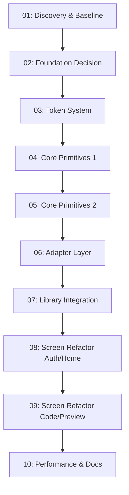

# MobVibe Phase 0.5: UI Framework Integration - Implementation Plan

**Project:** MobVibe - AI-powered mobile app builder
**Repos:** D:\009_Projects_AI\Personal_Projects\MobVibe
**UI Standards:**
- [UI Framework Plan](./../.docs/ui/UI-FRAMEWORK-INTEGRATION-PLAN.md)
- [Design System](./../.docs/design-system.md)
- [Native UI Guidelines](./../.docs/vibecode/native_ui.md)

**Documentation Index:**
- [SUMMARY.md](./../.docs/SUMMARY.md) - Complete documentation overview
- [Architecture](./../.docs/architecture.md) - System architecture
- [Implementation](./../.docs/implementation.md) - Technical stack
- [Roadmap](./../.docs/roadmap.md) - Development timeline

---

## Phase Overview

**Goal:** Establish robust UI foundation with systematic framework integration before Phase 1 MVP

**Duration:** 15-20 working days (3-4 weeks)

**Approach:** Small, incremental phases each delivering independent value and testable artifacts

---

## Phase List

| ID | Title | Value | Duration | Depends On |
|----|-------|-------|----------|------------|
| 01 | Discovery & Baseline Measurement | Establish current state metrics | 1 day | - |
| 02 | Foundation Decision (Tamagui vs gluestack) | Select primary UI library | 1.5 days | 01 |
| 03 | Token System Design | Create unified design tokens | 1 day | 02 |
| 04 | Core Primitives - Part 1 (Button, Text, Input) | Build foundational components | 1.5 days | 03 |
| 05 | Core Primitives - Part 2 (Card, Sheet, ListItem) | Complete component library | 1.5 days | 04 |
| 06 | Adapter Layer Implementation | Prevent vendor lock-in | 1 day | 05 |
| 07 | Selective Library Integration | Add Paper, Gifted Chat, Lottie | 1.5 days | 06 |
| 08 | Screen Refactoring (Auth & Home) | Apply new primitives | 1.5 days | 07 |
| 09 | Screen Refactoring (Code & Preview Tabs) | Complete screen migration | 1.5 days | 08 |
| 10 | Performance Audit & Documentation | Verify all acceptance criteria | 2 days | 09 |

**Total:** 13.5 days (target: 15-20 with buffer)

---

## Dependency Graph



---

## Cumulative Test Matrix

| Phase | Tests (Self) | Tests (+Prev) | UI Snapshots | Notes |
|-------|--------------|---------------|--------------|-------|
| 01    | ✅ Baseline metrics | N/A | ✅ Screenshots captured | Establishes baseline |
| 02    | ✅ PoC builds pass | ✅ (01) | ✅ Component examples | Decision documented |
| 03    | ✅ Token validation | ✅ (01-02) | ✅ Token demo app | Zero conflicts |
| 04    | ✅ Component tests | ✅ (01-03) | ✅ Primitive gallery | a11y passing |
| 05    | ✅ Component tests | ✅ (01-04) | ✅ Complete gallery | All primitives |
| 06    | ✅ Adapter tests | ✅ (01-05) | ✅ Adapter demo | No vendor leakage |
| 07    | ✅ Integration tests | ✅ (01-06) | ✅ Integrated screens | Library theming |
| 08    | ✅ Screen tests | ✅ (01-07) | ✅ Refactored Auth/Home | No regressions |
| 09    | ✅ Screen tests | ✅ (01-08) | ✅ All screens | Complete migration |
| 10    | ✅ Full audit | ✅ (01-09) | ✅ Final comparison | All predicates pass |

---

## Acceptance Criteria (Phase 0.5 Complete)

**Must all pass before proceeding to Phase 1:**

| Criterion | Target | Verification Method |
|-----------|--------|---------------------|
| **Single Source of Truth** | Zero token conflicts | `npm run ui:audit-tokens` |
| **No Vendor Leakage** | Zero direct imports outside adapters | `npm run ui:audit-imports` |
| **Native Feel** | Zero a11y issues, native gestures work | `npm run ui:audit-a11y` + manual testing |
| **Performance** | TTI ≤ baseline + 10%, FPS ≥ 55 | `npm run ui:audit-performance` |
| **Documentation** | All 5 docs complete | Check `docs/ui/{FOUNDATION,USAGE,THEMING,ADAPTERS,MIGRATION_GUIDE}.md` |

---

## Verification Status

### Predicate Checklist

- [ ] **phase_files_created**: All 10 phase .md files exist and are properly formatted
- [ ] **tasks_traceable**: Every task has owner and artifact path
- [ ] **tests_pass**: Phase-only tests AND cumulative tests all pass
- [ ] **ui_consistent**: All UI changes conform to UIFrameworkPlan and DesignSystem
- [ ] **links_valid**: All docs and cross-phase links resolve correctly
- [ ] **subagents_used**: Each phase invokes websearch, context7, sequentialthinking with outputs

**Verification Command:**
```bash
npm run verify:phases
```

**Last Verification Run:** [Not yet run]

---

## MCP Tools Usage Summary

### WebResearcher (websearch)
- **Phases Used:** 01, 02, 03, 07
- **Purpose:** Research best practices, competitive analysis, library comparisons
- **Outputs:** `/docs/research/{phase-id}/notes.md`

### ContextCurator (context7 MCP)
- **Phases Used:** All phases (01-10)
- **Purpose:** Aggregate relevant docs into focused context bundles
- **Outputs:** `/docs/context/{phase-id}-bundle.md`

### Sequencer (sequentialthinking MCP)
- **Phases Used:** All phases (01-10)
- **Purpose:** Generate step-by-step execution micro-plans
- **Outputs:** `/docs/sequencing/{phase-id}-steps.md`

---

## Risk Management

### High-Risk Phases

| Phase | Risk | Mitigation |
|-------|------|------------|
| 02 | Wrong foundation choice | Score both objectively, document decision, enable rollback |
| 06 | Adapter complexity | Keep adapters thin, test isolation thoroughly |
| 08-09 | Screen refactor breaks features | Test after each screen, maintain parallel old components temporarily |

### Rollback Strategy

Each phase produces:
1. Git commit with phase tag: `git tag phase-0.5-{NN}`
2. Snapshot in `reports/ui/phase-{NN}-snapshot.json`
3. Rollback instructions in phase file

**Rollback Command:**
```bash
git checkout phase-0.5-{NN-1}  # Go back one phase
npm install
npm run test
```

---

## Success Metrics

**Phase 0.5 Complete When:**
- ✅ All 10 phases completed
- ✅ All acceptance criteria pass
- ✅ Performance within budget (TTI ≤ +10%, FPS ≥ 55)
- ✅ Zero vendor imports outside adapters
- ✅ WCAG AA compliance verified
- ✅ Complete documentation suite
- ✅ Team can self-serve using primitives only

**Ready for Phase 1:** Mobile app foundation is production-ready for MVP feature development

---

## Next Steps After Phase 0.5

Once UI Framework Integration is complete:
1. Begin Phase 1 Week 3-4: Worker Service Setup
2. Continue with Phase 1 Week 5-7: Claude Agent Integration
3. Follow roadmap in [.docs/roadmap.md](./../.docs/roadmap.md)

---

## References

- [UI Framework Integration Plan](./../.docs/ui/UI-FRAMEWORK-INTEGRATION-PLAN.md) - Complete 10-step specification
- [Design System](./../.docs/design-system.md) - Current design tokens and components
- [Implementation Guide](./../.docs/implementation.md) - Technical architecture
- [Roadmap](./../.docs/roadmap.md) - Overall development timeline
- [Phase Files](./01-discovery-foundations.md) - Start with Phase 01

---

**Plan Version:** 1.0.0
**Created:** 2025-11-05
**Last Updated:** 2025-11-05
**Status:** Ready for execution
