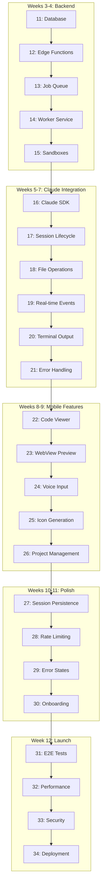

# MobVibe Phase 1: MVP - Implementation Plan

**Project:** MobVibe - AI-powered mobile app builder
**Repos:** D:\009_Projects_AI\Personal_Projects\MobVibe
**Phase:** 1 - MVP (Core Product)
**Documentation Index:**
- [Architecture](./../../../.docs/architecture.md) - System architecture
- [Implementation](./../../../.docs/implementation.md) - Technical stack
- [Data Flow](./../../../.docs/data-flow.md) - Complete data flows
- [Features & Journeys](./../../../.docs/features-and-journeys.md) - Feature specs
- [Roadmap](./../../../.docs/roadmap.md) - Development timeline

---

## Phase Overview

**Goal:** Build core MVP functionality - users can prompt, Claude codes, real-time preview

**Duration:** 10 weeks (50 working days) - Weeks 3-12 of roadmap

**Approach:** Small, incremental phases each delivering testable end-to-end slices

**Prerequisites:** ✅ Phase 0.5 Complete (UI framework foundation ready)

---

## Phase Breakdown

### **Weeks 3-4: Backend Infrastructure** (5 phases, 10 days)
- 11: Supabase database schema & RLS policies
- 12: Edge Functions (job enqueue, session management)
- 13: Job queue with Realtime subscriptions
- 14: Worker service foundation (Node.js, job processor)
- 15: Sandbox orchestration (Fly.io setup)

### **Weeks 5-7: Claude Agent Integration** (6 phases, 15 days)
- 16: Claude Agent SDK integration
- 17: Coding session lifecycle
- 18: File system operations & syncing
- 19: Real-time event streaming (WebSocket)
- 20: Terminal output capture & streaming
- 21: Error handling & recovery

### **Weeks 8-9: Mobile Features** (5 phases, 10 days)
- 22: Code viewer with syntax highlighting
- 23: WebView preview integration
- 24: Voice input (native + cloud fallback)
- 25: Icon generation workflow (Nano Banana API)
- 26: Project management (CRUD operations)

### **Weeks 10-11: Polish & Enhancement** (4 phases, 8 days)
- 27: Session persistence & resume
- 28: Rate limiting & usage tracking
- 29: Error states & empty states
- 30: Onboarding & user guidance

### **Week 12: Testing & Launch Prep** (4 phases, 7 days)
- 31: End-to-end testing suite
- 32: Performance optimization
- 33: Security audit
- 34: Production deployment & monitoring

---

## Phase List (24 Phases)

| ID | Title | Value | Duration | Depends On |
|----|-------|-------|----------|------------|
| 11 | Database Schema & RLS | Data layer foundation | 2 days | Phase 0.5 |
| 12 | Edge Functions Foundation | API endpoints | 2 days | 11 |
| 13 | Job Queue Implementation | Task orchestration | 2 days | 12 |
| 14 | Worker Service Foundation | Long-running processor | 2 days | 13 |
| 15 | Sandbox Orchestration | Isolated execution | 2 days | 14 |
| 16 | Claude Agent SDK Integration | AI code generation | 2.5 days | 15 |
| 17 | Coding Session Lifecycle | Session management | 2.5 days | 16 |
| 18 | File System Operations | File sync & storage | 2.5 days | 17 |
| 19 | Real-time Event Streaming | WebSocket communication | 2.5 days | 18 |
| 20 | Terminal Output Streaming | Command output display | 2.5 days | 19 |
| 21 | Error Handling & Recovery | Robust error management | 2.5 days | 20 |
| 22 | Code Viewer Component | Syntax-highlighted display | 2 days | 21 |
| 23 | WebView Preview | In-app preview | 2 days | 22 |
| 24 | Voice Input Integration | Speech-to-text | 2 days | 23 |
| 25 | Icon Generation Workflow | AI-powered icons | 2 days | 24 |
| 26 | Project Management | CRUD operations | 2 days | 25 |
| 27 | Session Persistence | Save & resume | 2 days | 26 |
| 28 | Rate Limiting & Tracking | Usage management | 2 days | 27 |
| 29 | Error & Empty States | UX polish | 2 days | 28 |
| 30 | Onboarding Flow | User guidance | 2 days | 29 |
| 31 | E2E Testing Suite | Comprehensive testing | 2 days | 30 |
| 32 | Performance Optimization | Speed & efficiency | 2 days | 31 |
| 33 | Security Audit | Vulnerability scan | 1.5 days | 32 |
| 34 | Production Deployment | Launch prep | 1.5 days | 33 |

**Total:** 50 days (10 weeks)

---

## Dependency Graph



---

## Cumulative Test Matrix

| Phase | Tests (Self) | Tests (+Prev) | Integration Test | Notes |
|-------|--------------|---------------|------------------|-------|
| 11 | ✅ Schema validation | N/A | ✅ DB queries | Foundation |
| 12 | ✅ Edge Function tests | ✅ (11) | ✅ API endpoints | API layer |
| 13 | ✅ Queue operations | ✅ (11-12) | ✅ Job enqueue/dequeue | Orchestration |
| 14 | ✅ Worker tests | ✅ (11-13) | ✅ Job processing | Backend complete |
| 15 | ✅ Sandbox tests | ✅ (11-14) | ✅ Isolated execution | Infrastructure ready |
| 16 | ✅ Claude SDK tests | ✅ (11-15) | ✅ Code generation | AI integrated |
| 17 | ✅ Session tests | ✅ (11-16) | ✅ Lifecycle management | Sessions working |
| 18 | ✅ File sync tests | ✅ (11-17) | ✅ File operations | Files syncing |
| 19 | ✅ WebSocket tests | ✅ (11-18) | ✅ Real-time events | Events streaming |
| 20 | ✅ Terminal tests | ✅ (11-19) | ✅ Output capture | Terminal working |
| 21 | ✅ Error tests | ✅ (11-20) | ✅ Recovery flows | Backend robust |
| 22 | ✅ Code viewer tests | ✅ (11-21) | ✅ Display & highlight | Code visible |
| 23 | ✅ WebView tests | ✅ (11-22) | ✅ Preview loading | Preview working |
| 24 | ✅ Voice input tests | ✅ (11-23) | ✅ STT accuracy | Voice input ready |
| 25 | ✅ Icon gen tests | ✅ (11-24) | ✅ API integration | Icons generating |
| 26 | ✅ CRUD tests | ✅ (11-25) | ✅ Project operations | Projects managed |
| 27 | ✅ Persistence tests | ✅ (11-26) | ✅ Resume sessions | Sessions resumable |
| 28 | ✅ Rate limit tests | ✅ (11-27) | ✅ Quota enforcement | Usage tracked |
| 29 | ✅ UX tests | ✅ (11-28) | ✅ Error/empty states | UX polished |
| 30 | ✅ Onboarding tests | ✅ (11-29) | ✅ User flows | Onboarding complete |
| 31 | ✅ E2E suite | ✅ (11-30) | ✅ Full user journeys | E2E coverage |
| 32 | ✅ Perf benchmarks | ✅ (11-31) | ✅ Speed targets | Optimized |
| 33 | ✅ Security scan | ✅ (11-32) | ✅ Vulnerability fixes | Secure |
| 34 | ✅ Deploy tests | ✅ (11-33) | ✅ Production ready | Launched ✅ |

---

## Acceptance Criteria (Phase 1 MVP Complete)

**Must all pass before launch:**

| Criterion | Target | Verification Method |
|-----------|--------|---------------------|
| **End-to-End Flow** | User → Prompt → Claude codes → Preview works | E2E test: "Build a todo app" |
| **Real-time Updates** | Events stream within 500ms | WebSocket latency test |
| **Code Generation** | Claude generates valid React Native code | Static analysis + build test |
| **Preview Works** | WebView loads generated app | Screenshot comparison test |
| **Voice Input** | STT accuracy ≥ 90% | 100 sample phrases test |
| **Icon Generation** | Icons generated in <10s | API response time test |
| **Session Management** | Sessions save, resume, expire correctly | Session lifecycle test |
| **Rate Limiting** | Free tier: 3 sessions/month enforced | Usage quota test |
| **Error Handling** | All errors handled gracefully | Error injection test |
| **Performance** | Session start <5s, events stream <500ms | Performance benchmark |
| **Security** | No secrets exposed, RLS enforced | Security audit |
| **Production Ready** | Deploy succeeds, monitoring active | Deployment checklist |

---

## MCP Tools Usage Summary

### WebResearcher (websearch)
- **Phases Used:** 11, 13, 15, 16, 19, 22, 24, 25, 33
- **Purpose:** Research infrastructure, Claude SDK, WebSocket, voice APIs, security
- **Outputs:** `/docs/research/phase1/{phase-id}/notes.md`

### ContextCurator (context7 MCP)
- **Phases Used:** All phases (11-34)
- **Purpose:** Aggregate architecture, data flow, API specs into focused bundles
- **Outputs:** `/docs/context/phase1/{phase-id}-bundle.md`

### Sequencer (sequentialthinking MCP)
- **Phases Used:** All phases (11-34)
- **Purpose:** Generate step-by-step implementation micro-plans
- **Outputs:** `/docs/sequencing/phase1/{phase-id}-steps.md`

---

## Critical Path

**Cannot proceed if any of these block:**

1. Phase 11 (Database) → All backend depends on schema
2. Phase 15 (Sandboxes) → Claude Agent needs isolated environment
3. Phase 16 (Claude SDK) → Core AI functionality
4. Phase 19 (Real-time) → Mobile updates depend on WebSocket
5. Phase 23 (WebView) → Preview is core value proposition
6. Phase 31 (E2E Tests) → Launch blocker

**Phases that can run in parallel:**
- Phase 22 (Code Viewer) + Phase 24 (Voice Input)
- Phase 25 (Icon Gen) + Phase 26 (Project Management)
- Phase 27-30 (Polish tasks can be split across team)

---

## Success Metrics

**Phase 1 MVP Complete When:**
- ✅ User can prompt: "Build a todo app"
- ✅ Claude generates code in real-time (visible in Code tab)
- ✅ User sees terminal output streaming
- ✅ Preview tab loads generated app in WebView
- ✅ User can iterate: "Add dark mode"
- ✅ Voice input works (optional path)
- ✅ Icon generation works (optional feature)
- ✅ Session persists and can be resumed
- ✅ Rate limiting enforces free tier (3 sessions)
- ✅ All E2E tests pass
- ✅ Performance targets met
- ✅ Security audit clean
- ✅ Production deployment successful

**Core User Journey (MVP):**
```
1. User opens app → Welcome screen
2. User taps "New Project"
3. User speaks/types: "Build a fitness tracker"
4. Claude starts coding (real-time updates visible)
5. User sees files being created in Code tab
6. User sees npm installs in terminal
7. Preview tab shows "Building..." then loads app
8. User tests app in WebView
9. User says: "Add a charts screen"
10. Claude modifies code, preview updates
11. User satisfied → exports or continues
```

---

## Risk Management

### High-Risk Phases

| Phase | Risk | Mitigation |
|-------|------|------------|
| 15 | Fly.io sandbox complexity | Start with simple Node container, iterate |
| 16 | Claude SDK integration | Use official docs, test with simple prompts first |
| 19 | WebSocket reliability | Implement reconnection logic, fallback to polling |
| 23 | WebView security | Sandbox properly, validate all preview code |
| 31 | E2E tests brittle | Use stable selectors, retry logic, parallel execution |

### Rollback Strategy

Each phase produces:
1. Git commit with phase tag: `git tag phase-1-{NN}`
2. Snapshot in `reports/phase1/phase-{NN}-snapshot.json`
3. Rollback instructions in phase file

**Rollback Command:**
```bash
git checkout phase-1-{NN-1}  # Go back one phase
npm install
npm run test
```

---

## Phase 1 Prerequisites

**From Phase 0.5 (must be complete):**
- ✅ UI framework installed and configured (gluestack UI)
- ✅ Design token system working
- ✅ 10 primitive components built
- ✅ All screens using primitives (no vendor leakage)
- ✅ Adapter pattern implemented
- ✅ Documentation complete

**Infrastructure Setup Required:**
- [ ] Fly.io account (for sandboxes)
- [ ] Anthropic API key (for Claude)
- [ ] Nano Banana API key (for icons)
- [ ] Google Cloud account (for voice STT fallback)
- [ ] Supabase project (already exists)

---

## Next Steps After Phase 1

Once Phase 1 MVP is complete:
1. **Beta Launch** - Release to limited users
2. **Gather Feedback** - User testing, bug reports
3. **Phase 2 Planning** - Enhanced features (3D logos, templates, community)
4. **Iterate** - Fix critical issues from beta

---

## References

- [Architecture](./../../../.docs/architecture.md) - System design
- [Implementation](./../../../.docs/implementation.md) - Tech stack
- [Data Flow](./../../../.docs/data-flow.md) - Complete flows
- [Features & Journeys](./../../../.docs/features-and-journeys.md) - Feature specs
- [Roadmap](./../../../.docs/roadmap.md) - Timeline
- [Phase 0.5 Complete](./../../phases/PLAN.md) - UI foundation ready

---

**Plan Version:** 1.0.0
**Created:** 2025-11-06
**Last Updated:** 2025-11-06
**Status:** Ready for execution (pending Phase 0.5 completion)
