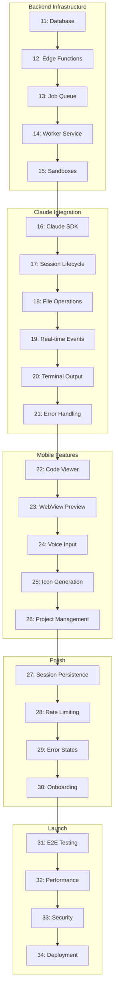

# Phase 1: Links Map & Artifact Flow

**Purpose:** Track dependencies and artifact flows between Phase 1 phases (11-34)

**Last Updated:** 2025-11-06

---

## Phase Linkage Overview



---

## Forward Links (What Each Phase Provides)

### Backend Infrastructure (11-15)

**Phase 11 → Phase 12**
- Database schema with RLS policies
- Tables: profiles, projects, coding_sessions, coding_jobs, session_events
- Migration files

**Phase 12 → Phase 13**
- Edge Functions creating jobs
- API endpoints: start-coding-session, continue-coding, get-session-status
- Auth validation middleware

**Phase 13 → Phase 14**
- JobQueue class for job claiming
- Queue functions (claim_next_job, complete_job, fail_job)
- Realtime subscriptions

**Phase 14 → Phase 15**
- Worker service running
- Job processing loop framework
- Health check endpoint

**Phase 15 → Phase 16**
- Sandbox lifecycle management
- Command execution in sandboxes
- Cleanup mechanisms

### Claude Integration (16-21)

**Phase 16 → Phase 17**
- Claude Agent SDK integrated
- AgentRunner with tool execution
- Basic tools: bash, read_file, write_file

**Phase 17 → Phase 18**
- Session state machine
- Timeout and expiration handling
- Pause/resume functionality

**Phase 18 → Phase 19**
- File sync service
- Supabase Storage integration
- File watching and diff tracking
- Conflict resolution

**Phase 19 → Phase 20**
- Real-time event streaming (backend)
- Supabase Realtime integration
- Event history retrieval
- Mobile subscription framework (deferred)

**Phase 20 → Phase 21**
- Terminal output capture
- stderr stream (for error detection)
- Event emission system
- Error event type

**Phase 21 → Phase 22**
- Comprehensive error handling
- Retry mechanisms with exponential backoff
- User-facing error messages
- Session state preservation

### Mobile Features (22-26)

**Phase 22 → Phase 23**
- File listing API (backend)
- File content retrieval API (backend)
- Language detection (25+ languages)
- Code viewer component (mobile deferred)

**Phase 23 → Phase 24**
- Preview URL generation (backend)
- Expo dev server management
- Database schema for preview URLs
- Preview lifecycle (start/stop/refresh)
- WebView preview component (mobile deferred)
- Auto-refresh on updates (mobile deferred)
- Screenshot capability (mobile deferred)

**Phase 24 → Phase 25**
- Cloud speech-to-text API (backend)
- Google Cloud Speech integration
- Voice input components (mobile deferred)
- Hold-to-speak UI (mobile deferred)
- Permission handling (mobile deferred)

**Phase 25 → Phase 26**
- AI-powered icon generation (backend)
- Image generation API integration
- Supabase Storage for icons
- Database schema for icon URLs
- Icon gallery and selection (mobile deferred)

**Phase 26 → Phase 27**
- Project CRUD operations
- Project list and details screens
- Search and filter

### Polish (27-30)

**Phase 27 → Phase 28**
- Session persistence
- Auto-save and resume
- Session history
- Activity tracking for rate calculations

**Phase 28 → Phase 29**
- Rate limiting enforcement
- Usage tracking per tier
- Quota check API
- Warning thresholds (80%, 100%)

**Phase 29 → Phase 30**
- Error message catalog (30+ errors)
- Empty state catalog (9 scenarios)
- Friendly, actionable error messages
- Integration with Phase 21 error handling
- Integration with Phase 28 quota warnings

**Phase 30 → Phase 31**
- Onboarding flow (4 welcome screens, 5 walkthrough steps)
- First session template (HELLO_WORLD)
- Milestone tracking (6 auto-tracked achievements)
- Contextual tips (9 tips for first 3 sessions)
- Complete user journey (signup → onboarding → execution)

### Launch (31-34)

**Phase 31 → Phase 32**
- E2E test framework (Detox) configured for iOS and Android
- Test suites: 53 scenarios across auth, dev flow, session management
- Test helpers and utilities (auth, session, matchers, cleanup)
- GitHub Actions workflow with parallel execution
- Performance targets for optimization validation (<5min suite)
- Coverage requirements (>80% critical paths)
- Test infrastructure ready for mobile app implementation

**Phase 32 → Phase 33**
- Performance benchmarking utilities (mark-and-measure API, async tracking)
- Metro bundle optimization (minification, tree-shaking, code splitting)
- Lazy loading utilities with retry logic and suspense
- Bundle size limits (iOS <15MB, Android <20MB)
- Memory management (LRU cache with TTL, cleanup hooks)
- Network optimization (HTTP caching, request deduplication, prefetching)
- Rendering performance hooks (throttle, debounce, requestAnimationFrame)
- Cold start optimization (deferred initialization, priority-based tasks)
- Performance monitoring (Sentry integration, metrics tracking)
- Performance targets defined (<5s cold start, <3s session start, <500ms events)
- Optimization infrastructure ready for mobile app implementation

**Phase 33 → Phase 34**
- Automated security scanning (GitHub Actions: dependency, secret, SAST, container, code quality)
- RLS policy verification (30 SQL tests + 19 TypeScript integration tests)
- API security testing (30 tests: auth, injection, rate limiting, authorization, validation)
- Secret scanning (TruffleHog, git-secrets, bash script with 10+ pattern checks)
- Environment validation (TypeScript validator with format checking)
- OWASP Top 10 compliance (48 tests across all 10 categories)
- Security audit documentation (comprehensive guide with best practices)
- Security audit report template (professional reporting format)
- 127 total security tests covering all critical paths
- Security infrastructure ready for production deployment

**Phase 34 → Production**
- Production deployment
- Monitoring active
- Beta rollout plan

---

## Backward Links (Dependencies)

### Critical Dependencies

| Phase | Blocks | Reason |
|-------|--------|--------|
| 11 | 12-34 | All backend depends on database schema |
| 15 | 16-34 | Claude Agent needs isolated sandbox |
| 16 | 17-34 | Core AI functionality required |
| 19 | 20-34 | Real-time updates essential for UX |
| 23 | 24-34 | Preview is core value proposition |
| 31 | 32-34 | Testing must pass before optimization |
| 33 | 34 | Security must be verified before launch |

### Parallel Opportunities

| Phases | Can Run Concurrently | Notes |
|--------|---------------------|-------|
| 22, 24 | Code Viewer + Voice Input | Independent mobile features |
| 25, 26 | Icon Gen + Projects | Separate API integrations |
| 27-30 | Polish features | Can split across team (2 per engineer) |
| 31, 32 | Testing + Optimization | Separate tracks if needed |

---

## Cross-Phase Artifact References

### Code Artifacts

| Artifact | Created In | Used By | Purpose |
|----------|-----------|---------|---------|
| Database Schema | 11 | 12-34 | All data operations |
| JobQueue Class | 13 | 14-21 | Job processing |
| SandboxManager | 15 ⭐ | 16-21 | Fly.io API integration |
| SandboxLifecycle | 15 ⭐ | 16-21, 27 | Session-based sandboxes |
| Sandbox Docker Image | 15 ⭐ | 15-21 | Isolated execution environment |
| ClaudeClient | 16 ⭐ | 17-21 | Anthropic API wrapper |
| AgentRunner | 16 ⭐ | 17-21 | Agent loop orchestration |
| Agent Tools | 16 ⭐ | 16-21 | bash, read_file, write_file |
| SessionLifecycleManager | 17 ⭐ | 18-21, 27 | Session state machine + events |
| SessionState Enum | 17 ⭐ | 17-21 | State transition validation |
| SessionEventType Enum | 17 ⭐ | 17-21 | Event type definitions |
| FileSyncService | 18 ⭐ | 19-23 | Supabase Storage integration |
| FileWatcher | 18 ⭐ | 18-21 | Sandbox file monitoring |
| ConflictResolver | 18 ⭐ | 18-21 | Conflict detection + resolution |
| FileHasher | 18 ⭐ | 18-21 | SHA-256 change detection |
| OutputStreamer | 20 ⭐ | 20-21 | Terminal output buffering + streaming |
| MobVibeError Class | 21 ⭐ | 21-34 | Custom error type with categorization |
| ErrorCatalog | 21 ⭐ | 21-34 | Error factory functions |
| RetryManager | 21 ⭐ | 21-34 | Exponential backoff retry logic |
| ErrorHandler | 21 ⭐ | 21-34 | Central error processing + event emission |
| get-session-files Edge Function | 22 ⭐ | 22-34 | File tree API endpoint |
| get-file-content Edge Function | 22 ⭐ | 22-34 | File content retrieval API |
| Language Detection Utility | 22 ⭐ | 22-34 | File extension → language mapping |
| PreviewManager | 23 ⭐ | 23-34 | Preview URL generation + lifecycle |
| Preview Migration (012) | 23 ⭐ | 23-34 | Database schema for preview URLs |
| speech-to-text Edge Function | 24 ⭐ | 24-34 | Cloud speech recognition API |
| generate-icons Edge Function | 25 ⭐ | 25-34 | AI-powered icon generation API |
| Icon Migration (013) | 25 ⭐ | 25-34 | Database schema + storage for icons |
| Project Enhancement Migration (014) | 26 ⭐ | 26-34 | Enhanced project schema (framework, metadata, search) |
| Session Persistence Migration (015) | 27 ⭐ | 27-34 | Session state snapshots, resume, compression |
| SessionPersistenceManager | 27 ⭐ | 27-34 | Auto-save, resume, history, cleanup |
| Rate Limiting Migration (016) | 28 ⭐ | 28-34 | Tier-based usage tracking, quota enforcement |
| RateLimitManager | 28 ⭐ | 28-34 | Quota checks, usage stats, warning thresholds |
| Error Message Catalog | 29 ⭐ | 29-34 | 30+ user-facing error messages, 9 empty states, dynamic formatting |
| ErrorState Component (mobile) | 29 ⭐ | 29-34 | Error display with severity, actions, illustrations (deferred) |
| EmptyState Component (mobile) | 29 ⭐ | 29-34 | Empty state guidance with CTAs (deferred) |
| Onboarding Migration (017) | 30 ⭐ | 30-34 | Onboarding state tracking, milestones, preferences, auto-triggers |
| Onboarding Content Catalog | 30 ⭐ | 30-34 | 4 welcome screens, 5 walkthroughs, 9 tips, 5 templates, 6 milestones |
| OnboardingFlow Component (mobile) | 30 ⭐ | 30-34 | Welcome screens carousel and first session creation (deferred) |
| InteractiveWalkthrough Component (mobile) | 30 ⭐ | 30-34 | UI element highlights and guided tour (deferred) |
| Detox E2E Framework Configuration | 31 ⭐ | 31-34 | .detoxrc.js, Jest config, iOS/Android test setup |
| E2E Test Suites | 31 ⭐ | 31-34 | 53 test scenarios: auth (12), dev flow (17), session mgmt (24) |
| E2E Test Helpers | 31 ⭐ | 31-34 | Auth, session, matchers, cleanup utilities |
| E2E GitHub Actions Workflow | 31 ⭐ | 31-34 | Parallel iOS/Android CI/CD with artifact capture |
| PerformanceBenchmark | 32 ⭐ | 32-34 | Mark-and-measure API, async operation tracking, target validation |
| Metro Bundle Config | 32 ⭐ | 32-34 | Minification, tree-shaking, code splitting, inline requires |
| LazyLoadManager | 32 ⭐ | 32-34 | Code splitting utilities with retry logic and suspense fallback |
| Bundle Size Limits | 32 ⭐ | 32-34 | iOS <15MB, Android <20MB automated validation |
| useMemoryManager Hook | 32 ⭐ | 32-34 | Resource cleanup on app background, unmount, manual cleanup |
| MemoryCache Class | 32 ⭐ | 32-34 | LRU cache with TTL (sessions, API responses, images) |
| OptimizedApiClient | 32 ⭐ | 32-34 | HTTP caching, request deduplication, retry logic |
| usePrefetch Hook | 32 ⭐ | 32-34 | Predictive loading, intersection observer, cache integration |
| useThrottledCallback Hook | 32 ⭐ | 32-34 | Throttle, debounce, requestAnimationFrame utilities |
| DeferredInitializationManager | 32 ⭐ | 32-34 | Priority-based task execution for cold start optimization |
| Performance Tracking Utilities | 32 ⭐ | 32-34 | Sentry integration, metrics recording, transaction management |
| Security Scan Workflow | 33 ⭐ | 33-34 | GitHub Actions: dependency, secret, SAST, container, code quality scans |
| RLS Policy Tests (SQL) | 33 ⭐ | 33-34 | 30 PostgreSQL tests for row-level security verification |
| RLS Enforcement Tests (TypeScript) | 33 ⭐ | 33-34 | 19 integration tests for RLS policy enforcement |
| API Security Test Suite | 33 ⭐ | 33-34 | 30 tests: authentication, injection, rate limiting, authorization |
| Secret Scanning Script | 33 ⭐ | 33-34 | Bash script with TruffleHog, git-secrets, 10+ pattern checks |
| Environment Validation Script | 33 ⭐ | 33-34 | TypeScript validator for env vars, HTTPS, JWT, formats |
| OWASP Compliance Tests | 33 ⭐ | 33-34 | 48 tests across OWASP Top 10 2021 categories |
| EventEmitter | 19 | 20-26 | Real-time updates |
| CodeViewer Component | 22 | 23, 27 | Display code (mobile deferred) |
| WebView Component | 23 | 27, 30 | Preview apps |

### Documentation

| Document | Created In | Referenced By |
|----------|-----------|---------------|
| DATABASE.md | 11 | 12, 13 |
| API.md | 12 | 13-21 |
| JOB_QUEUE.md | 13 | 14, 15 |
| WORKER_SERVICE.md | 14 | 15-21 |
| worker-patterns.md (Research) | 14 | 14, 15 |
| 14-context-bundle.md | 14 | 14 |
| 14-worker-steps.md (Sequencing) | 14 | 14 |
| SANDBOXES.md | 15 ⭐ | 16-21 |
| sandbox-patterns.md (Research) | 15 | 15, 16 |
| 15-context-bundle.md | 15 | 15 |
| 15-sandbox-steps.md (Sequencing) | 15 | 15 |
| CLAUDE_AGENT.md | 16 ⭐ | 17-21 |
| claude-sdk.md (Research) | 16 | 16, 17 |
| 16-context-bundle.md | 16 | 16 |
| 16-agent-steps.md (Sequencing) | 16 | 16 |
| SESSION-LIFECYCLE.md | 17 ⭐ | 18-21 |
| state-machine-patterns.md (Research) | 17 | 17, 18 |
| 17-context-bundle.md | 17 | 17 |
| 17-steps.md (Sequencing) | 17 | 17 |
| FILE-SYNC.md | 18 ⭐ | 19-23 |
| file-sync-patterns.md (Research) | 18 | 18, 19 |
| 18-context-bundle.md | 18 | 18 |
| 18-steps.md (Sequencing) | 18 | 18 |
| REALTIME.md | 19 ⭐ | 20-26 |
| realtime-patterns.md (Research) | 19 | 19, 20 |
| 19-context-bundle.md | 19 | 19 |
| 19-realtime-steps.md (Sequencing) | 19 | 19 |
| TERMINAL.md | 20 ⭐ | 21-26 |
| ERROR_HANDLING.md | 21 ⭐ | 22-34 |
| CODE_VIEWER.md | 22 ⭐ | 23-34 |
| WEBVIEW_PREVIEW.md | 23 ⭐ | 24-34 |
| VOICE_INPUT.md | 24 ⭐ | 25-34 |
| ICON_GENERATION.md | 25 ⭐ | 26-34 |
| PROJECT_MANAGEMENT.md | 26 ⭐ | 27-34 |
| SESSION_PERSISTENCE.md | 27 ⭐ | 28-34 |
| RATE_LIMITING.md | 28 ⭐ | 29-34 |
| ERROR_STATES.md | 29 ⭐ | 30-34 |
| ONBOARDING.md | 30 ⭐ | 31-34 |
| E2E_TESTING.md | 31 ⭐ | 32-34 |
| PERFORMANCE.md | 32 ⭐ | 33-34 |
| SECURITY_AUDIT.md | 33 ⭐ | 34 |
| SECURITY_AUDIT_REPORT.md | 33 ⭐ | 34 |

### Test Artifacts

| Test Suite | Created In | Expanded In |
|------------|-----------|-------------|
| Database tests | 11 | 12, 13 |
| Edge Function tests | 12 | 13 |
| Queue tests | 13 | 14 |
| Worker tests | 14 | 15-21 |
| Mobile component tests | 22-26 | 31 |
| E2E tests | 31 | 32 |
| Security tests | 33 | 34 |

---

## Data Flow Through Phases

### User Prompt → Preview (Core Flow)

```
User inputs prompt (Phase 23/24)
    ↓
Edge Function creates job (Phase 12)
    ↓
Job Queue enqueues (Phase 13)
    ↓
Worker claims job (Phase 14)
    ↓
Sandbox created (Phase 15)
    ↓
Claude Agent generates code (Phase 16-17)
    ↓
Files synced (Phase 18)
    ↓
Events streamed (Phase 19)
    ↓
Terminal output displayed (Phase 20)
    ↓
Errors handled (Phase 21)
    ↓
Code displayed (Phase 22)
    ↓
Preview loaded (Phase 23)
    ↓
User sees working app ✅
```

### Session Persistence Flow

```
Session starts (Phase 17)
    ↓
Files created (Phase 18)
    ↓
Events emitted (Phase 19)
    ↓
State saved (Phase 27)
    ↓
User closes app
    ↓
Session state persisted (Phase 27)
    ↓
User reopens app
    ↓
Session resumed (Phase 27)
    ↓
Continue from where left off ✅
```

---

## Integration Points

### Mobile ↔ Backend

| Mobile Component | Backend Service | Communication |
|-----------------|----------------|---------------|
| Session starter (12) | Edge Functions (12) | HTTP POST |
| Event listener (19) | Realtime (19) | WebSocket |
| Code viewer (22) | File sync (18) | Supabase Storage |
| Preview (23) | EAS Updates (17) | WebView URL |
| Voice input (24) | Transcribe Edge Function (24) | HTTP POST |
| Icon gallery (25) | Icon gen Edge Function (25) | HTTP POST |

### Worker ↔ Services

| Worker Component | External Service | Integration |
|-----------------|------------------|-------------|
| Sandbox (15) | Fly.io Machines | REST API |
| Claude Agent (16) | Anthropic API | SDK |
| File sync (18) | Supabase Storage | SDK |
| Events (19) | Supabase Realtime | SDK |

---

## Verification Checkpoints

| After Phase | Checkpoint | Verification |
|-------------|-----------|--------------|
| 12 | API endpoints work | cURL test all functions |
| 15 | Sandboxes run | Manual Fly.io test |
| 16 | Claude generates code | Test "build todo app" |
| 19 | Events stream | Mobile receives updates |
| 23 | Preview works | App loads in WebView |
| 26 | CRUD complete | All operations tested |
| 31 | E2E passes | CI green |
| 34 | Production live | App in stores ✅ |

---

## Rollback Strategy

Each phase produces:
- Git tag: `phase-1-{NN}`
- Snapshot: `reports/phase1/phase-{NN}-snapshot.json`
- Rollback instructions in phase file

**Rollback Command:**
```bash
git checkout phase-1-{NN-1}
npm install
npm run test
```

---

**Status:** Phase 1 Links Map Complete
**Next:** Execute phases 11-34 following this dependency map
