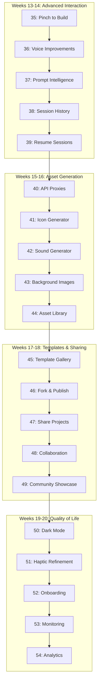

# MobVibe Phase 2: Enhancement - Implementation Plan

**Project:** MobVibe - AI-powered mobile app builder
**Repos:** D:\009_Projects_AI\Personal_Projects\MobVibe
**Phase:** 2 - Enhancement (Advanced Features)
**Documentation Index:**
- [Architecture](../../../.docs/architecture.md) - System architecture
- [Implementation](../../../.docs/implementation.md) - Technical stack
- [Data Flow](../../../.docs/data-flow.md) - Complete data flows
- [Features & Journeys](../../../.docs/features-and-journeys.md) - Feature specs
- [Roadmap](../../../.docs/roadmap.md) - Development timeline

---

## Phase Overview

**Goal:** Enhance MVP with advanced interaction, AI assets, templates, and quality-of-life features

**Duration:** 8 weeks (40 working days) - Weeks 13-20 of roadmap

**Approach:** Small, incremental phases each delivering user-facing enhancements

**Prerequisites:** ✅ Phase 1 Complete (MVP launched, users in production)

---

## Phase Breakdown

### **Weeks 13-14: Advanced Interaction** (5 phases, 10 days)
- 35: Pinch to Build gesture system
- 36: Voice input improvements & continuous mode
- 37: Prompt suggestions & smart autocomplete
- 38: Session history & browsing
- 39: Resume sessions & state recovery

### **Weeks 15-16: Asset Generation (Secure Proxy)** (5 phases, 10 days)
- 40: Backend API proxy infrastructure
- 41: Icon generator with Nano Banana integration
- 42: Sound generator with ElevenLabs integration
- 43: Background image generation
- 44: Asset library & management UI

### **Weeks 17-18: Templates & Sharing** (5 phases, 10 days)
- 45: Template gallery & categories
- 46: Fork & publish templates
- 47: Share projects with view-only links
- 48: Collaboration features (invite, comments)
- 49: Community showcase & ratings

### **Weeks 19-20: Quality of Life** (5 phases, 10 days)
- 50: Dark mode & theme system
- 51: Haptic feedback refinement
- 52: Onboarding tutorial & in-app tips
- 53: Performance monitoring & error reporting
- 54: Analytics dashboard & insights

---

## Phase List (20 Phases)

| ID | Title | Value | Duration | Depends On |
|----|-------|-------|----------|------------|
| 35 | Pinch to Build Gesture | Element selection → prompt | 2 days | Phase 1 |
| 36 | Voice Input Improvements | Continuous mode, wake word | 2 days | 35 |
| 37 | Prompt Intelligence | Suggestions & autocomplete | 2 days | 36 |
| 38 | Session History | Browse & search past sessions | 2 days | 37 |
| 39 | Resume Sessions | State recovery & continuation | 2 days | 38 |
| 40 | Backend API Proxies | Secure AI service access | 2 days | 39 |
| 41 | Icon Generator | Nano Banana integration | 2 days | 40 |
| 42 | Sound Generator | ElevenLabs integration | 2 days | 41 |
| 43 | Background Images | Hero/splash generation | 2 days | 42 |
| 44 | Asset Library | Manage & export assets | 2 days | 43 |
| 45 | Template Gallery | Browse & categorize | 2 days | 44 |
| 46 | Fork & Publish | Create from templates | 2 days | 45 |
| 47 | Share Projects | View-only links | 2 days | 46 |
| 48 | Collaboration | Multi-user projects | 2 days | 47 |
| 49 | Community Showcase | Ratings & featured | 2 days | 48 |
| 50 | Dark Mode | System & manual toggle | 2 days | 49 |
| 51 | Haptic Refinement | Context-aware feedback | 2 days | 50 |
| 52 | Onboarding & Tips | Tutorial & guidance | 2 days | 51 |
| 53 | Monitoring & Reporting | Performance & errors | 2 days | 52 |
| 54 | Analytics Dashboard | Usage insights | 2 days | 53 |

**Total:** 40 days (8 weeks)

---

## Dependency Graph



---

## Cumulative Test Matrix

| Phase | Tests (Self) | Tests (+Prev) | Integration Test | Notes |
|-------|--------------|---------------|------------------|-------|
| 35 | ✅ Gesture tests | ✅ (Phase 1) | ✅ Element selection | Interaction layer |
| 36 | ✅ Voice tests | ✅ (35) | ✅ Continuous mode | Voice enhanced |
| 37 | ✅ AI suggestion tests | ✅ (35-36) | ✅ Autocomplete | Intelligence added |
| 38 | ✅ History tests | ✅ (35-37) | ✅ Session browsing | History working |
| 39 | ✅ Resume tests | ✅ (35-38) | ✅ State recovery | Interaction complete |
| 40 | ✅ Proxy tests | ✅ (35-39) | ✅ API security | Infrastructure ready |
| 41 | ✅ Icon gen tests | ✅ (35-40) | ✅ Nano Banana API | Icons working |
| 42 | ✅ Sound tests | ✅ (35-41) | ✅ ElevenLabs API | Sounds working |
| 43 | ✅ Image tests | ✅ (35-42) | ✅ Image generation | Images working |
| 44 | ✅ Library tests | ✅ (35-43) | ✅ Asset management | Assets complete |
| 45 | ✅ Gallery tests | ✅ (35-44) | ✅ Template browsing | Gallery working |
| 46 | ✅ Fork tests | ✅ (35-45) | ✅ Template creation | Fork/publish ready |
| 47 | ✅ Share tests | ✅ (35-46) | ✅ Link sharing | Sharing enabled |
| 48 | ✅ Collab tests | ✅ (35-47) | ✅ Multi-user | Collaboration working |
| 49 | ✅ Community tests | ✅ (35-48) | ✅ Showcase & ratings | Templates complete |
| 50 | ✅ Dark mode tests | ✅ (35-49) | ✅ Theme switching | Dark mode working |
| 51 | ✅ Haptic tests | ✅ (35-50) | ✅ Feedback patterns | Haptics refined |
| 52 | ✅ Onboarding tests | ✅ (35-51) | ✅ Tutorial flows | Onboarding polished |
| 53 | ✅ Monitor tests | ✅ (35-52) | ✅ Error tracking | Monitoring active |
| 54 | ✅ Analytics tests | ✅ (35-53) | ✅ Insights dashboard | Phase 2 complete ✅ |

---

## Acceptance Criteria (Phase 2 Enhancement Complete)

**Must all pass before Phase 3:**

| Criterion | Target | Verification Method |
|-----------|--------|---------------------|
| **Pinch to Build** | User can pinch element → describe changes | E2E test: Pinch gesture → prompt → code update |
| **Voice Continuous** | Hands-free multi-turn conversations | Voice test: "Hey MobVibe" → continuous commands |
| **Smart Prompts** | AI suggests relevant improvements | Suggestion quality test (5 sample apps) |
| **Session History** | All sessions browsable & searchable | History navigation test |
| **Resume Works** | Sessions resume from exact state | Resume after force-quit test |
| **API Proxies** | Secure backend for AI services | Security audit (no exposed keys) |
| **Icon Generation** | Icons in <10s with 6 variations | API response time + quality test |
| **Sound Generation** | Custom sounds in <15s | Audio generation test |
| **Image Generation** | Backgrounds in <20s | Image quality test |
| **Asset Library** | Manage & export all assets | Library CRUD test |
| **Template Gallery** | 50+ templates, searchable | Gallery browsing test |
| **Fork Template** | One-tap fork & customize | Fork flow test |
| **Share Projects** | View-only links work | Link sharing test |
| **Collaboration** | Multi-user editing | Concurrent editing test |
| **Community Showcase** | Ratings & featured section | Showcase functionality test |
| **Dark Mode** | Consistent across all screens | Visual regression test (light/dark) |
| **Haptic Feedback** | Context-aware vibrations | Haptic pattern test |
| **Onboarding** | <60s tutorial, 80% completion | Tutorial completion rate |
| **Performance Monitoring** | Real-time metrics dashboard | Sentry integration test |
| **Analytics** | User insights & trends | Analytics data accuracy test |

---

## MCP Tools Usage Summary

### WebResearcher (websearch)
- **Phases Used:** 35, 36, 40, 41, 42, 43, 50, 53
- **Purpose:** Research gesture APIs, voice SDKs, AI services, monitoring tools
- **Outputs:** `/docs/research/phase2/{phase-id}/notes.md`

### ContextCurator (context7 MCP)
- **Phases Used:** All phases (35-54)
- **Purpose:** Aggregate API specs, UI patterns, integration docs
- **Outputs:** `/docs/context/phase2/{phase-id}-bundle.md`

### Sequencer (sequentialthinking MCP)
- **Phases Used:** All phases (35-54)
- **Purpose:** Generate step-by-step implementation micro-plans
- **Outputs:** `/docs/sequencing/phase2/{phase-id}-steps.md`

---

## Critical Path

**Cannot proceed if any of these block:**

1. Phase 40 (API Proxies) → All AI asset features depend on secure backend
2. Phase 45 (Template Gallery) → Community features depend on templates
3. Phase 50 (Dark Mode) → All UI screens must support theming
4. Phase 53 (Monitoring) → Production stability depends on observability

**Phases that can run in parallel:**
- Phase 35 (Pinch) + Phase 50 (Dark Mode) - Different systems
- Phase 41-43 (Asset generators) - Independent implementations
- Phase 45-46 (Templates) + Phase 51 (Haptics) - Different domains

---

## Success Metrics

**Phase 2 Enhancement Complete When:**
- ✅ Pinch to Build works (gesture → prompt → code)
- ✅ Voice input supports continuous mode
- ✅ AI suggests relevant prompts based on context
- ✅ Users can browse all session history
- ✅ Sessions resume from exact state
- ✅ Icon generation works (<10s, 6 variations)
- ✅ Sound generation works (<15s, custom audio)
- ✅ Background images generate (<20s)
- ✅ Asset library manages all generated assets
- ✅ Template gallery has 50+ templates
- ✅ Users can fork templates in one tap
- ✅ Share links work (view-only access)
- ✅ Collaboration supports multi-user editing
- ✅ Community showcase shows featured apps
- ✅ Dark mode consistent across all screens
- ✅ Haptic feedback context-aware
- ✅ Onboarding tutorial <60s, >80% completion
- ✅ Performance monitoring active (Sentry)
- ✅ Analytics dashboard shows insights

**Core Enhanced User Journey:**
```
1. User opens app → Dark mode detected
2. Pinches Preview element → "Make this button green"
3. Claude updates code → Preview refreshes
4. User says "Hey MobVibe, add a logo"
5. Icon Gen tab auto-opens → 6 variations shown
6. User selects icon → Applied to app
7. User taps "Share" → Link copied
8. Friend opens link → Sees working app
9. Friend taps "Fork This" → Creates own version
10. User browses history → Resumes old project
```

---

## Risk Management

### High-Risk Phases

| Phase | Risk | Mitigation |
|-------|------|------------|
| 35 | Gesture conflicts with native scrolling | Use precise hit detection, conflict resolution |
| 40 | API proxy security vulnerabilities | Rate limiting, key rotation, audit logs |
| 41-43 | Third-party API rate limits | Implement caching, queue management |
| 48 | Real-time collaboration conflicts | CRDT for conflict-free merging |
| 53 | Monitoring overhead impacts performance | Async logging, sampling, aggregation |

### Rollback Strategy

Each phase produces:
1. Git commit with phase tag: `git tag phase-2-{NN}`
2. Snapshot in `reports/phase2/phase-{NN}-snapshot.json`
3. Rollback instructions in phase file

**Rollback Command:**
```bash
git checkout phase-2-{NN-1}  # Go back one phase
npm install
npm run test
```

---

## Phase 2 Prerequisites

**From Phase 1 (must be complete):**
- ✅ MVP launched and users in production
- ✅ Real-time events working
- ✅ Preview system stable
- ✅ Database schema supports extensions
- ✅ Rate limiting infrastructure ready

**Infrastructure Setup Required:**
- [ ] Nano Banana API account & key
- [ ] ElevenLabs API account & key
- [ ] Background image service (Replicate/DALL-E)
- [ ] Sentry project (error monitoring)
- [ ] PostHog/Mixpanel (analytics)

---

## Next Steps After Phase 2

Once Phase 2 Enhancement is complete:
1. **Analyze Usage Data** - Understand most-used features
2. **Gather Feedback** - User surveys, feature requests
3. **Phase 3 Planning** - Publishing & Scale features
4. **Optimize** - Performance improvements based on data

---

## References

- [Architecture](../../../.docs/architecture.md) - System design
- [Implementation](../../../.docs/implementation.md) - Tech stack
- [Data Flow](../../../.docs/data-flow.md) - Complete flows
- [Features & Journeys](../../../.docs/features-and-journeys.md) - Feature specs
- [Roadmap](../../../.docs/roadmap.md) - Timeline
- [Phase 1 Complete](./../../phases/phase1/PLAN.md) - MVP foundation ready

---

**Plan Version:** 1.0.0
**Created:** 2025-11-08
**Last Updated:** 2025-11-08
**Status:** Ready for execution (pending Phase 1 completion)
