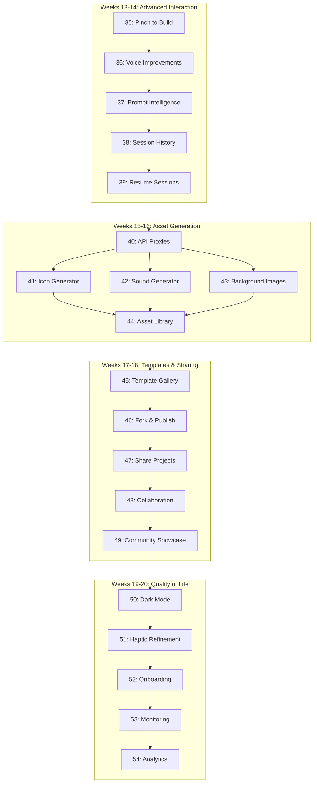

# Phase 2: Enhancement - Links Map & Artifact Flow

**Phase:** 2 - Enhancement (Weeks 13-20, 40 days)
**Total Phases:** 20 (Phases 35-54)
**Status:** Planning Complete

---

## Phase Linkage Overview



---

## Forward Links (What Each Phase Provides)

### Advanced Interaction (Weeks 13-14)

**Phase 35: Pinch to Build → Phase 36**
- ✅ Gesture recognition system
- ✅ Element selection registry
- ✅ Visual feedback patterns
- **Provides:** Foundation for multimodal interaction

**Phase 36: Voice Improvements → Phase 37**
- ✅ Continuous voice mode
- ✅ Wake word detection
- ✅ Multi-language support
- **Provides:** Enhanced voice input for prompt intelligence

**Phase 37: Prompt Intelligence → Phase 38**
- ✅ Context analysis engine
- ✅ Suggestion generation
- ✅ Pattern learning system
- **Provides:** Smart prompt context for session history

**Phase 38: Session History → Phase 39**
- ✅ Session database & search
- ✅ Timeline visualization
- ✅ Quick access patterns
- **Provides:** Historical context for session resume

**Phase 39: Resume Sessions → Phase 40**
- ✅ State persistence system
- ✅ Auto-save mechanisms
- ✅ Recovery workflows
- **Provides:** Stable foundation for backend services

---

### Asset Generation (Weeks 15-16)

**Phase 40: API Proxies → Phases 41, 42, 43**
- ✅ Secure proxy infrastructure
- ✅ Rate limiting per user/tier
- ✅ Key rotation & audit logging
- ✅ Cost tracking
- **Provides:** Foundation for ALL AI asset generation services

**Phase 41: Icon Generator → Phase 44**
- ✅ Nano Banana API integration
- ✅ 6-variation generation
- ✅ Icon storage system
- **Provides:** Icon assets for library

**Phase 42: Sound Generator → Phase 44**
- ✅ ElevenLabs API integration
- ✅ Audio generation & preview
- ✅ Sound storage system
- **Provides:** Audio assets for library

**Phase 43: Background Images → Phase 44**
- ✅ Image generation API integration
- ✅ Multi-resolution support
- ✅ Image storage system
- **Provides:** Image assets for library

**Phase 44: Asset Library → Phase 45**
- ✅ Unified asset management
- ✅ Filter, search, export
- ✅ Version tracking
- **Provides:** Complete asset ecosystem for templates

---

### Templates & Sharing (Weeks 17-18)

**Phase 45: Template Gallery → Phase 46**
- ✅ Template browsing UI
- ✅ Category organization
- ✅ Search & filter
- **Provides:** Discovery mechanism for template system

**Phase 46: Fork & Publish → Phase 47**
- ✅ Fork functionality
- ✅ Template creation workflow
- ✅ Metadata management
- **Provides:** Template creation foundation for sharing

**Phase 47: Share Projects → Phase 48**
- ✅ Share link generation
- ✅ View-only access
- ✅ Permission controls
- **Provides:** Sharing infrastructure for collaboration

**Phase 48: Collaboration → Phase 49**
- ✅ Multi-user editing
- ✅ Real-time presence
- ✅ Comment system
- **Provides:** Social features for community

**Phase 49: Community Showcase → Phase 50**
- ✅ Featured projects
- ✅ Rating & review system
- ✅ Trending algorithm
- **Provides:** Community engagement platform

---

### Quality of Life (Weeks 19-20)

**Phase 50: Dark Mode → Phase 51**
- ✅ Theme system architecture
- ✅ Color scheme definitions
- ✅ Theme switching logic
- **Provides:** Theming foundation for all UI components

**Phase 51: Haptic Refinement → Phase 52**
- ✅ Context-aware haptic patterns
- ✅ Platform-specific mappings
- ✅ User preferences
- **Provides:** Enhanced tactile feedback for onboarding

**Phase 52: Onboarding → Phase 53**
- ✅ Tutorial system
- ✅ Contextual tips
- ✅ Progress tracking
- **Provides:** User education framework

**Phase 53: Monitoring → Phase 54**
- ✅ Error tracking (Sentry)
- ✅ Performance monitoring
- ✅ Real-time alerting
- **Provides:** Data foundation for analytics

**Phase 54: Analytics**
- ✅ Usage insights dashboard
- ✅ Feature adoption metrics
- ✅ Data export
- **Provides:** Phase 2 complete ✅

---

## Backward Links (Dependencies)

### Critical Dependencies (Blocking)

**Phase 40 (API Proxies) is CRITICAL:**
- Blocks: Phases 41, 42, 43 (all AI asset generation)
- Without this: Cannot securely integrate third-party AI services
- Risk: High - security vulnerability if skipped

**Phase 44 (Asset Library) is CRITICAL:**
- Blocks: Phase 45 (template assets need management)
- Without this: No unified asset management for templates
- Risk: Medium - workaround possible but inefficient

**Phase 50 (Dark Mode) is CRITICAL:**
- Blocks: Phases 51-54 (all UI must support theming)
- Without this: Inconsistent theme support across features
- Risk: Medium - UI quality degradation

### Soft Dependencies (Recommended)

**Phase 35 → Phase 36:**
- Gesture system informs voice UX patterns
- Can proceed without, but better with context

**Phase 37 → Phase 38:**
- Prompt intelligence enhances history search
- History works without, but less intelligent

**Phase 48 → Phase 49:**
- Collaboration features enable community engagement
- Community works without, but limited social features

---

## Cross-Phase Artifacts

### Database Schema Extensions

**From Phase 35 (Pinch to Build):**
```sql
-- Element registry for gesture targeting
CREATE TABLE selected_elements (
  id UUID PRIMARY KEY,
  session_id UUID REFERENCES coding_sessions(id),
  element_path TEXT,
  coordinates JSONB,
  timestamp TIMESTAMPTZ
);
```
**Used by:** Phases 36 (voice), 37 (prompt intelligence)

**From Phase 38 (Session History):**
```sql
-- Session snapshots for resume
CREATE TABLE session_snapshots (
  id UUID PRIMARY KEY,
  session_id UUID REFERENCES coding_sessions(id),
  snapshot_data JSONB,
  milestone TEXT,
  created_at TIMESTAMPTZ
);
```
**Used by:** Phase 39 (resume sessions)

**From Phase 40 (API Proxies):**
```sql
-- API usage tracking for all AI services
CREATE TABLE api_usage (
  id UUID PRIMARY KEY,
  user_id UUID REFERENCES profiles(id),
  service TEXT, -- 'nano_banana', 'elevenlabs', 'replicate'
  endpoint TEXT,
  tokens_used INTEGER,
  cost_cents INTEGER,
  created_at TIMESTAMPTZ
);
```
**Used by:** Phases 41-43 (all asset generation), 54 (analytics)

**From Phase 45 (Template Gallery):**
```sql
-- Template metadata for community
CREATE TABLE templates (
  id UUID PRIMARY KEY,
  project_id UUID REFERENCES projects(id),
  author_id UUID REFERENCES profiles(id),
  name TEXT,
  description TEXT,
  category TEXT,
  is_official BOOLEAN DEFAULT false,
  is_featured BOOLEAN DEFAULT false,
  fork_count INTEGER DEFAULT 0,
  view_count INTEGER DEFAULT 0,
  rating_avg DECIMAL(3,2),
  created_at TIMESTAMPTZ
);
```
**Used by:** Phases 46-49 (template ecosystem)

---

### Shared Components

**From Phase 35:**
- `ElementRegistry.ts` - Used by phases 36, 37 for context
- `SelectionOverlay.tsx` - Used by phase 36 for visual feedback

**From Phase 37:**
- `ContextAnalyzer.ts` - Used by phases 38, 39 for intelligent history
- `PatternLearner.ts` - Used by phase 54 for analytics

**From Phase 40:**
- `BaseProxy.ts` - Used by all asset generation phases (41-43)
- `RateLimiter.ts` - Used by phases 48 (collaboration), 53 (monitoring)

**From Phase 44:**
- `AssetLibrary.tsx` - Used by phases 45-46 for templates
- `AssetService.ts` - Used by phase 54 for analytics

**From Phase 50:**
- `ThemeContext.tsx` - Used by ALL subsequent phases (51-54)
- `useTheme.ts` hook - Used by all UI components

---

## Data Flow Diagrams

### Advanced Interaction Flow (Phases 35-39)

```
User Action
    ↓
[Pinch Element] (P35) → Element Selection Registry
    ↓
[Voice Input] (P36) → "Make this button green"
    ↓
[Prompt Intelligence] (P37) → Context Analysis + Suggestions
    ↓
[Session History] (P38) → Save to Timeline
    ↓
[Auto-Save] (P39) → Session Snapshot for Resume
```

### Asset Generation Flow (Phases 40-44)

```
User Request: "Generate app icon"
    ↓
[Icon Gen UI] (P41) → API Proxy (P40)
    ↓
Nano Banana API → Icon Variations (x6)
    ↓
[Asset Storage] → Supabase Storage
    ↓
[Asset Library] (P44) → Display & Manage
    ↓
User Selects → Apply to Project
```

### Template Ecosystem Flow (Phases 45-49)

```
[Template Gallery] (P45) → Browse Categories
    ↓
User Selects Template
    ↓
[Fork Template] (P46) → Create New Project
    ↓
User Customizes → Publishes Template
    ↓
[Share Link] (P47) → Share with Friends
    ↓
[Collaboration] (P48) → Multi-User Editing
    ↓
[Community Showcase] (P49) → Featured if Popular
```

### Quality of Life Flow (Phases 50-54)

```
[User Opens App]
    ↓
[Dark Mode] (P50) → Detect System Preference
    ↓
[Haptic Feedback] (P51) → Success Pattern on Tap
    ↓
[Onboarding] (P52) → Show Tips if New User
    ↓
[Monitoring] (P53) → Track Performance Metrics
    ↓
[Analytics] (P54) → Display Usage Dashboard
```

---

## Integration Points

### Mobile ↔ Backend

**Phase 35-39 (Interaction):**
- Mobile: Gesture detection, voice capture, UI state
- Backend: Session storage, pattern learning, snapshot persistence
- Protocol: WebSocket (real-time), REST (CRUD)

**Phase 40-44 (Assets):**
- Mobile: Asset request UI, preview, storage download
- Backend: API proxy, rate limiting, cost tracking, storage upload
- Protocol: REST (asset generation), WebSocket (progress updates)

**Phase 45-49 (Templates):**
- Mobile: Gallery browsing, fork UI, share UI, collaboration
- Backend: Template database, share links, real-time sync (Yjs)
- Protocol: REST (templates), WebSocket (collaboration)

**Phase 50-54 (QoL):**
- Mobile: Theme UI, haptics, onboarding UI, metrics collection
- Backend: Analytics aggregation, error reporting, performance tracking
- Protocol: REST (analytics), Sentry SDK (errors)

---

## Verification Checkpoints

### After Advanced Interaction (Phase 39)
- [ ] Pinch gesture selects elements accurately
- [ ] Voice mode stays active continuously
- [ ] Prompt suggestions appear <100ms
- [ ] Session history searchable & browsable
- [ ] Sessions resume from exact state

### After Asset Generation (Phase 44)
- [ ] API proxies secure (no exposed keys)
- [ ] Icons generate in <10s
- [ ] Sounds generate in <15s
- [ ] Images generate in <30s
- [ ] Asset library manages all types

### After Templates (Phase 49)
- [ ] Template gallery has 50+ templates
- [ ] Fork creates working project copy
- [ ] Share links work (view-only)
- [ ] Collaboration supports real-time editing
- [ ] Community showcase displays featured

### After Quality of Life (Phase 54)
- [ ] Dark mode consistent across all screens
- [ ] Haptics context-aware on all actions
- [ ] Onboarding tutorial <60s
- [ ] Monitoring tracks errors & performance
- [ ] Analytics dashboard shows insights

---

## Rollback Strategy

### Phase-Level Rollback
```bash
# Rollback to previous phase
git checkout phase-2-{NN-1}
npm install
npm run test

# Example: Rollback from Phase 41 to Phase 40
git checkout phase-2-40
npm install
npm run test
```

### Feature-Level Rollback (if phase partially complete)
```bash
# Disable feature via feature flag
UPDATE feature_flags
SET enabled = false
WHERE name = 'icon_generator';

# Redeploy without feature
npm run build
eas update --branch production --message "Disable icon generator"
```

### Emergency Rollback (production issue)
```bash
# Full Phase 2 rollback to Phase 1
git checkout phase-1-34  # Last Phase 1 commit
npm install
npm run test
eas update --branch production --message "Emergency rollback to Phase 1"
```

---

## Critical Path Summary

**Must Complete in Order:**
1. Phase 40 (API Proxies) - Foundation for AI services
2. Phase 44 (Asset Library) - Foundation for templates
3. Phase 50 (Dark Mode) - Foundation for UI consistency

**Can Parallelize:**
- Phases 35-39 (Interaction) can overlap with Phase 50 (Dark Mode)
- Phases 41-43 (Asset Gen) can run in parallel after Phase 40
- Phases 51-52 (Haptics, Onboarding) can overlap with Phase 53 (Monitoring)

**Total Duration:** 40 days (8 weeks)
- Week 13-14: Advanced Interaction (5 phases)
- Week 15-16: Asset Generation (5 phases)
- Week 17-18: Templates & Sharing (5 phases)
- Week 19-20: Quality of Life (5 phases)

---

## Success Criteria

**Phase 2 Enhancement Complete When:**
1. ✅ All 20 phases delivered (35-54)
2. ✅ All integration tests pass
3. ✅ User acceptance criteria met for each phase
4. ✅ Performance targets achieved (<100ms gestures, <10s icons, etc.)
5. ✅ Security audit clean (API proxies, share links, collaboration)
6. ✅ Dark mode consistent across 100% of screens
7. ✅ Analytics dashboard operational

**Ready for Phase 3:** Publishing & Scale

---

**Document Version:** 1.0.0
**Created:** 2025-11-08
**Last Updated:** 2025-11-08
**Status:** Planning Complete - Ready for Phase 2 Execution
